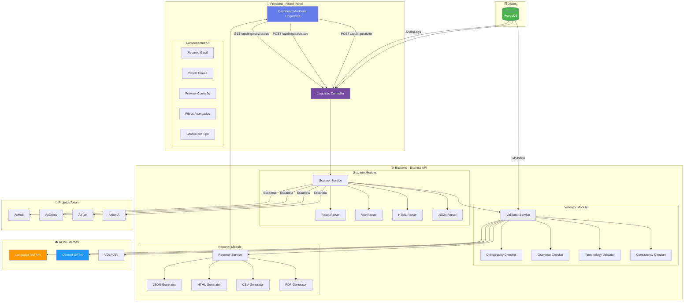
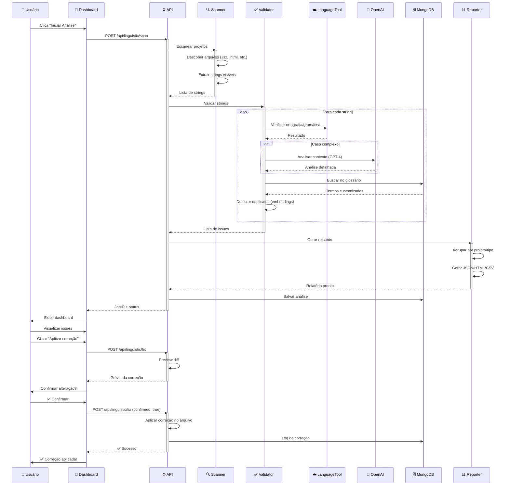

# 🏗️ ARQUITETURA TÉCNICA: Linguistic Validation Engine

## Diagrama de Arquitetura Geral



---

## Fluxo de Análise (Sequência)



---

## Estrutura de Dados

### 1. Issue (MongoDB Collection)

```javascript
{
  "_id": ObjectId("..."),
  "jobId": "job_2026-06-22_12345",
  "project": "AxHub",
  "module": "Dashboard",
  "file": "src/pages/Dashboard.jsx",
  "line": 45,
  "column": 12,
  "element": "button",
  "context": "<button onClick={handleClick}>Visualisar Relatório</button>",
  
  "issue": {
    "type": "orthography", // orthography | grammar | terminology | consistency
    "category": "spelling_error",
    "original": "Visualisar Relatório",
    "suggested": "Visualizar Relatório",
    "detail": "Erro de grafia: 'Visualisar' não existe. Correto: 'Visualizar'",
    "severity": "medium", // low | medium | high | critical
    "confidence": 0.95,
    "source": "languagetool" // languagetool | openai | volp | glossary
  },
  
  "status": "pending", // pending | approved | rejected | fixed
  "fixed_at": null,
  "fixed_by": null,
  
  "metadata": {
    "detected_at": ISODate("2026-06-22T14:30:00Z"),
    "processing_time_ms": 150,
    "api_cost": 0.001
  }
}
```

### 2. Glossary (MongoDB Collection)

```javascript
{
  "_id": ObjectId("..."),
  "termo_preferido": "usuário",
  "variacoes": ["utilizador", "user"],
  "categoria": "interface", // interface | backend | geral
  "projetos_aplicaveis": ["AxHub", "AxCross", "AxTon"],
  "definicao": "Pessoa que utiliza o sistema",
  "exemplos": [
    "Cadastro de usuário",
    "Perfil do usuário"
  ],
  "criado_em": ISODate("2026-06-01T10:00:00Z"),
  "atualizado_em": ISODate("2026-06-22T14:00:00Z")
}
```

### 3. Analysis Job (MongoDB Collection)

```javascript
{
  "_id": ObjectId("..."),
  "jobId": "job_2026-06-22_12345",
  "projects": ["AxHub", "AxCross"],
  "status": "completed", // queued | running | completed | failed
  
  "stats": {
    "files_scanned": 1247,
    "strings_extracted": 8934,
    "issues_found": 342,
    "processing_time_seconds": 187,
    "api_calls": {
      "languagetool": 8934,
      "openai": 23,
      "volp": 156
    },
    "cost_usd": 0.87
  },
  
  "breakdown": {
    "by_project": {
      "AxHub": { "issues": 142, "files": 587 },
      "AxCross": { "issues": 200, "files": 660 }
    },
    "by_type": {
      "orthography": 201,
      "grammar": 56,
      "terminology": 45,
      "consistency": 40
    },
    "by_severity": {
      "critical": 3,
      "high": 12,
      "medium": 89,
      "low": 238
    }
  },
  
  "created_at": ISODate("2026-06-22T14:00:00Z"),
  "completed_at": ISODate("2026-06-22T14:03:07Z")
}
```

---

## Endpoints da API

### 1. Análise

```
POST /api/linguistic/scan
Body: {
  "projects": ["AxHub", "AxCross"],
  "include_types": ["jsx", "html", "json"],
  "validation_level": "basic" | "full" | "advanced"
}
Response: {
  "jobId": "job_2026-06-22_12345",
  "status": "queued",
  "estimated_time_seconds": 180
}
```

### 2. Status da Análise

```
GET /api/linguistic/status/:jobId
Response: {
  "jobId": "job_2026-06-22_12345",
  "status": "running",
  "progress": 45, // porcentagem
  "files_scanned": 562,
  "issues_found": 142,
  "estimated_remaining_seconds": 95
}
```

### 3. Listar Issues

```
GET /api/linguistic/issues?jobId=xxx&project=AxHub&type=orthography&severity=high&page=1&limit=50
Response: {
  "total": 342,
  "page": 1,
  "limit": 50,
  "issues": [...]
}
```

### 4. Aplicar Correção

```
POST /api/linguistic/fix
Body: {
  "issueId": "64a7f...",
  "action": "preview" | "apply",
  "apply_to_all_similar": false
}
Response (preview): {
  "diff": "- Visualisar\n+ Visualizar",
  "context": "<button>Visualisar Relatório</button>",
  "similar_count": 3
}
Response (apply): {
  "success": true,
  "files_modified": 1,
  "similar_fixed": 0
}
```

### 5. Gerenciar Glossário

```
GET  /api/linguistic/glossary
POST /api/linguistic/glossary
PUT  /api/linguistic/glossary/:id
DELETE /api/linguistic/glossary/:id

POST Body: {
  "termo_preferido": "usuário",
  "variacoes": ["utilizador", "user"],
  "categoria": "interface"
}
```

### 6. Relatórios

```
GET /api/linguistic/report/:jobId?format=json|html|csv|pdf
Response: (arquivo ou JSON)
```

### 7. Estatísticas

```
GET /api/linguistic/stats
Response: {
  "total_analyses": 47,
  "total_issues_found": 8934,
  "total_issues_fixed": 6782,
  "avg_issues_per_project": 142,
  "top_projects_issues": [
    { "project": "AxHub", "issues": 342 },
    { "project": "AxCross", "issues": 289 }
  ],
  "top_issue_types": [
    { "type": "orthography", "count": 5423 },
    { "type": "grammar", "count": 2134 }
  ]
}
```

---

## Algoritmos Principais

### 1. Scanner - Extração de Strings (JSX)

```javascript
// Exemplo simplificado
function extractStringsFromJSX(code) {
  const ast = acorn.parse(code, { ecmaVersion: 2022, sourceType: 'module' });
  const strings = [];
  
  traverse(ast, {
    JSXText(node) {
      const text = node.value.trim();
      if (text && !isVariable(text)) {
        strings.push({
          text,
          line: node.loc.start.line,
          type: 'jsx_text'
        });
      }
    },
    JSXAttribute(node) {
      if (node.value && node.value.type === 'StringLiteral') {
        const attrName = node.name.name;
        if (['placeholder', 'title', 'aria-label', 'alt'].includes(attrName)) {
          strings.push({
            text: node.value.value,
            line: node.loc.start.line,
            type: 'jsx_attribute',
            attribute: attrName
          });
        }
      }
    }
  });
  
  return strings;
}
```

### 2. Validator - Ortografia

```javascript
async function checkOrthography(text, glossary) {
  // 1. Verificar glossário customizado primeiro
  if (glossary.isValidTerm(text)) {
    return { valid: true, source: 'glossary' };
  }
  
  // 2. LanguageTool API
  const ltResult = await languageToolAPI.check(text, { language: 'pt-BR' });
  
  if (ltResult.matches.length > 0) {
    return {
      valid: false,
      issues: ltResult.matches.map(m => ({
        type: 'orthography',
        detail: m.message,
        suggested: m.replacements[0]?.value,
        confidence: m.confidence || 0.8,
        source: 'languagetool'
      }))
    };
  }
  
  // 3. VOLP (fallback)
  const volpValid = await volpAPI.exists(text);
  if (!volpValid) {
    return {
      valid: false,
      issues: [{
        type: 'orthography',
        detail: 'Palavra não encontrada no VOLP',
        confidence: 0.6,
        source: 'volp'
      }]
    };
  }
  
  return { valid: true };
}
```

### 3. Consistency Checker - Duplicatas

```javascript
async function detectDuplicates(strings) {
  const duplicates = [];
  const embeddings = await generateEmbeddings(strings); // OpenAI
  
  for (let i = 0; i < strings.length; i++) {
    for (let j = i + 1; j < strings.length; j++) {
      const similarity = cosineSimilarity(embeddings[i], embeddings[j]);
      
      if (similarity > 0.90) { // 90% similar
        duplicates.push({
          string1: strings[i],
          string2: strings[j],
          similarity,
          suggestion: 'Unificar textos'
        });
      }
    }
  }
  
  return duplicates;
}
```

---

## Performance e Otimização

### 1. Cache de Análises

```javascript
// Cache no MongoDB
const cacheKey = hash(fileContent);
const cached = await AnalysisCache.findOne({ 
  file: filePath, 
  cacheKey 
});

if (cached && Date.now() - cached.analyzed_at < 7 * 24 * 60 * 60 * 1000) {
  // Cache válido por 7 dias
  return cached.issues;
}

// Senão, analisar e salvar cache
const issues = await analyzeFile(filePath);
await AnalysisCache.updateOne(
  { file: filePath },
  { cacheKey, issues, analyzed_at: Date.now() },
  { upsert: true }
);
```

### 2. Análise Incremental (Git)

```javascript
// Analisar apenas arquivos modificados desde último scan
const lastScanCommit = await getLastScanCommit();
const changedFiles = execSync(
  `git diff --name-only ${lastScanCommit} HEAD`
).toString().split('\n');

const filesToAnalyze = changedFiles.filter(f => 
  ['.jsx', '.html', '.json'].some(ext => f.endsWith(ext))
);

console.log(`Analisando ${filesToAnalyze.length} arquivos modificados (ao invés de todos)`);
```

### 3. Rate Limiting LanguageTool

```javascript
// Queue system com Bull
const queue = new Bull('linguistic-validation', { redis: { host: 'localhost' } });

queue.process('validate-text', async (job) => {
  await rateLimiter.wait(); // Aguardar se atingiu limite
  const result = await languageToolAPI.check(job.data.text);
  return result;
});

// Rate limiter (100 req/min)
const rateLimiter = {
  requests: [],
  maxPerMinute: 100,
  
  async wait() {
    const now = Date.now();
    this.requests = this.requests.filter(t => now - t < 60000);
    
    if (this.requests.length >= this.maxPerMinute) {
      const oldestRequest = this.requests[0];
      const waitTime = 60000 - (now - oldestRequest);
      await new Promise(resolve => setTimeout(resolve, waitTime));
    }
    
    this.requests.push(now);
  }
};
```

---

## Segurança

### 1. Sanitização de Dados

```javascript
function sanitizeForReport(issue) {
  // Remover paths absolutos (expõe estrutura de diretórios)
  issue.file = issue.file.replace(/^.*\\src\\/, 'src/');
  
  // Remover tokens/senhas se detectados no contexto
  issue.context = issue.context.replace(
    /(?:token|password|secret)=["'].*?["']/gi,
    'token="***"'
  );
  
  return issue;
}
```

### 2. Permissões de Correção

```javascript
// Apenas admin pode aplicar auto-fix
app.post('/api/linguistic/fix', authenticate, authorize('admin'), async (req, res) => {
  const { issueId, action } = req.body;
  
  if (action === 'apply') {
    // Log de auditoria
    await AuditLog.create({
      user: req.user.id,
      action: 'linguistic_fix_applied',
      issueId,
      timestamp: Date.now()
    });
    
    // Aplicar correção
    const result = await applyFix(issueId);
    res.json(result);
  }
});
```

---

## Testes

### 1. Teste de Scanner

```javascript
test('Scanner extrai strings de JSX corretamente', () => {
  const code = `
    <button onClick={handleClick}>
      Visualisar Relatório
    </button>
  `;
  
  const strings = extractStringsFromJSX(code);
  
  expect(strings).toEqual([
    {
      text: 'Visualisar Relatório',
      line: 2,
      type: 'jsx_text'
    }
  ]);
});
```

### 2. Teste de Validator

```javascript
test('Validator detecta erro ortográfico', async () => {
  const result = await checkOrthography('Visualisar', glossary);
  
  expect(result.valid).toBe(false);
  expect(result.issues[0].suggested).toBe('Visualizar');
});
```

### 3. Teste de False Positives

```javascript
test('Validator não flaga termos técnicos do glossário', async () => {
  const glossary = new Glossary();
  await glossary.add({ termo: 'webhook', categoria: 'tecnico' });
  
  const result = await checkOrthography('webhook', glossary);
  
  expect(result.valid).toBe(true);
  expect(result.source).toBe('glossary');
});
```

---

**Documento técnico criado por**: GitHub Copilot  
**Data**: 2026-06-22  
**Versão**: 1.0.0
