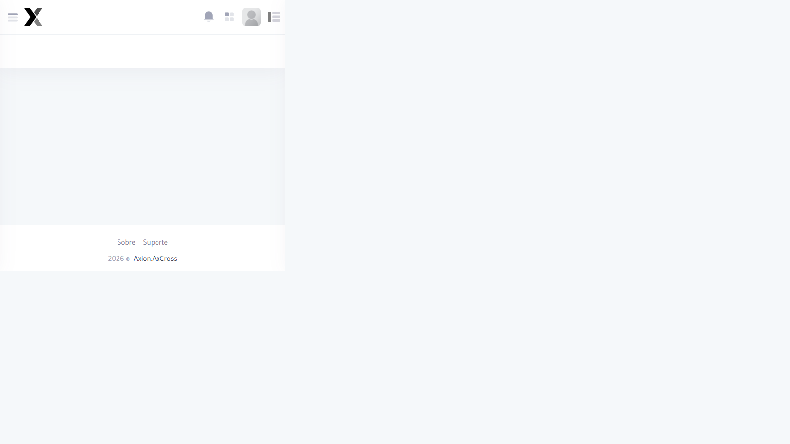

# Logs de Acesso

Registros de todas as ações realizadas pelos Usuários no sistema, permitindo auditoria completa de quem fez o quê e quando.

## Como acessar

No **menu lateral**, expanda **Administração** e clique em **Logs de acesso**.

## Informações registradas

| Campo | Descrição |
|-------|-----------|
| Usuário | Nome do Usuário que realizou a ação |
| **Data/Hora** | Momento exato do evento |
| **Ação** | Tipo de operação realizada Login Criação, Edição, Exclusão) |
| **Módulo** | Área do sistema onde a ação ocorreu |
| **Detalhe** | Descrição complementar da ação |
| **IP** | Endereço IP de onde partiu o acesso |

## Tipos de ação registrados

| Ação | Descrição |
|------|-----------|
| Login | Entrada no sistema |
| Logout | Saída do sistema |
| **Criar** | Inclusão de novo registro |
| **Editar** | Alteração de registro existente |
| **Excluir** | Remoção de registro |
| **Exportar** | Geração de Relatório ou exportação de dados |
| **Sincronizar** | Execução de sincronização de dados |

## Filtros disponíveis

| Filtro | Descrição |
|--------|-----------|
| **Período** | Data e hora do evento |
| **Usuário** | Filtrar por conta específica |
| **Ação** | Tipo de operação |
| **Módulo** | Área do sistema |

:::tip
O log de acesso é essencial para investigação de incidentes de segurança ou revisões de auditoria. Exporte regularmente para arquivamento.
:::

## Relacionado

- [Usuários](../usuarios)
- [Perfis de Acesso](../perfis-acesso)

| Filtro | Descrição |
|--------|-----------|
| Usuário | Filtrar por Usuário específico |
| **Data Início / Data Fim** | Período de consulta |
| **Ação** | Tipo de operação realizada |
| **Módulo** | Área do sistema |

## Passo a passo — Consultar logs

1. Acesse **Administração → Logs de acesso** no menu lateral
2. Defina o **período** de consulta
3. Opcionalmente, aplique filtros por Usuário **Ação** ou **Módulo**
4. Clique em **Pesquisar**
5. Para exportar, clique em **Excel**

:::tip Segurança
Os logs de acesso não podem ser editados ou excluídos por nenhum Usuário garantindo a integridade da trilha de auditoria.
:::

:::caution Retenção
Verifique a política de retenção de logs configurada em **Configurações do Sistema** para saber o período disponível para consulta.
:::

## Segurança

- Monitore acessos em horários incomuns (madrugada, fins de semana) e confirme com o responsável da conta
- Filtre por **Status = Falha** para identificar tentativas de acesso não autorizado — padrões repetidos do mesmo IP indicam ataque
- Os logs são imutáveis — nenhum usuário pode editá-los, garantindo a integridade da trilha de auditoria
- Exporte e arquive os logs mensalmente como parte do plano de conformidade e auditoria de segurança
