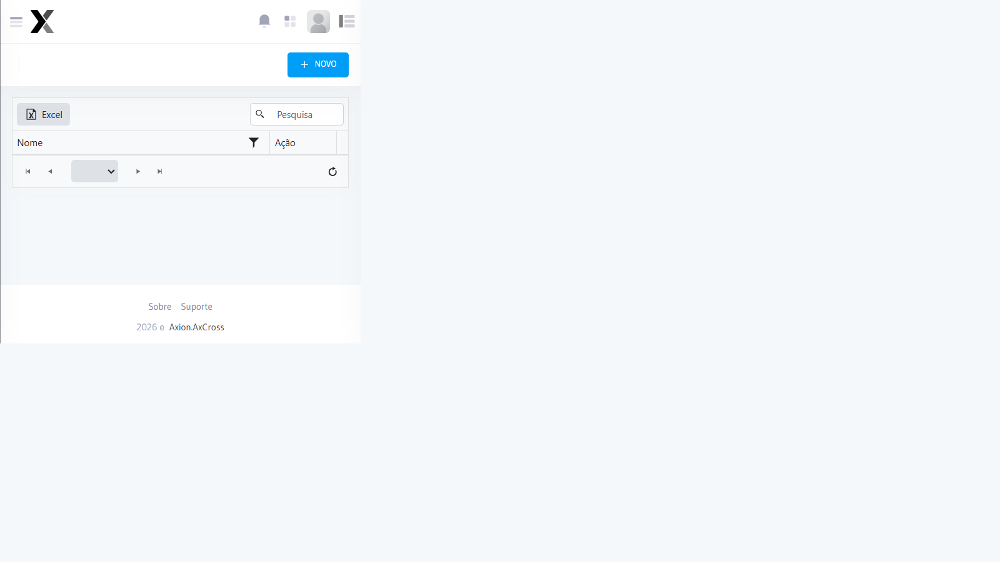

# Perfis de Acesso

Cadastro dos perfis de acesso que agrupam conjuntos de permissões para atribuição a Usuários

## Como acessar

No **menu lateral**, expanda **Administração** e clique em **Perfis de acesso**.

## Campos

| Campo | Obrigatório | Descrição |
|-------|:-----------:|-----------|
| **Nome do Perfil** | Sim | Nome identificador do perfil |
| **Descrição** | Não | Descrição das responsabilidades do perfil |
| **Status** | Sim | Ativo ou Inativo |

## Passo a passo — Criar novo perfil

1. Acesse **Administração → Perfis de acesso** no menu lateral
2. Clique em **Novo Perfil**
3. Informe o **Nome do Perfil** e opcionalmente uma **Descrição**
4. Clique em **Salvar**
5. Após salvar, configure as **Permissões de Acesso** do perfil

## Perfis padrão

| Perfil | Descrição |
|--------|-----------|
| **Administrador** | Acesso total a todos os módulos e Configurações |
| **Operador** | Acesso a monitoramento, operações e Relatórios |
| **Consulta** | Acesso somente leitura aos Relatórios |

:::info Importante
Perfis vinculados a Usuários ativos não podem ser excluídos. Inative o perfil para bloquear o acesso.
:::
