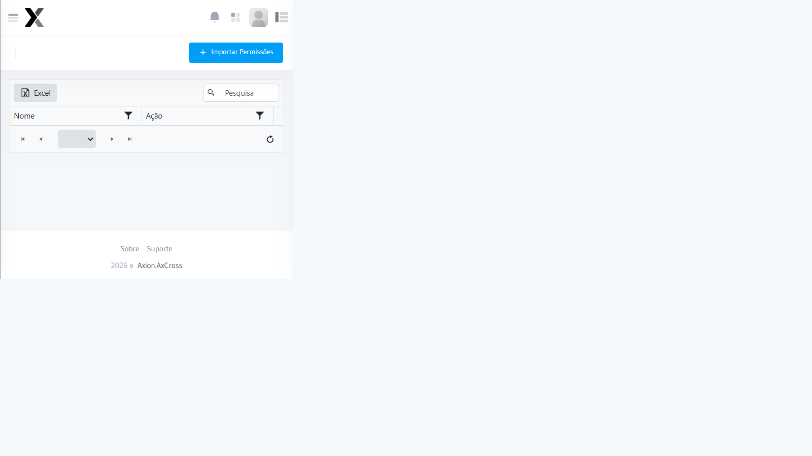

# Permissões de Acesso

Define quais funcionalidades cada perfil de acesso pode utilizar no sistema.  
As permissões são organizadas por **módulo** e cada ação representa uma operação específica que o usuário poderá ou não executar.

## Como acessar

No **menu lateral**, expanda **Administração** e clique em **Permissões de acesso**.

---

## Passo a passo — Configurar permissões

1. Acesse **Administração → Permissões de acesso** no menu lateral
2. Selecione o **Perfil de Acesso** a ser configurado
3. Para cada módulo, marque as permissões desejadas
4. Clique em **Salvar**

:::caution Permissão necessária
Apenas administradores com a permissão `accesspermission.edit` podem alterar as configurações de permissões.
:::

---

## Mapeamento completo de permissões por módulo

A seguir, todas as permissões disponíveis no sistema, com a descrição de **o que cada ação permite fazer operacionalmente**.

---

### 🔔 Alertas (`alert`)

Gerencia os alertas configurados para identificar veículos suspeitos ou em situação irregular durante o monitoramento.

| Permissão | Código | O que o usuário pode fazer |
|-----------|--------|---------------------------|
| Alertas — Index | `alert.index` | Visualizar a lista de alertas cadastrados |
| Alertas — Criar | `alert.create` | Cadastrar um novo alerta (ex.: veículo roubado, placa prioritária) |
| Alertas — Editar | `alert.edit` | Alterar critérios, nome ou vigência de um alerta existente |
| Alertas — Excluir | `alert.delete` | Remover permanentemente um alerta do sistema |

:::tip Exemplo operacional
O operador com `alert.create` consegue cadastrar um alerta para uma placa suspeita. Quando essa placa passar em qualquer equipamento monitorado, o sistema gera um evento imediato no Painel de Alertas.
:::

---

### 🗺️ Área (`area`)

Agrupa equipamentos por localização geográfica ou funcional, permitindo monitoramento segmentado por região ou corredor viário.

| Permissão | Código | O que o usuário pode fazer |
|-----------|--------|---------------------------|
| Área — Index | `area.index` | Visualizar as áreas cadastradas |
| Área — Criar | `area.create` | Criar uma nova área de monitoramento |
| Área — Editar | `area.edit` | Renomear ou alterar as propriedades de uma área |
| Área — Excluir | `area.delete` | Remover uma área (somente se não houver equipamentos vinculados) |
| Área — Adicionar Equipamentos Automaticamente | `area.addequipmentstoareaautomatically` | Adicionar todos os equipamentos de um critério (ex.: região) à área de uma só vez |
| Área — Excluir Equipamento da Área | `area.deletearealane` | Desvincular um equipamento específico de uma área |
| Área — Limpar Equipamentos da Área | `area.clearareaequipments` | Remover **todos** os equipamentos de uma área (ação em massa) |
| Área — Reordenar Sequência | `area.reordersequence` | Definir a ordem de exibição dos equipamentos dentro da área |

:::warning Atenção — Limpar Equipamentos
A permissão `area.clearareaequipments` remove **todos** os vínculos de equipamentos com a área. Conceda apenas a perfis técnicos ou de administração.
:::

---

### 🚗 Classificações dos Veículos (`vehicleclassification`)

Define as categorias de veículos reconhecidas pelo sistema (ex.: moto, carro, caminhão, ônibus), utilizadas na triagem de passagens e relatórios.

| Permissão | Código | O que o usuário pode fazer |
|-----------|--------|---------------------------|
| Classificações — Index | `vehicleclassification.index` | Visualizar as classificações cadastradas |
| Classificações — Criar | `vehicleclassification.create` | Adicionar uma nova categoria de veículo |
| Classificações — Editar | `vehicleclassification.edit` | Alterar o nome ou critérios de uma classificação |
| Classificações — Excluir | `vehicleclassification.delete` | Remover uma classificação não utilizada em passagens |

---

### ⚙️ Configurações do Sistema (`systemsettings`)

Controla o acesso às configurações globais do AxCross (parâmetros de operação, integrações, etc.).

| Permissão | Código | O que o usuário pode fazer |
|-----------|--------|---------------------------|
| Configurações — Index | `systemsettings.index` | Visualizar as configurações atuais do sistema |
| Configurações — Editar | `systemsettings.indexsettings` | Alterar parâmetros globais do sistema |

:::caution
Esta permissão deve ser restrita ao perfil **Administrador**. Alterações indevidas nas configurações podem afetar todo o funcionamento do sistema.
:::

---

### 📷 Equipamentos (`equipment`)

Gerencia os dispositivos físicos de captura (câmeras/leitores OCR) instalados nas vias.

| Permissão | Código | O que o usuário pode fazer |
|-----------|--------|---------------------------|
| Equipamentos — Index | `equipment.index` | Visualizar a lista de equipamentos cadastrados |
| Equipamentos — Criar | `equipment.create` | Cadastrar um novo equipamento (câmera, leitor) |
| Equipamentos — Editar | `equipment.edit` | Alterar dados do equipamento (localização, código, status) |
| Equipamentos — Excluir | `equipment.delete` | Remover um equipamento do sistema |
| Equipamentos — Criar Faixa | `equipment.lane` | Adicionar uma faixa de captura ao equipamento |
| Equipamentos — Excluir Faixa | `equipment.deletelane` | Remover uma faixa de captura específica |

:::tip Exemplo operacional
Um técnico de campo com `equipment.edit` pode atualizar as coordenadas GPS de um equipamento relocado, sem ter acesso para excluí-lo (`equipment.delete`).
:::

---

### 📦 Grupo de Equipamentos (`equipmentgroup`)

Organiza equipamentos em grupos lógicos para facilitar filtros e relatórios agrupados.

| Permissão | Código | O que o usuário pode fazer |
|-----------|--------|---------------------------|
| Grupo — Index | `equipmentgroup.index` | Visualizar os grupos cadastrados |
| Grupo — Criar | `equipmentgroup.create` | Criar um novo grupo de equipamentos |
| Grupo — Editar | `equipmentgroup.edit` | Renomear ou ajustar um grupo |
| Grupo — Excluir | `equipmentgroup.delete` | Remover um grupo (os equipamentos não são excluídos) |
| Grupo — Excluir Equipamento do Grupo | `equipmentgroup.deleteequipmentfromequipmentgroup` | Desvincular um equipamento específico do grupo |

---

### 📥 Importação de Veículos Monitorados (`vehiclemonitoredimport`)

Permite importar em massa listas de placas para o módulo de Veículos Monitorados via arquivo (CSV/Excel).

| Permissão | Código | O que o usuário pode fazer |
|-----------|--------|---------------------------|
| Importação — Index | `vehiclemonitoredimport.index` | Visualizar o histórico de importações realizadas |
| Importação — Criar | `vehiclemonitoredimport.create` | Realizar uma nova importação de placas |
| Importação — Editar | `vehiclemonitoredimport.edit` | Corrigir dados de uma importação pendente |
| Importação — Excluir | `vehiclemonitoredimport.delete` | Remover um lote de importação |

---

### 📤 Importar Equipamentos (`equipmentimport`)

Permite importar equipamentos em lote via arquivo, agilizando implantações com múltiplos dispositivos.

| Permissão | Código | O que o usuário pode fazer |
|-----------|--------|---------------------------|
| Importar Equipamentos — Index | `equipmentimport.index` | Acessar a tela de importação de equipamentos e executar o processo |

---

### 📋 Log de Acesso (`logaccess`)

Registro completo de acessos dos usuários ao sistema — quem acessou, quando e de onde.

| Permissão | Código | O que o usuário pode fazer |
|-----------|--------|---------------------------|
| Log de Acesso — Index | `logaccess.index` | Consultar o histórico de acessos de todos os usuários |

:::info Uso operacional
Utilize o Log de Acesso para auditorias de segurança, rastrear ações suspeitas e verificar o horário de acesso dos operadores.
:::

---

### 🫧 Mapa de Bolhas por Irregularidade (`irregularitybubblemap`)

Visualização geográfica com concentração de irregularidades por localização — útil para identificar pontos críticos na malha viária.

| Permissão | Código | O que o usuário pode fazer |
|-----------|--------|---------------------------|
| Mapa de Bolhas — Index | `irregularitybubblemap.index` | Acessar o mapa de bolhas |
| Mapa de Bolhas — Data | `irregularitybubblemap.data` | Carregar os dados de irregularidades para renderização do mapa |

---

### 🔗 Monitoramento de Grafo (`monitoringgraph`)

Exibe os vínculos e comboios de veículos detectados em múltiplos pontos de captura, revelando padrões de deslocamento.

| Permissão | Código | O que o usuário pode fazer |
|-----------|--------|---------------------------|
| Monitoramento de Grafo — Index | `monitoringgraph.index` | Acessar e visualizar o grafo de monitoramento de comboios |

---

### 🖥️ Monitoramento Online (`monitoring`)

Módulo central de operação em tempo real. Concentra a visualização ao vivo das passagens, alertas e status de câmeras.

| Permissão | Código | O que o usuário pode fazer |
|-----------|--------|---------------------------|
| Monitoramento — Index | `monitoring.index` | Acessar o módulo de monitoramento |
| Mapa de Equipamentos | `monitoring.equipmentmap` | Visualizar o mapa com status em tempo real de cada câmera |
| Monitoramento Online | `monitoring.monitoringonline` | Acompanhar passagens e alertas em tempo real com filtros |
| Mural — Visualizar | `monitoring.monitoringwall` | Acessar o mural de câmeras (grade de imagens ao vivo) |
| Mural — Listar Layouts | `monitoring.listlayouts` | Ver os layouts de mural salvos |
| Mural — Obter Layout | `monitoring.getlayout` | Carregar um layout específico |
| Mural — Marcar como Usado | `monitoring.markasused` | Definir o layout como ativo |
| Mural — Salvar Layout | `monitoring.savelayout` | Criar e salvar um novo layout de mural |
| Mural — Atualizar Layout | `monitoring.updatelayout` | Editar um layout existente |
| Mural — Excluir Layout | `monitoring.deletelayout` | Remover um layout salvo |
| Mural — Alertas do Layout | `monitoring.getlayoutalerts` | Visualizar os alertas associados ao layout ativo |

:::tip Exemplo operacional — Mural de Monitoramento
O supervisor cria um layout com as 8 câmeras mais críticas do corredor e salva como "Rodovia BR-153". O operador de plantão carrega esse layout e monitora apenas os pontos prioritários, sem precisar configurar a tela a cada turno.
:::

---

### 📊 Painel Analítico de Veículo (`vehicleanalytics`)

Análise aprofundada do histórico de um veículo específico — rota, passagens, alertas, heatmap de frequência.

| Permissão | Código | O que o usuário pode fazer |
|-----------|--------|---------------------------|
| Painel Analítico — Index | `vehicleanalytics.index` | Acessar o painel analítico |
| Resumo Rápido | `vehicleanalytics.quick` | Ver dados rápidos do veículo (última passagem, alertas ativos) |
| Sumário | `vehicleanalytics.summary` | Visualizar o resumo consolidado do histórico |
| Heatmap | `vehicleanalytics.heatmap` | Ver o mapa de calor com frequência de passagens por local |
| Linha do Tempo | `vehicleanalytics.timeline` | Acompanhar a cronologia de passagens do veículo |
| Rotas | `vehicleanalytics.routes` | Visualizar as rotas percorridas pelo veículo |
| Passagens | `vehicleanalytics.passages` | Listar todas as passagens registradas para o veículo |
| Alertas | `vehicleanalytics.alerts` | Ver alertas associados ao veículo pesquisado |

:::tip Exemplo operacional
O analista investiga um veículo suspeito: usa `vehicleanalytics.timeline` para ver todos os pontos onde ele foi flagrado e `vehicleanalytics.routes` para reconstruir o deslocamento nas últimas 24 horas.
:::

---

### 🚨 Painel de Alertas (`alertsummary`)

Visão consolidada de todos os alertas disparados no sistema.

| Permissão | Código | O que o usuário pode fazer |
|-----------|--------|---------------------------|
| Painel de Alertas — Index | `alertsummary.index` | Visualizar o painel resumo de alertas ativos e históricos |

---

### 👤 Perfil de Acesso (`accessprofile`)

Gerencia os perfis (grupos de permissões) que são atribuídos aos usuários.

| Permissão | Código | O que o usuário pode fazer |
|-----------|--------|---------------------------|
| Perfil — Index | `accessprofile.index` | Listar os perfis de acesso cadastrados |
| Perfil — Criar | `accessprofile.create` | Criar um novo perfil |
| Perfil — Editar | `accessprofile.edit` | Alterar o nome ou descrição de um perfil |
| Perfil — Excluir | `accessprofile.delete` | Remover um perfil sem usuários vinculados |

---

### 🔐 Permissões de Acesso (`accesspermission`)

Controla quais permissões individuais cada perfil possui. É o módulo mais sensível do sistema.

| Permissão | Código | O que o usuário pode fazer |
|-----------|--------|---------------------------|
| Permissões — Index | `accesspermission.index` | Visualizar as permissões configuradas para cada perfil |
| Permissões — Criar | `accesspermission.create` | Adicionar uma nova permissão a um perfil |
| Permissões — Editar | `accesspermission.edit` | Alterar uma permissão existente |
| Permissões — Excluir | `accesspermission.delete` | Remover uma permissão de um perfil |
| Permissões — Importar | `accesspermission.importaccesspermissions` | Importar um conjunto de permissões de outro perfil ou arquivo |

:::caution Permissão crítica
O conjunto `accesspermission.*` concede poder total sobre o controle de acesso. Atribua **somente ao perfil Administrador**.
:::

---

### 🔍 Rastreamento Por Placa (`platetracking`)

Permite pesquisar todas as passagens de um veículo específico por placa, em qualquer período e equipamento.

| Permissão | Código | O que o usuário pode fazer |
|-----------|--------|---------------------------|
| Rastreamento — Index | `platetracking.index` | Acessar e executar buscas de rastreamento por placa |

---

### 📈 Relatórios (`reports`)

Geração de relatórios analíticos com exportação em PDF/Excel.

| Permissão | Código | O que o usuário pode fazer |
|-----------|--------|---------------------------|
| Relatório de Ocorrências | `reports.occurrences` | Gerar relatório de ocorrências registradas |
| Mapeamento de Rotas | `reports.routemapping` | Gerar relatório de rotas percorridas por veículos |
| Relatório de Passagens | `reports.passages` | Gerar relatório de todas as passagens por filtro (período, equipamento, faixa) |
| Relatórios Exportados | `reports.reportsgenerated` | Acessar o histórico de relatórios já gerados e baixar novamente |
| Relatório Veículos Monitorados | `reports.vehiclemonitored` | Gerar relatório dos veículos cadastrados no monitoramento |

---

### 🔄 Sincronização de Passagens (`sync`)

Processo técnico que sincroniza os dados de passagens entre os bancos de dados Cassandra e Elasticsearch.

| Permissão | Código | O que o usuário pode fazer |
|-----------|--------|---------------------------|
| Sincronização — Index | `sync.index` | Visualizar o status e histórico de sincronizações |
| Sincronizar | `sync.syncpassagecassandratoelastic` | Executar a sincronização manual de passagens |

:::caution Uso técnico
Esta funcionalidade é destinada a **técnicos e administradores**. A sincronização indevida pode gerar inconsistências nos dados de passagens.
:::

---

### 🚦 Tipo de Ocorrência (`occurrencetype`)

Define os tipos de ocorrências que podem ser registradas no sistema (ex.: "Veículo Roubado", "Placa Adulterada", "Alerta Interpol").

| Permissão | Código | O que o usuário pode fazer |
|-----------|--------|---------------------------|
| Tipo de Ocorrência — Index | `occurrencetype.index` | Visualizar os tipos cadastrados |
| Tipo de Ocorrência — Criar | `occurrencetype.create` | Cadastrar um novo tipo de ocorrência |
| Tipo de Ocorrência — Editar | `occurrencetype.edit` | Alterar nome ou descrição de um tipo |
| Tipo de Ocorrência — Excluir | `occurrencetype.delete` | Remover um tipo não vinculado a ocorrências ativas |

---

### 👥 Usuários (`user`)

Gerenciamento de contas de acesso dos operadores ao sistema.

| Permissão | Código | O que o usuário pode fazer |
|-----------|--------|---------------------------|
| Usuários — Index | `user.index` | Listar todos os usuários cadastrados |
| Usuários — Criar | `user.create` | Criar um novo usuário |
| Usuários — Editar | `user.edit` | Alterar dados ou redefinir senha de um usuário |
| Usuários — Excluir | `user.delete` | Desativar ou remover um usuário do sistema |

---

### 🚙 Veículo Monitorado (`monitoredvehicle`)

Cadastro das placas que devem ser monitoradas e alertadas quando detectadas pelos equipamentos.

| Permissão | Código | O que o usuário pode fazer |
|-----------|--------|---------------------------|
| Veículo Monitorado — Index | `monitoredvehicle.index` | Visualizar a lista de veículos monitorados |
| Veículo Monitorado — Criar | `monitoredvehicle.create` | Cadastrar manualmente uma nova placa para monitoramento |
| Veículo Monitorado — Editar | `monitoredvehicle.edit` | Alterar dados de vigência ou tipo de alerta de um veículo |
| Veículo Monitorado — Excluir | `monitoredvehicle.delete` | Remover um veículo da lista de monitorados |
| Veículo Monitorado — Importar Placas | `monitoredvehicle.importvehicles` | Importar uma lista de placas via arquivo (CSV/Excel) |

:::tip Exemplo operacional
O agente de inteligência com `monitoredvehicle.create` e `monitoredvehicle.importvehicles` pode incluir uma lista recém-recebida de veículos suspeitos diretamente do sistema de inteligência policial, ativando o monitoramento imediatamente.
:::

---

## Perfis operacionais sugeridos

Com base no mapeamento completo de permissões, recomendamos a seguinte estrutura de perfis:

### 👑 Administrador — Acesso total

Responsável pela gestão completa do sistema. Possui todas as permissões.

**Permissões exclusivas deste perfil:**
- `systemsettings.*` — Configurações globais
- `accesspermission.*` — Controle de permissões
- `accessprofile.*` — Gestão de perfis
- `user.*` — Gestão de usuários
- `logaccess.index` — Auditoria de acessos
- `sync.*` — Sincronização de dados
- `equipmentimport.index` — Importação de equipamentos

---

### 🖥️ Operador de Monitoramento — Turno

Responsável pelo acompanhamento em tempo real. Não realiza cadastros ou configurações.

| Módulo | Permissões recomendadas |
|--------|------------------------|
| Monitoramento Online | `monitoring.index`, `monitoring.monitoringonline`, `monitoring.equipmentmap`, `monitoring.monitoringwall`, `monitoring.listlayouts`, `monitoring.getlayout`, `monitoring.markasused`, `monitoring.getlayoutalerts` |
| Painel de Alertas | `alertsummary.index` |
| Mapa de Bolhas | `irregularitybubblemap.index`, `irregularitybubblemap.data` |
| Monitoramento de Grafo | `monitoringgraph.index` |
| Painel Analítico | `vehicleanalytics.index`, `vehicleanalytics.quick`, `vehicleanalytics.summary`, `vehicleanalytics.timeline`, `vehicleanalytics.passages`, `vehicleanalytics.alerts` |
| Rastreamento por Placa | `platetracking.index` |

---

### 🔎 Analista / Investigador

Realiza pesquisas históricas, gera relatórios e analisa deslocamentos de veículos.

| Módulo | Permissões recomendadas |
|--------|------------------------|
| Painel Analítico | todas (`vehicleanalytics.*`) |
| Rastreamento por Placa | `platetracking.index` |
| Relatórios | todos (`reports.*`) |
| Mapa de Bolhas | `irregularitybubblemap.index`, `irregularitybubblemap.data` |
| Monitoramento de Grafo | `monitoringgraph.index` |
| Monitoramento Online | `monitoring.index`, `monitoring.monitoringonline` |
| Veículo Monitorado | `monitoredvehicle.index`, `monitoredvehicle.create`, `monitoredvehicle.edit`, `monitoredvehicle.importvehicles` |

---

### 🔧 Técnico de Campo

Realiza cadastros e manutenção de equipamentos. Sem acesso a dados operacionais sensíveis.

| Módulo | Permissões recomendadas |
|--------|------------------------|
| Equipamentos | `equipment.index`, `equipment.create`, `equipment.edit`, `equipment.lane`, `equipment.deletelane` |
| Grupo de Equipamentos | `equipmentgroup.index`, `equipmentgroup.create`, `equipmentgroup.edit` |
| Área | `area.index`, `area.edit`, `area.addequipmentstoareaautomatically`, `area.reordersequence` |
| Importar Equipamentos | `equipmentimport.index` |
| Monitoramento Online | `monitoring.index`, `monitoring.equipmentmap` |

---

### 📖 Consulta — Somente Leitura

Usuário com acesso mínimo para visualizar dados sem risco de alterações.

| Módulo | Permissões recomendadas |
|--------|------------------------|
| Relatórios | `reports.passages`, `reports.occurrences`, `reports.reportsgenerated` |
| Monitoramento | `monitoring.index`, `monitoring.monitoringonline` |
| Rastreamento | `platetracking.index` |
| Painel Analítico | `vehicleanalytics.index`, `vehicleanalytics.summary` |
