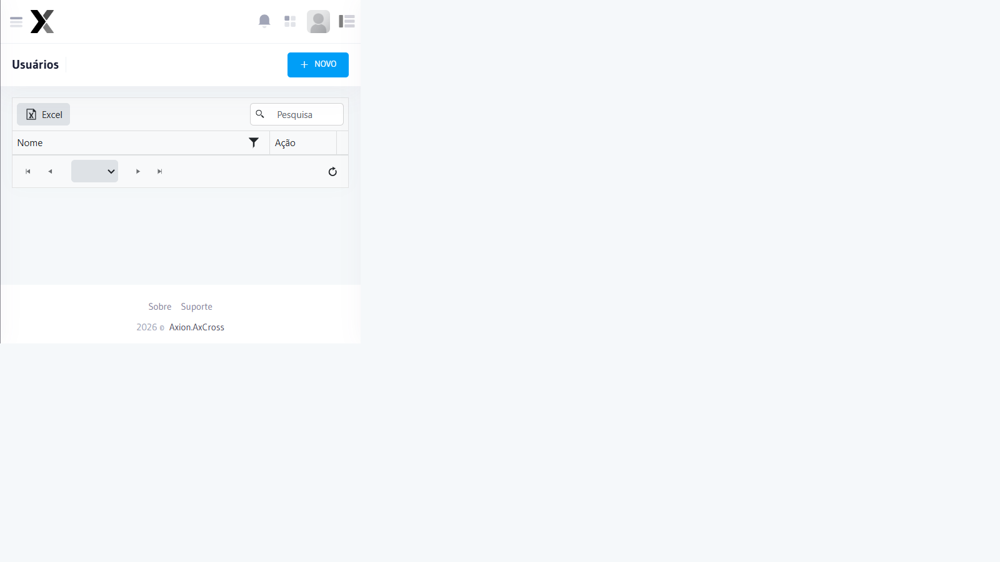

# Usuários

Cadastro e gestão dos Usuários que terão acesso ao sistema AxCross.

## Como acessar

No **menu lateral**, expanda **Administração** e clique em Usuários

## Campos

| Campo | Obrigatório | Descrição |
|-------|:-----------:|-----------|
| **Nome** | Sim | Nome completo do Usuário |
| Login | Sim | Nome de Usuário para acesso ao sistema |
| **E-mail** | Sim | E-mail para recuperação de senha e notificações |
| **Senha** | Sim | Senha de acesso (mínimo 6 caracteres) |
| **Perfil de Acesso** | Sim | Perfil que define as permissões do Usuário |
| **Status** | Sim | Ativo ou Inativo |

## Passo a passo — Criar novo Usuário

1. Acesse **Administração → Usuários no menu lateral
2. Clique em **Novo Usuário
3. Preencha **Nome**, Login e **E-mail**
4. Defina a **Senha** de acesso
5. Selecione o **Perfil de Acesso**
6. Clique em **Salvar**

:::warning Atenção
Ao inativar um Usuário ele perde imediatamente o acesso ao sistema. A operação pode ser revertida reativando o cadastro.
:::
