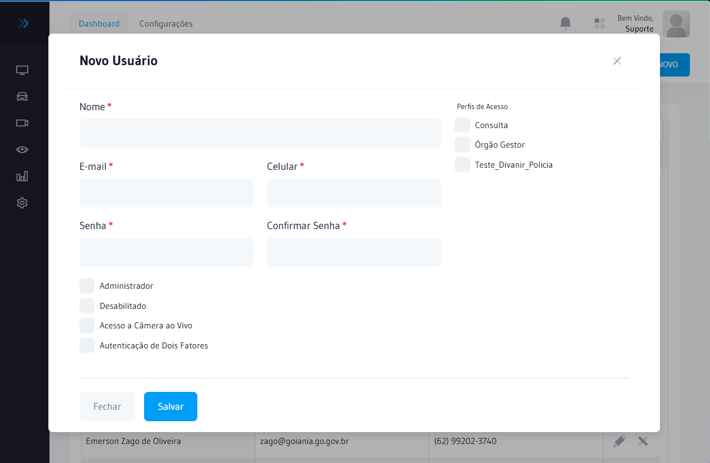

# Usuários

Cadastro e gestão dos usuários que terão acesso ao sistema AxCross. Todo usuário deve ter um **Perfil de Acesso** atribuído, que define exatamente quais funcionalidades ele pode acessar.

## Como acessar

No **menu lateral**, expanda **Configurações** e clique em **Usuários**.


:::info Permissão necessária
Para **visualizar**: `user.index`  
Para **criar**: `user.create`  
Para **editar**: `user.edit`  
Para **excluir**: `user.delete`
:::

---

## Campos

| Campo | Obrigatório | Descrição |
|-------|:-----------:|-----------|
| **Nome** | Sim | Nome completo do usuário |
| **Login** | Sim | Nome de usuário para acesso ao sistema (não pode ser alterado após criado) |
| **E-mail** | Sim | E-mail para recuperação de senha e notificações |
| **Senha** | Sim | Senha de acesso (mínimo 6 caracteres) |
| **Perfil de Acesso** | Sim | Perfil que define as permissões do usuário — consulte [Perfis de Acesso](perfis-acesso.md) |
| **Status** | Sim | Ativo ou Inativo |

---

## Passo a passo — Criar novo usuário



1. Acesse **Configurações → Usuários** no menu lateral
2. Clique em **Novo Usuário**
3. Preencha **Nome**, **Login** e **E-mail**
4. Defina a **Senha** de acesso
5. Selecione o **Perfil de Acesso** correspondente à função do usuário
6. Clique em **Salvar**

:::tip Criando o perfil antes do usuário
Crie primeiro o [Perfil de Acesso](perfis-acesso.md) com as permissões corretas. Só então cadastre o usuário e vincule ao perfil.
:::

---

## Passo a passo — Editar usuário

1. Na lista de usuários, localize o usuário e clique no ícone de edição ✏️
2. Altere os campos desejados (nome, e-mail, perfil ou status)
3. Para **redefinir a senha**, informe a nova senha no campo correspondente
4. Clique em **Salvar**

---

## Inativar usuário

Ao inativar um usuário ele perde **imediatamente** o acesso ao sistema. A operação pode ser revertida reativando o cadastro a qualquer momento.

**Quando usar:** colaborador que saiu da equipe, acesso temporário expirado ou suspeita de uso indevido da conta.

:::warning Atenção
Não exclua usuários que já realizaram operações no sistema. Prefira **inativar** para preservar o histórico de atividades no [Log de Acesso](logs-acesso.md).
:::

---

## Fluxo completo de criação de acesso

Para garantir que um novo operador tenha o acesso correto desde o primeiro login, siga esta ordem:

```
1. Definir a função do usuário (operador, analista, técnico...)
         ↓
2. Verificar se existe um Perfil de Acesso adequado
   → Se não existe: criar em Configurações → Perfis de Acesso
         ↓
3. Configurar as Permissões do perfil
   → Configurações → Permissões de Acesso
         ↓
4. Criar o Usuário e vincular ao perfil
   → Configurações → Usuários → Novo Usuário
         ↓
5. Informar o login e senha ao usuário
```

---

## Auditoria de acessos

Todas as entradas e saídas do sistema são registradas automaticamente. Para auditar:

- Acesse **Configurações → Logs de Acesso** (`logaccess.index`)
- Filtre por usuário e período para verificar atividades

Consulte [Logs de Acesso](logs-acesso.md) para detalhes.

## Segurança

- Nunca compartilhe credenciais entre usuários — cada pessoa deve ter login próprio para garantir rastreabilidade
- Inative imediatamente usuários que saíram da equipe ou que não acessam mais o sistema
- Atribua o perfil com **menor privilégio necessário** para a função — não use perfil de administrador para operações rotineiras

## Relacionado

- [Perfis de Acesso](./perfis-acesso) — Criação e configuração de perfis com conjuntos de permissões
- [Permissões de Acesso](./permissoes) — Controle granular por funcionalidade
- [Logs de Acesso](./logs-acesso) — Histórico de acessos e ações por usuário

## Perguntas frequentes

**Por que é recomendado inativar um usuário ao invés de excluí-lo quando ele sai da equipe?**
Excluir um usuário que já realizou operações remove a rastreabilidade do Log de Acesso. Inativando, o histórico de ações é preservado e o usuário perde imediatamente o acesso ao sistema sem comprometer a auditoria.

**Como redefinir a senha de um usuário que não consegue acessar o sistema?**
Acesse **Configurações → Usuários**, localize o usuário, clique em **Editar** e preencha o campo **Senha** com a nova senha temporária. Informe ao usuário e oriente-o a alterar no primeiro acesso.

**Um usuário pode ter mais de um perfil de acesso atribuído simultaneamente?**
Não. Cada usuário possui apenas um perfil de acesso vinculado. Se precisar de permissões de múltiplos perfis, crie um novo perfil personalizado que agrupe todas as permissões necessárias.

## Erros comuns

| Situação | Causa | Solução |
|----------|-------|----------|
| Usuário não consegue acessar | Campo **Status** inativo | Edite o cadastro e marque como **Ativo** |
| Login duplicado | Nome de usuário já existe | Use identificador único (e-mail ou código funcional) |
| Usuário não vê módulos esperados | Perfil sem permissão de visualização | Revise as permissões do perfil em **Configurações → Permissões** |
| Não é possível excluir usuário | Usuário tem registros vinculados | Inative em vez de excluir para preservar o histórico |

## Integração com outros módulos

| Módulo | Como se relaciona com Usuários |
|--------|--------------------------------|
| **Configurações → Perfis de Acesso** | Cada usuário deve ter um perfil vinculado que define suas permissões |
| **Configurações → Permissões** | As permissões do perfil determinam o que o usuário pode visualizar e fazer |
| **Logs de Acesso** | Registra cada acesso e ação realizada pelo usuário para auditoria |
| **Login** | O login cadastrado aqui é usado para autenticação na tela de Login |

## Perfis recomendados

| Perfil | Acesso sugerido | Função |
|--------|----------------|--------|
| **Administrador** | Total | Gestor do sistema e da equipe |
| **Operador de Monitoramento** | Monitoramento Online + Alertas | Acompanhamento em tempo real no plantão |
| **Analista / Investigador** | Painel Analítico + Relatórios | Análise histórica de veículos |
| **Técnico de Campo** | Cadastros + Status equipamentos | Instalação e manutenção |
| **Auditor externo** | Somente visualização | Auditoria de conformidade |

:::tip Princípio do mínimo privilégio
Atribua sempre o perfil com menor nível de acesso suficiente para a função. Consulte [Perfis de Acesso](perfis-acesso.md) para configurar as permissões de cada perfil.
:::
