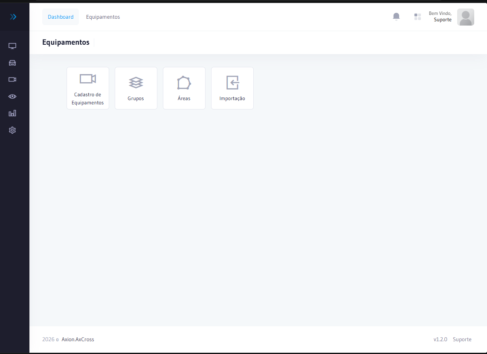
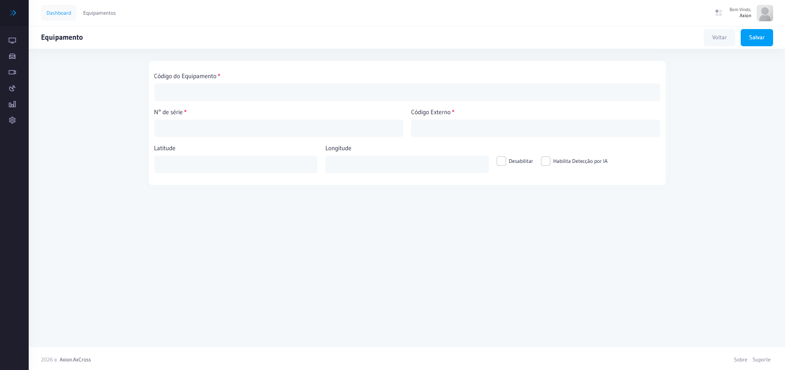
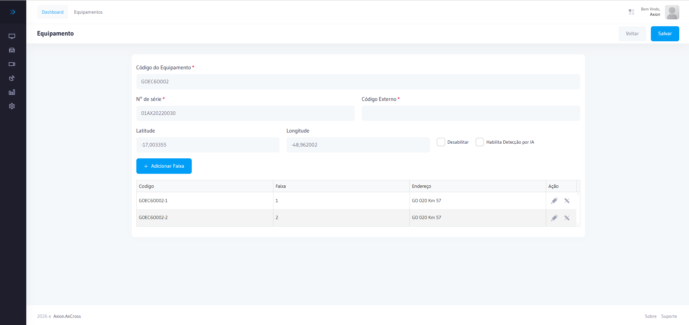
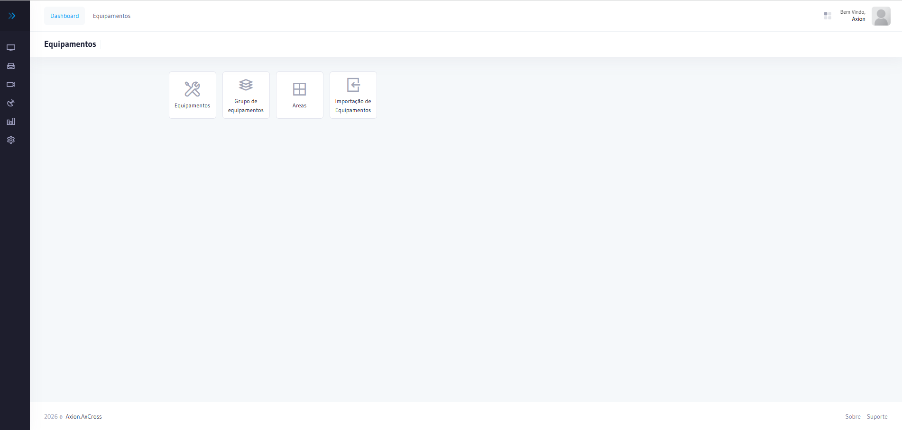
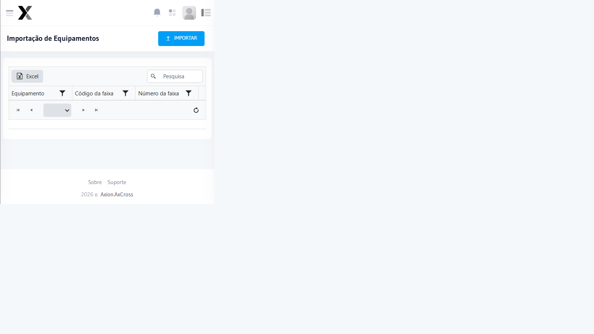
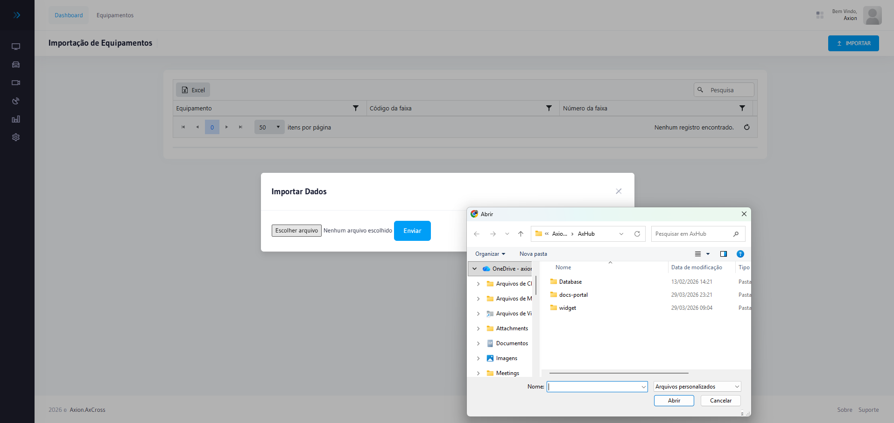
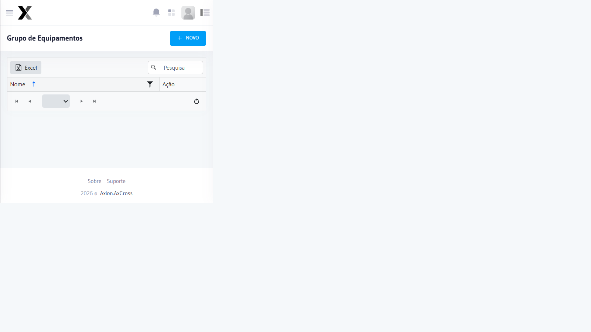
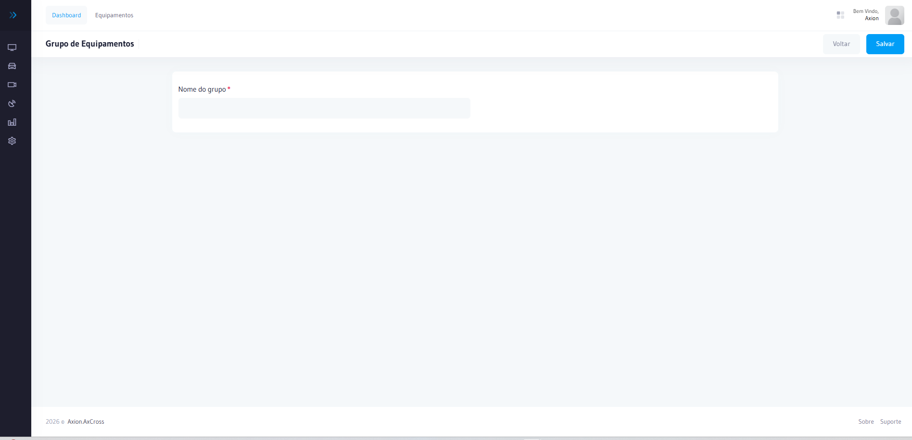

# Equipamentos

Cadastro e gestão dos Equipamentos de fiscalização instalados nos cruzamentos monitorados.

## Como acessar

No **menu lateral**, expanda **Cadastros** e clique em Equipamentos

## Campos

| Campo | Obrigatório | Descrição |
|-------|:-----------:|-----------|
| **Nome** | Sim | Nome identificador do Equipamento |
| **Tipo** | Sim | Câmera, Detector, Sensor, Radar |
| **Modelo** | Sim | Modelo do Equipamento |
| **Fabricante** | Sim | Fabricante do Equipamento |
| **Número de Série** | Sim | Número de série do Equipamento |
| **Local** | Sim | Cruzamento onde está instalado |
| **IP** | Não | Endereço IP para comunicação |
| **Status** | Sim | Online, Offline, Manutenção |

## Passo a passo — Cadastrar novo Equipamento

1. Acesse **Cadastros → Equipamentos no menu lateral
2. Clique em **Novo Equipamento
3. Preencha **Nome**, **Tipo**, **Modelo** e **Fabricante**
4. Informe o **Número de Série**
5. Selecione o **Local** (cruzamento) de instalação
6. Opcionalmente, informe o **IP** do Equipamento
7. Clique em **Salvar**

:::warning Atenção
Equipamentos vinculados a operações ativas não podem ser desativados.
:::

## Importação em lote

1. Acesse **Cadastros → Equipamentos** no menu lateral
2. Clique em **Importar**
3. Selecione o arquivo CSV com os dados dos Equipamentos
4. Confirme a importação

---

## Grupos de Equipamentos

Agrupamento lógico de Equipamentos para facilitar a gestão e o monitoramento de conjuntos relacionados (por exemplo, Equipamentos de uma mesma região ou tipo de fiscalização).

### Campos

| Campo | Obrigatório | Descrição |
|---|:---:|---|
| **Nome** | Sim | Nome identificador do grupo |
| **Descrição** | Não | Descrição do propósito do grupo |
| **Equipamentos** | Sim | Lista de Equipamentos vinculados ao grupo |
| **Status** | Sim | Ativo ou Inativo |

### Criar novo grupo

1. Acesse **Cadastros → Grupos de Equipamentos** no menu lateral
2. Clique em **Novo Grupo**
3. Informe o **Nome** do grupo
4. Opcionalmente, adicione uma **Descrição**
5. Selecione os Equipamentos a vincular ao grupo
6. Clique em **Salvar**

:::tip Dica
Grupos de Equipamentos facilitam o monitoramento simultâneo de vários pontos de fiscalização, permitindo visualizar o status de todos os Equipamentos de um conjunto de uma só vez.
:::

---

## Áreas

As **Áreas** permitem delimitar regiões geográficas no mapa e associar automaticamente os Equipamentos que estão dentro do perímetro desenhado. É útil para organizar o monitoramento por zonas, setores ou regiões da cidade.

### Campos

| Campo | Obrigatório | Descrição |
|---|:---:|---|
| **Nome** | Sim | Nome identificador da área (ex.: CENTRAL, NORTE, SUL) |
| **Código da Área** | Sim | Código numérico único da área |
| **Cor** | Sim | Cor de identificação visual da área no mapa |

### Como funciona

A tela de Área é dividida em duas partes:

- **Mapa (esquerda)** — permite desenhar o perímetro da área diretamente sobre o mapa. Os Equipamentos localizados dentro da região selecionada são identificados automaticamente.
- **Equipamento das Áreas (direita)** — tabela que exibe todos os Equipamentos pertencentes à área selecionada no mapa, com o **Código**, quantidade de **Faixas** e o **Endereço** de cada Equipamento.

### Cadastrar nova área

1. Acesse **Cadastros → Áreas** no menu lateral
2. Clique em **Nova Área**
3. Informe o **Nome** e o **Código da Área**
4. Selecione a **Cor** de identificação
5. No mapa, clique em **Editar** para entrar no modo de desenho
6. Delimite o perímetro da área clicando no mapa para definir os vértices da região
7. O sistema preenche automaticamente a grade **Equipamento das Áreas** com os Equipamentos dentro do perímetro
8. Clique em **Salvar**

### Editar área existente

1. Localize a área na lista e clique no ícone de edição ✏️
2. Clique em **Editar** no mapa para reconfigurar o perímetro
3. Para limpar o desenho atual, clique em **Limpar**
4. Redesenhe o perímetro conforme necessário
5. Clique em **Salvar**

### Equipamento das Áreas

A grade lateral exibe em tempo real os Equipamentos contidos no perímetro desenhado:

| Coluna | Descrição |
|---|---|
| **Código** | Código do Equipamento (ex.: GYN7M719) |
| **Faixas** | Número de faixas monitoradas pelo Equipamento |
| **Endereço** | Localização do Equipamento (via/avenida) |

:::info Atualização automática
Ao editar o perímetro no mapa, a lista de **Equipamento das Áreas** é atualizada automaticamente para refletir os Equipamentos que entram ou saem da região delimitada.
:::

---

## Importação via AxHub

O AxCross permite importar automaticamente os dados de configuração dos Equipamentos já cadastrados no **AxHub**, eliminando a necessidade de recadastro manual. Esse processo aproveita as informações que já existem no cadastro de operações do AxHub, como nome, local, faixas e tipo de Equipamento.

### Cadastro de Operações no AxHub

Os dados importados pelo AxCross têm origem no **Cadastro de Operações** do AxHub, acessível pelo caminho:

**Menu Operações → Cadastro de Operações**

O Cadastro de Operações do AxHub reúne todos os Equipamentos e suas configurações operacionais (locais, faixas, velocidade máxima, modelo, etc.). Ao importar esses dados para o AxCross, o operador garante que ambos os sistemas trabalham com as mesmas referências de infraestrutura.

### Como realizar a importação

1. Acesse **Cadastros → Equipamentos** no menu lateral
2. Clique em **Importar**
3. Selecione o arquivo de configuração exportado pelo AxHub (formato CSV)
4. Confirme a importação

:::info Integração AxHub → AxCross
A importação sincroniza os dados cadastrais dos Equipamentos. Após a importação, revise os registros e ajuste configurações específicas do AxCross (como alertas e áreas) conforme necessário.
:::

---

## Locais

Cadastro dos cruzamentos e pontos monitorados pelo sistema AxCross. Um **Local** representa o endereço físico onde os Equipamentos estão instalados.

### Campos

| Campo | Obrigatório | Descrição |
|---|:---:|---|
| **Nome** | Sim | Nome identificador do local |
| **Endereço** | Sim | Endereço completo do cruzamento |
| **Latitude** | Não | Coordenada geográfica (latitude) |
| **Longitude** | Não | Coordenada geográfica (longitude) |
| **Município** | Sim | Município onde o local está situado |
| **UF** | Sim | Unidade Federativa |
| **Status** | Sim | Ativo ou Inativo |

### Cadastrar novo local

1. Acesse **Cadastros → Locais** no menu lateral
2. Clique em **Novo Local**
3. Preencha o **Nome** e **Endereço**
4. Informe **Município** e **UF**
5. Opcionalmente, informe **Latitude** e **Longitude** para geolocalização
6. Clique em **Salvar**

:::tip Dica
Com as coordenadas geográficas preenchidas, o local será exibido no mapa do monitoramento online.
:::

---

## Faixas

Configuração das faixas de monitoramento em cada cruzamento. Cada faixa representa uma via monitorada por Equipamentos de fiscalização.

### Campos

| Campo | Obrigatório | Descrição |
|---|:---:|---|
| **Local** | Sim | Cruzamento onde a faixa está localizada |
| **Número da Faixa** | Sim | Identificador numérico da faixa |
| **Sentido** | Sim | Sentido do fluxo (Norte, Sul, Leste, Oeste) |
| **Equipamento** | Sim | Equipamento vinculado à faixa |
| **Velocidade Máxima** | Não | Velocidade máxima regulamentada (km/h) |
| **Status** | Sim | Ativa ou Inativa |

### Cadastrar nova faixa

1. Acesse **Cadastros → Faixas** no menu lateral
2. Clique em **Nova Faixa**
3. Selecione o **Local** (cruzamento)
4. Informe o **Número da Faixa** e **Sentido**
5. Vincule o Equipamento responsável pelo monitoramento
6. Opcionalmente, defina a **Velocidade Máxima**
7. Clique em **Salvar**

:::info Dependência
Para cadastrar uma faixa, é necessário que o **Local** e o **Equipamento** já estejam cadastrados no sistema.
:::
