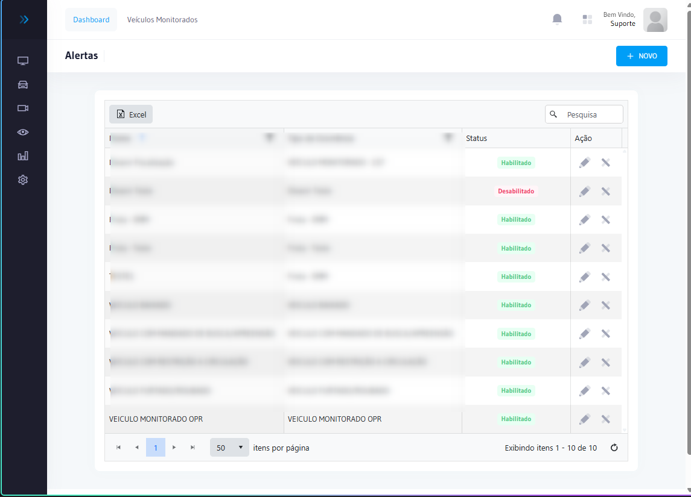
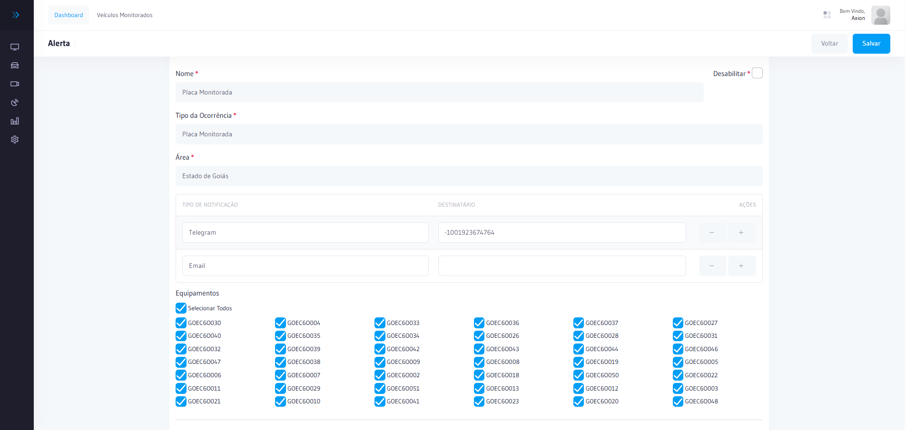
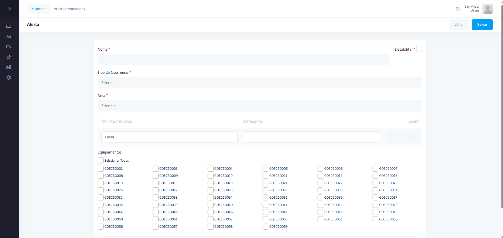
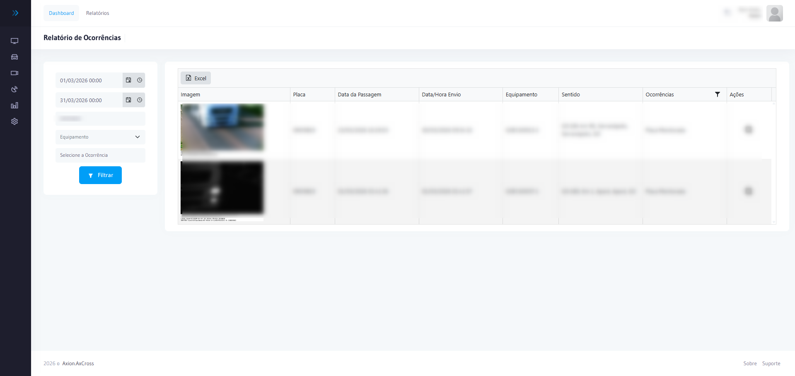

---
sidebar_position: 3
title: Alertas
description: Gestão de alertas e ocorrências no AxCross — como visualizar, tratar e criar alertas operacionais
---

# Alertas

Os alertas registram eventos detectados pelo sistema que exigem atenção da equipe operacional. Podem ser gerados **automaticamente** (detecção de veículo monitorado, tempo na mancha, comboio) ou **registrados manualmente** pelo operador durante a fiscalização.

## Como acessar

No **menu lateral**, clique em **Alertas**.  
O módulo também está acessível pelo atalho na tela de [Dashboard Principal](../primeiros-passos/dashboard.md).

:::info Permissão necessária
Para **visualizar** alertas: `alert.index`  
Para **criar** alertas manuais: `alert.create`  
Para **editar** alertas: `alert.edit`  
Para **excluir** alertas: `alert.delete`
:::

---

## Tipos de alerta

| Tipo | Origem | Descrição |
|------|--------|-----------|
| **Veículo Monitorado** | Automático | Placa cadastrada como monitorada foi detectada por um equipamento |
| **MANCHA01 — Tempo na Mancha** | Automático | Veículo permaneceu em área monitorada além do tempo máximo configurado |
| **COMBOIO01** | Automático | Grupo de veículos detectado viajando em conjunto (requer Neo4j ativo) |
| **Equipamento Offline** | Automático | Equipamento sem comunicação além do tempo limite configurado |
| **Falha de Imagem** | Automático | Equipamento detectou passagem, mas sem imagem registrada |
| **Ocorrência Manual** | Manual | Evento registrado pelo operador durante a fiscalização |

---

## Colunas da lista de alertas

| Coluna | Descrição |
|--------|-----------|
| **Data/Hora** | Momento do disparo do alerta |
| **Placa** | Placa do veículo associado ao alerta (quando aplicável) |
| **Tipo de Ocorrência** | Categoria do alerta (ex.: Veículo Monitorado, MANCHA01) |
| **Local / Equipamento** | Cruzamento e câmera que registraram a detecção |
| **Status** | Aberto, Em tratativa, Resolvido ou Descartado |
| **Responsável** | Operador que assumiu a tratativa |

---

## Ações disponíveis

| Ação | Descrição | Quando usar |
|------|-----------|-------------|
| **Visualizar** | Abrir detalhes do alerta com imagem, dados da passagem e histórico | Sempre que houver um alerta novo |
| **Assumir** | Registrar o operador responsável pela tratativa | Antes de agir sobre o alerta |
| **Resolver** | Marcar como resolvido após a ação tomada | Após verificar e tratar o alerta |
| **Descartar** | Ignorar o alerta com justificativa registrada | Falso positivo ou duplicidade |

:::tip Fluxo operacional recomendado
1. **Visualizar** o alerta → verificar placa, imagem e local
2. **Assumir** → para que a equipe saiba que está sendo tratado
3. Tomar a ação necessária (comunicar, registrar BO, acionar viatura, etc.)
4. **Resolver** com registro da ação realizada
:::

---

## Criar novo alerta manualmente

Use esta função para registrar ocorrências identificadas em campo que não foram detectadas automaticamente pelo sistema.

1. Na tela de Alertas, clique em **Novo Alerta**
2. Selecione o **Tipo de Ocorrência** (cadastrado em [Tipos de Ocorrências](tipos-ocorrencias.md))
3. Informe a **Placa** do veículo (se aplicável)
4. Selecione o **Equipamento** e **Faixa** relacionados
5. Descreva a **Ocorrência** com detalhes do evento
6. Clique em **Salvar**

:::info Permissão necessária
Apenas usuários com `alert.create` conseguem cadastrar alertas manualmente.
:::

---

## Painel de Alertas

Além da lista detalhada, o sistema disponibiliza o **Painel de Alertas** (`alertsummary.index`) — uma visão consolidada com os totais de alertas por tipo, status e período, ideal para o acompanhamento do supervisor de operações.

---

## Relatório de Ocorrências

Para consultar e exportar o histórico completo de ocorrências com filtros por período, placa, tipo e equipamento:

Acesse **Relatórios → Ocorrências** no menu lateral. Consulte [Relatório de Ocorrências](../relatorios/ocorrencias-alertas.md) para instruções detalhadas.

:::tip Dica
Use o Relatório de Ocorrências para consolidar tratativas realizadas durante operações de fiscalização e gerar evidências documentadas.
:::

## Erros comuns

| Erro | Causa | Solução |
|------|-------|----------|
| Alerta não gerado para veículo monitorado | Placa não cadastrada em Veículos Monitorados | Verificar a lista de Veículos Monitorados e incluir a placa |
| Alerta gerado incorretamente (falso positivo) | OCR leu a placa incorretamente | Verificar a qualidade das imagens e alinhar a câmera |
| Notificação sonora não funciona | Permissão de áudio bloqueada no navegador | Habilitar som nas configurações do navegador para o domínio |

## Perguntas frequentes

**Qual a diferença entre um alerta automático e uma ocorrência manual no AxCross?**
Alertas automáticos são gerados pelo sistema quando detecta eventos configurados (veículo monitorado, tempo na mancha, equipamento offline). Ocorrências manuais são registradas pelo operador para documentar eventos identificados em campo que o sistema não detectou automaticamente.

**Como tratar corretamente um alerta de veículo monitorado detectado pelo sistema?**
Siga o fluxo: **Visualizar** o alerta para verificar a imagem e confirmar a placa, **Assumir** para registrar sua responsabilidade, tome a ação necessária (comunicar à equipe de campo, acionar viatura, registrar BO) e por fim **Resolver** com descrição da ação realizada.

**Por que um alerta de MANCHA01 é gerado para veículos que não estão em situação irregular?**
O alerta MANCHA01 é baseado em tempo de permanência na área monitorada, não em irregularidade do veículo. Qualquer veículo que permaneça além do tempo máximo configurado dispara o alerta. Revise o tempo limite configurado nas **Vigencias de Alertas** se o número de falsos positivos estiver alto.

## Integração com outros módulos

| Módulo | Como se relaciona com Alertas |
|--------|-------------------------------|
| **Operações → Veículos Monitorados** | A lista de veículos monitorados é a base dos alertas — quando detectado, gera ocorrência |
| **Operações → Vigência de Alertas** | Define períodos de validade dos alertas por tipo e placa |
| **Relatórios → Ocorrências e Alertas** | Consolida o histórico de alertas gerados para exportação e prestação de contas |
| **Monitoramento Online** | Alertas ativos aparecem em tempo real no painel de monitoramento |

## Tabela de referência rápida

| Situação | Ação recomendada | Resultado esperado |
|----------|:----------------:|-------------------|
| Alerta de veículo furtado/roubado detectado | Assumir imediatamente + acionar viatura | Ocorrência registrada com descrição da ação; alerta resolvido |
| Alerta MANCHA01 (tempo na área excedido) | Verificar imagem + consultar rastreamento de placas | Comportamento suspeito confirmado ou descartado com justificativa |
| Alerta COMBOIO01 gerado pelo Neo4j | Analisar Grafos de Comboio para confirmar padrão | Grupo de veículos monitorado ou ocorrência encerrada |
| Alerta de equipamento offline | Acionar equipe técnica imediatamente | Equipamento restaurado; passagens do período verificadas |
| Falso positivo frequente (OCR errado) | Verificar alinhamento da câmera + limpar lente | Taxa de reconhecimento melhora; alertas inválidos reduzem |

