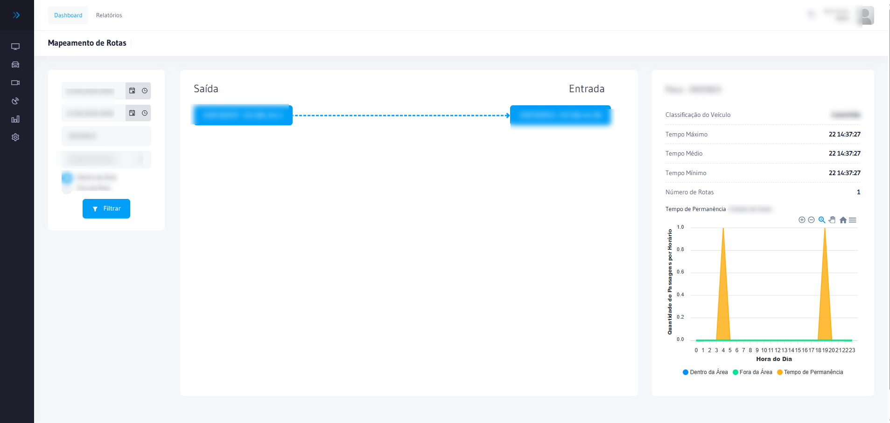

# Cadastro de Operações

Permite criar e gerenciar operações de fiscalização, definindo local, período, Equipamentos e parâmetros de monitoramento.

## Como acessar

No **menu lateral**, clique em **Operações**.

## Campos

| Campo | Obrigatório | Descrição |
|-------|:-----------:|-----------|
| **Nome** | Sim | Nome identificador da operação |
| **Local** | Sim | Cruzamento onde a operação será realizada |
| **Data Início** | Sim | Data/hora de início |
| **Data Fim** | Não | Data/hora de encerramento |
| **Equipamentos** | Sim | Câmeras participantes |
| **Responsável** | Não | Agente responsável |

## Passo a passo

1. Acesse **Operações**
2. Clique em **+ Nova Operação**
3. Preencha o **Nome**, **Local** e **Data Início**
4. Adicione os **Equipamentos** participantes
5. Clique em **Salvar**

:::tip
Uma operação ativa vincula todas as passagens dos equipamentos selecionados ao contexto da fiscalização, facilitando a exportação e relatórios.
:::

## Relacionado

- [Alertas](./alertas)
- [Passagens](../relatorios/passagens)
- [Ocorrências e Alertas](../relatorios/ocorrencias-alertas)

| **Status** | Sim | Ativa, Pausada ou Encerrada |
| **Observações** | Não | Informações complementares |

## Passo a passo — Criar nova operação

1. Acesse **Operações** no menu lateral
2. Clique em **Nova Operação**
3. Preencha o **Nome** da operação
4. Selecione o **Local** (cruzamento)
5. Defina **Data Início** e **Data Fim**
6. Clique em **Salvar**

## Ações disponíveis

| Ação | Descrição |
|------|-----------|
| **Editar** | Alterar dados da operação |
| **Pausar** | Suspender temporariamente a operação |
| **Encerrar** | Finalizar a operação |
| **Excluir** | Remover operação (somente se não houver registros vinculados) |

:::warning Atenção
Operações com registros de passagem vinculados não podem ser excluídas, apenas encerradas.
:::

## Boas práticas

- Defina um **Nome** descritivo que identifique o local e o objetivo da operação (ex.: *Fiscalização Av. Paulista — Jul/2026*)
- Vincule somente os equipamentos ativos no período da operação para evitar registros de passagem em equipamentos inativos
- **Encerre** a operação assim que concluída — operações abertas continuam recebendo passagens e podem distorcer relatórios futuros
- Use o campo **Responsável** para rastrear qual agente conduziu a fiscalização em cada ponto

## Fluxo de criação de operação

1. Confirmar que os **Equipamentos** a incluir estão ativos e com status Online
2. Acessar **Operações** no menu lateral
3. Clicar em **Nova Operação**
4. Preencher **Nome**, **Local** e **Data Início**
5. Vincular os **Equipamentos** participantes
6. Clicar em **Salvar**
7. Durante a fiscalização: monitorar via [Monitoramento Online](./monitoramento-online)
8. Ao encerrar: clicar em **Encerrar** para fechar o período da operação

## Tabela de referência — status de operações

| Status | Descrição | Passagens registradas? |
|--------|-----------|:----------------------:|
| **Ativa** | Em andamento, recebendo dados | Sim |
| **Pausada** | Suspensa temporariamente | Não |
| **Encerrada** | Concluída, período fechado | Não |

## Erros comuns

| Problema | Causa | Solução |
|----------|-------|----------|
| Passagens não aparecem na operação | Equipamento não vinculado | Editar operação e adicionar o equipamento |
| Operação não pode ser excluída | Há registros vinculados | Encerrar a operação em vez de excluir |
| Dados distorcidos no relatório | Operação aberta além do prazo | Encerrar a operação na data correta |
| Equipamento inativo na operação | Status offline durante a operação | Verificar conectividade do equipamento |

## Relacionado

- [Alertas](./alertas)
- [Veículos Monitorados](./veiculos-monitorados)
- [Relatório de Passagens](../relatorios/relatorio-passagens)

## Perguntas frequentes

**O que acontece com as passagens registradas quando encerro uma operação?**
As passagens ficam permanentemente vinculadas à operação encerrada e contínuam acessíveis nos relatórios com o período correto. Após o encerramento, nenhuma nova passagem é adicionada à operação, mesmo que os equipamentos continuem capturando.

**Posso ter múltiplas operações ativas simultaneamente no mesmo local?**
Sim, mas é uma prática que deve ser evitada. Operações sobrepostas no mesmo cruzamento podem gerar ambiguidade nos relatórios e dificultar a análise por período. Encerre a operação anterior antes de iniciar uma nova para o mesmo local.

**Por que não consigo excluir uma operação que criei por engano?**
O sistema impede a exclusão de operações que já possuem registros de passagem vinculados. Nesse caso, encerre a operação informando a data correta de fim. Para operações sem nenhum registro, a exclusão é permitida.
- [Ocorrências e Alertas](../relatorios/ocorrencias-alertas)
