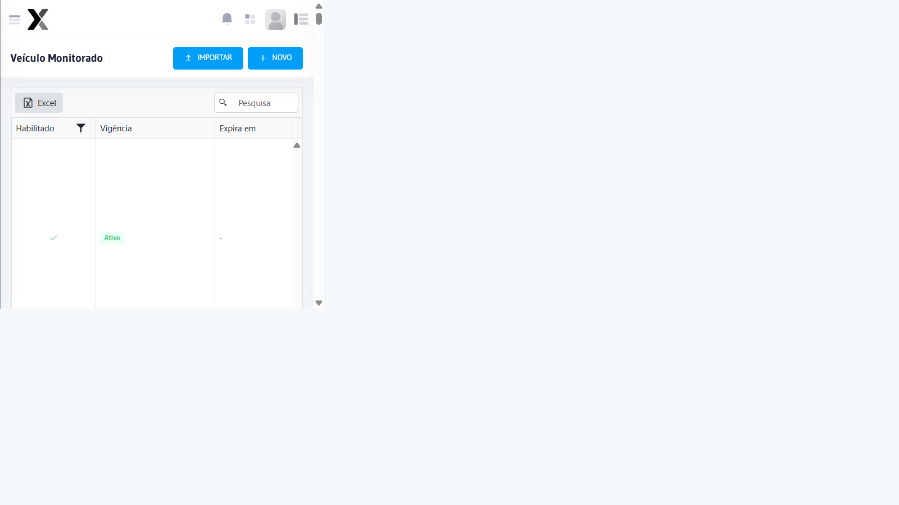
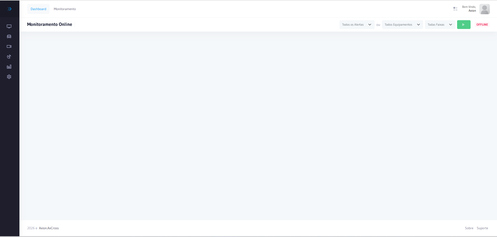
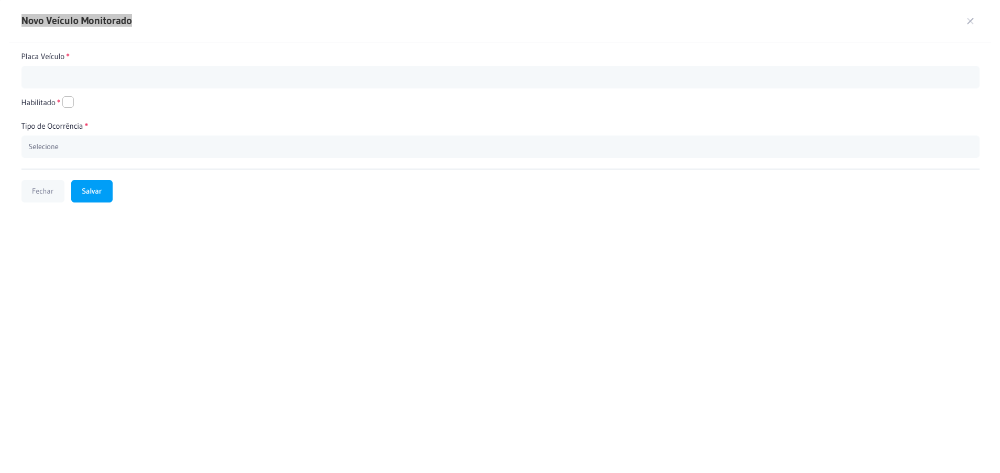
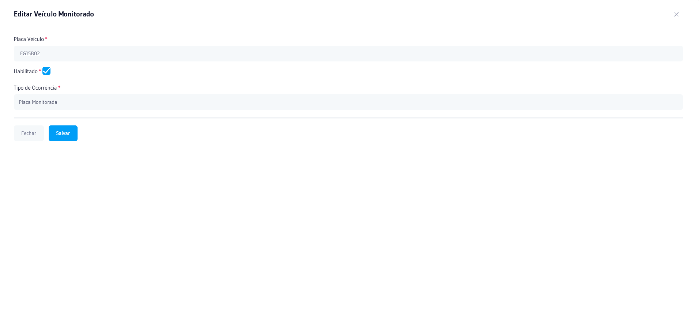
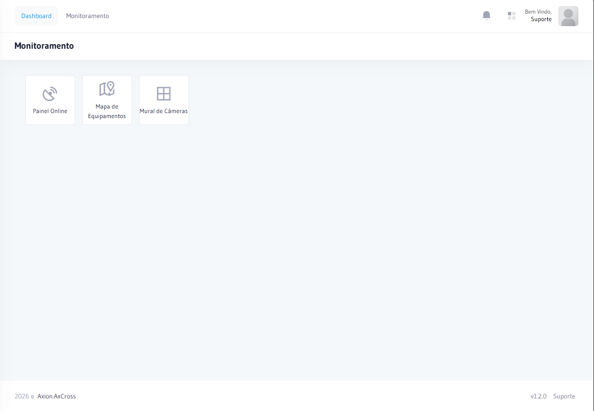
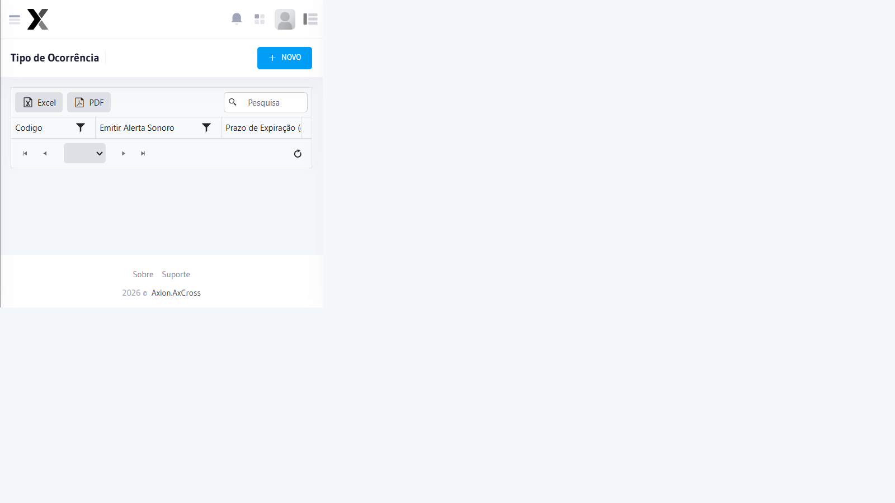
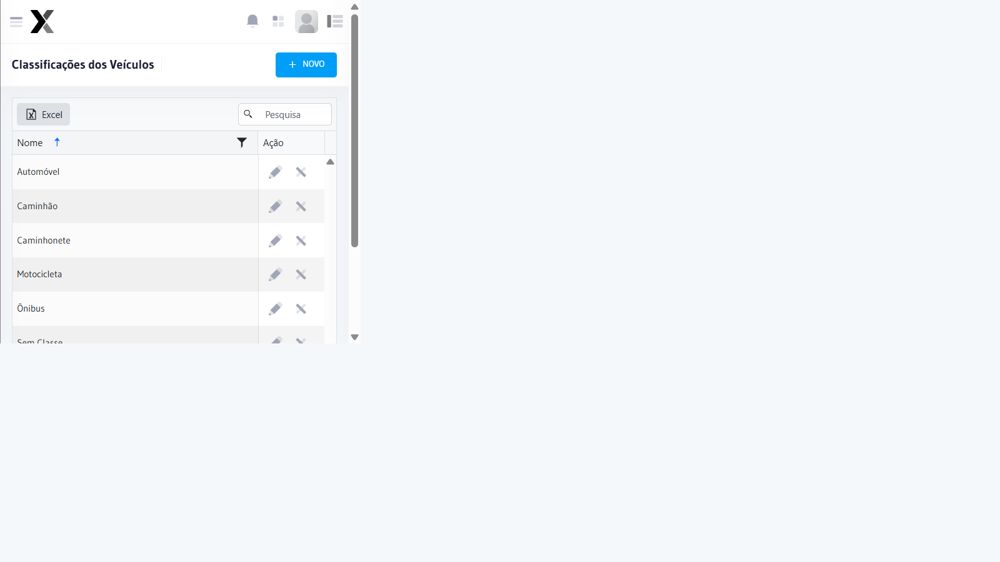
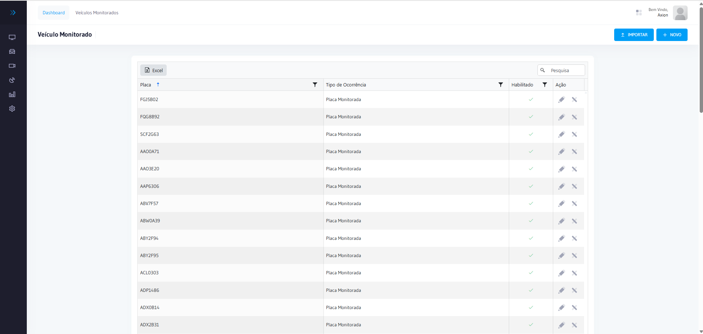
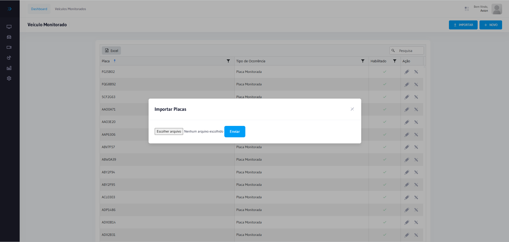
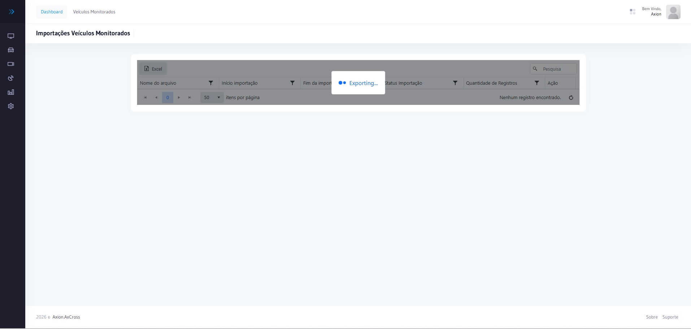

# Veículos Monitorados

O módulo **Veículos Monitorados** permite registrar placas e veículos de interesse para monitoramento especial. Quando um veículo cadastrado é detectado em qualquer cruzamento, o sistema gera um alerta automático para a equipe operacional.

## Como acessar

No **menu lateral**, clique em **Veículos Monitorados**.

O módulo é composto pelos seguintes submódulos:

| Submódulo | Descrição |
|-----------|-----------|
| [**Veículos Monitorados**](#lista-de-veiculos) | Cadastro e consulta das placas monitoradas |
| [**Tipos de Ocorrências**](#tipos-de-ocorrencias) | Categorias de ocorrência para alertas |
| [**Alertas**](#alertas-gerados) | Alertas gerados automaticamente e gestão de ocorrências |
| [**Classificações dos Veículos**](#classificacoes-dos-veiculos) | Tipos e categorias de veículos |
| [**Importação de Monitorados**](#importacao-em-lote) | Importar lista de placas via CSV |

---

## Lista de Veículos Monitorados {#lista-de-veiculos}

Exibe todos os veículos cadastrados para monitoramento, com filtros por placa, classificação e status.

### Campos

| Campo | Obrigatório | Descrição |
|-------|:-----------:|-----------|
| **Placa** | Sim | Placa do veículo no formato Mercosul ou antigo |
| **Classificação** | Sim | Categoria do veículo (ex.: Roubado, VIP, Suspeito) |
| **Motivo** | Não | Razão do monitoramento |
| **Observações** | Não | Informações complementares |
| **Status** | Sim | Ativo ou Inativo |

### Cadastrar novo veículo monitorado

1. Na lista de veículos monitorados, clique em **Novo Veículo Monitorado**
2. Informe a **Placa** do veículo
3. Selecione a **Classificação**
4. Opcionalmente, preencha **Motivo** e **Observações**
5. Clique em **Salvar**

### Editar veículo monitorado

1. Localize o veículo na lista e clique no ícone de edição ✏️
2. Altere os campos desejados
3. Clique em **Salvar**

---

## Monitoramento Online {#monitoramento-online}

Após o cadastro, os veículos monitorados são destacados em tempo real na tela de **Monitoramento Online** quando detectados.

:::info Alerta automático
Toda vez que um veículo monitorado ativo for detectado por um equipamento, o sistema gera um alerta automático na lista de [Alertas](#alertas-gerados) e notifica a tela de monitoramento online.
:::

---

## Tipos de Ocorrências {#tipos-de-ocorrencias}

Define as categorias utilizadas para classificar as ocorrências registradas nos alertas.

Para acessar: **Veículos Monitorados → Tipos de Ocorrências**.

| Campo | Descrição |
|-------|-----------|
| **Nome** | Nome do tipo de ocorrência |
| **Descrição** | Descrição detalhada da ocorrência |
| **Status** | Ativo ou Inativo |

**Passo a passo — Cadastrar tipo de ocorrência:**

1. Clique em **Novo Tipo de Ocorrência**
2. Informe o **Nome**
3. Opcionalmente, preencha a **Descrição**
4. Clique em **Salvar**

---

## Alertas {#alertas-gerados}

Os alertas registram eventos detectados pelo sistema que requerem atenção, como detecção de veículos monitorados, equipamentos offline ou ocorrências de trânsito.

Para acessar: **Veículos Monitorados → Alertas**.

### Colunas da lista

| Coluna | Descrição |
|--------|-----------|
| **Data/Hora** | Momento da detecção |
| **Placa** | Placa do veículo detectado |
| **Local** | Cruzamento onde foi detectado |
| **Equipamento** | Câmera/sensor que realizou a leitura |
| **Classificação** | Categoria do veículo monitorado |
| **Status** | Pendente, Assumido ou Resolvido |

### Tipos de alerta

| Tipo | Descrição |
|------|-----------|
| **Veículo Monitorado** | Placa cadastrada como monitorada foi detectada |
| **Equipamento Offline** | Equipamento sem comunicação além do tempo limite |
| **Falha de Imagem** | Equipamento detectou passagem mas sem imagem |
| **Ocorrência de Trânsito** | Evento registrado manualmente pela operação |

### Tipo de Ocorrência

Configure os tipos de ocorrência disponíveis para categorizar os alertas manualmente.

### Ações disponíveis

| Ação | Descrição |
|------|-----------|
| **Visualizar** | Abrir detalhes do alerta |
| **Assumir** | Registrar responsável pela tratativa |
| **Resolver** | Marcar o alerta como resolvido |
| **Descartar** | Ignorar o alerta (com justificativa) |

### Criar novo alerta manualmente

1. Na tela de Alertas, clique em **Novo Alerta**
2. Selecione o **Tipo de Ocorrência**
3. Informe o **Local** e **Equipamento** relacionado
4. Descreva a **Ocorrência**
5. Clique em **Salvar**

### Relatório de Ocorrências

Para exportar e consultar ocorrências registradas:

:::tip Dica
Acesse o relatório de ocorrências para consolidar as tratativas realizadas e gerar evidências de fiscalização.
:::

---

## Classificações dos Veículos {#classificacoes-dos-veiculos}

Gerencia as categorias disponíveis para classificar os veículos monitorados (ex.: Roubado, Suspeito, VIP, Autorizado).

Para acessar: **Veículos Monitorados → Classificações dos Veículos**.

### Nova Classificação

1. Clique em **Nova Classificação**
2. Informe o **Nome** da classificação
3. Clique em **Salvar**

### Editar Classificação

---

## Importação em Lote {#importacao-em-lote}

Permite importar múltiplas placas de uma só vez através de um arquivo CSV.

Para acessar: **Veículos Monitorados → Importação de Monitorados**.

### Passo a passo

1. Clique em **Importar**
2. Clique em **Escolher Arquivo**
3. Selecione o arquivo **CSV** com as placas (uma por linha)
4. Confirme a importação

:::info Formato do arquivo
O arquivo CSV deve conter uma placa por linha, no formato Mercosul (ABC1D23) ou padrão antigo (ABC-1234). A classificação padrão será atribuída automaticamente podendo ser editada após a importação.
:::
