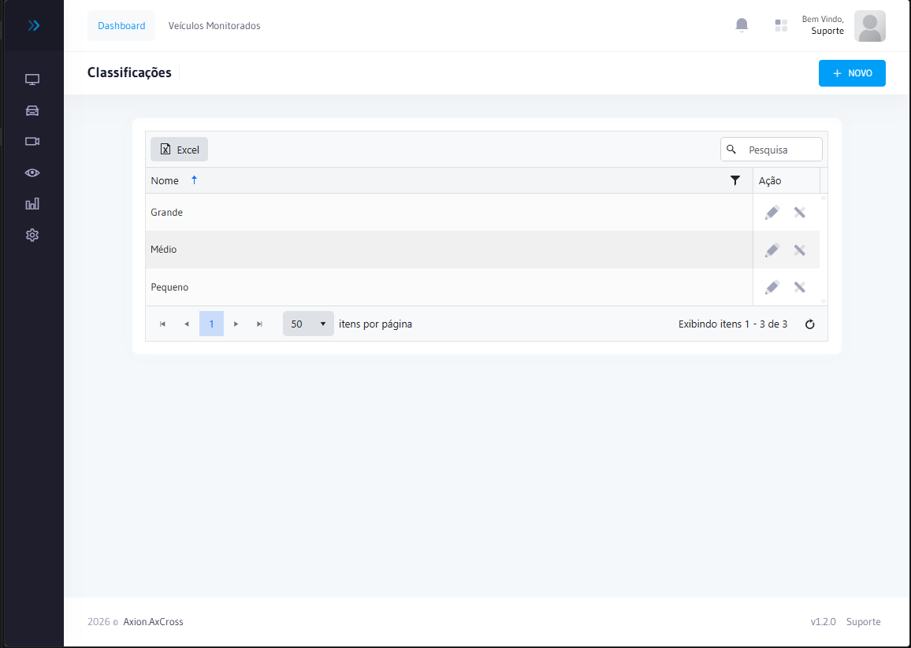

---
sidebar_position: 1
title: Veículos Monitorados
description: Cadastro e gestão completa de Veículos Monitorados, Tipos de Ocorrências, Alertas, Classificações e Importação no AxCross
---

# Veículos Monitorados

O módulo **Veículos Monitorados** permite registrar placas e veículos de interesse para monitoramento especial. Quando um veículo cadastrado é detectado em qualquer cruzamento, o sistema gera um alerta automático para a equipe operacional.

## Como acessar

No **menu lateral**, clique em **Veículos Monitorados**. O módulo é organizado em cinco seções acessíveis diretamente pela tela principal:

| Seção | Descrição |
|---|---|
| [**Cadastro de Monitorados**](#cadastro-de-monitorados) | Registra e consulta as placas sob monitoramento ativo |
| [**Tipos de Ocorrências**](#tipos-de-ocorrências) | Define as categorias usadas para classificar alertas e eventos |
| [**Alertas**](#alertas) | Lista e gerencia os alertas gerados automaticamente pelo sistema |
| [**Classificações**](#classificações) | Cria e edita as categorias dos veículos monitorados |
| [**Importação**](#importação) | Cadastra múltiplas placas de uma vez via arquivo CSV |

---

## Cadastro de Monitorados

Exibe todos os veículos cadastrados para monitoramento, com filtros por placa, classificação e status.

### Campos do cadastro

| Campo | Obrigatório | Descrição |
|---|:---:|---|
| **Placa** | Sim | Placa do veículo no formato Mercosul ou padrão antigo |
| **Classificação** | Sim | Categoria do veículo (ex.: Roubado, VIP, Suspeito) |
| **Motivo** | Não | Razão do monitoramento |
| **Observações** | Não | Informações complementares |
| **Status** | Sim | Ativo ou Inativo |

### Cadastrar novo veículo monitorado

1. Na lista de veículos, clique em **Novo Veículo Monitorado**
2. Informe a **Placa** do veículo
3. Selecione a **Classificação**
4. Opcionalmente, preencha **Motivo** e **Observações**
5. Clique em **Salvar**

### Editar veículo monitorado

1. Localize o veículo na lista e clique no ícone de edição ✏️
2. Altere os campos desejados
3. Clique em **Salvar**

:::info Alerta automático
Toda vez que um veículo monitorado ativo for detectado por um Equipamento, o sistema gera um alerta automático na seção de [Alertas](#alertas) e destaca a passagem na tela de Monitoramento Online.
:::

---

## Tipos de Ocorrências

Define as categorias de ocorrência utilizadas para classificar alertas e eventos registrados no sistema.

### Campos

| Campo | Obrigatório | Descrição |
|---|:---:|---|
| **Código** | Sim | Identificador único da ocorrência |
| **Nome** | Sim | Nome do tipo de ocorrência |
| **Cor** | Não | Cor de identificação visual nos alertas |
| **Emitir Alerta Sonoro** | Não | Dispara sinal sonoro ao gerar alerta deste tipo |
| **Prazo de Expiração (dias)** | Não | Dias até expiração automática dos veículos vinculados. Vazio = sem expiração. |

### Tipos padrão do sistema

| Tipo | Descrição |
|---|---|
| **Placa Monitorada** | Veículo cadastrado na lista de monitorados foi detectado |
| **MANCHA01 — Tempo na Mancha** | Veículo permaneceu na área monitorada além do tempo máximo configurado (padrão: 4 horas) |

### Cadastrar novo tipo de ocorrência

1. Clique em **+ NOVO**
2. Informe o **Código** e o **Nome**
3. Selecione a **Cor** de identificação
4. Opcionalmente, ative **Emitir Alerta Sonoro**
5. Para vigência automática, informe o **Prazo de Expiração (dias)**
6. Clique em **Salvar**

:::info Vigência dos Alertas
O campo **Prazo de Expiração (dias)** ativa o controle de vigência para todos os veículos deste tipo. Ao salvar, o sistema recalcula automaticamente a data de expiração de todos os veículos vinculados. Consulte [Vigência dos Alertas](vigencia-alertas.md) para detalhes.
:::

:::caution Tipos em uso
Tipos de ocorrência vinculados a alertas existentes não podem ser excluídos. Inative-os para impedir novos usos.
:::

---

## Alertas

Os alertas registram eventos detectados pelo sistema que requerem atenção, como detecção de veículos monitorados, Equipamentos offline ou ocorrências de trânsito.

### Colunas da lista

| Coluna | Descrição |
|---|---|
| **Data/Hora** | Momento da detecção |
| **Placa** | Placa do veículo detectado |
| **Local** | Cruzamento onde foi detectado |
| **Equipamento** | Câmera/sensor que realizou a leitura |
| **Classificação** | Categoria do veículo monitorado |
| **Status** | Pendente, Assumido ou Resolvido |

### Tipos de alerta

| Tipo | Descrição |
|---|---|
| **Veículo Monitorado** | Placa cadastrada como monitorada foi detectada |
| **Equipamento Offline** | Equipamento sem comunicação além do tempo limite |
| **Falha de Imagem** | Equipamento detectou passagem, mas sem imagem registrada |
| **Ocorrência de Trânsito** | Evento registrado manualmente pela operação |

### Ações disponíveis

| Ação | Descrição |
|---|---|
| **Visualizar** | Abrir detalhes completos do alerta |
| **Assumir** | Registrar o operador responsável pela tratativa |
| **Resolver** | Marcar o alerta como resolvido |
| **Descartar** | Ignorar o alerta (requer justificativa) |

### Criar alerta manualmente

1. Na tela de Alertas, clique em **Novo Alerta**
2. Selecione o **Tipo de Ocorrência**
3. Informe o **Local** e o Equipamento relacionado
4. Descreva a **Ocorrência**
5. Clique em **Salvar**

---

## Vigência dos Alertas

A **Vigência dos Alertas** permite definir um **prazo de expiração** para os veículos monitorados. Ao configurar um prazo no Tipo de Ocorrência, o sistema calcula automaticamente a data limite para cada veículo cadastrado. Após esse período, o veículo deixa de gerar alertas — sem necessidade de desativação manual.

:::info Novo Recurso
Disponível a partir da versão com as melhorias **AxCross — Vigência dos Alertas**. Inclui campo **Prazo de Expiração (dias)** no Tipo de Ocorrência e controle de vigência na lista de Veículos Monitorados.
:::

### Conceitos Fundamentais

| Conceito | Descrição |
|---|---|
| **Habilitado** | Controle **manual** do usuário. Não é alterado automaticamente por nenhum processo. |
| **Vigência** | Controle de **expiração** baseado no prazo do Tipo de Ocorrência. Independente do campo Habilitado. |
| **Alerta** | Gerado somente se o veículo estiver **habilitado** E **dentro da vigência**. |

### Status da Vigência

| Status | Condição | Cor |
|---|---|---|
| **Ativo** | Habilitado e dentro do prazo (ou sem expiração) | 🟢 Verde |
| **Expira em X horas / X dias** | Habilitado e expirando em breve | 🟡 Amarelo |
| **Expirado** | Habilitado, mas prazo já venceu | 🔴 Vermelho |
| **Desativado** | `Habilitado = Não` (independente da data) | 🟡 Amarelo |

### Configurar prazo no Tipo de Ocorrência

O prazo de vigência é definido diretamente no **Tipo de Ocorrência**. Todos os veículos vinculados a esse tipo herdam automaticamente o prazo.

1. No menu lateral, acesse **Veículos Monitorados → Tipos de Ocorrências**
2. Clique no ícone de edição ✏️ do tipo desejado (ou clique em **+ NOVO** para criar)
3. No campo **Prazo de Expiração (dias)**, informe a quantidade de dias (ex.: `30`)
4. Clique em **Salvar**

:::tip Exemplos de prazo
- **30 dias** — veículo expira 30 dias após o cadastro
- **90 dias** — vigência trimestral
- **365 dias** — vigência anual
- **Vazio** — sem prazo, nunca expira automaticamente
:::

### Atualização em Bloco

Ao alterar o **Prazo de Expiração** de um Tipo de Ocorrência, o sistema atualiza automaticamente **todos os veículos vinculados** sem necessidade de editar individualmente.

| Alteração no tipo | Resultado nos veículos |
|---|---|
| Prazo removido (ex.: 20 dias → vazio) | `Data de Expiração = sem prazo` para todos |
| Prazo alterado (ex.: 20 → 30 dias) | `Data de Expiração = hoje + 30 dias` para todos |
| Prazo adicionado (ex.: vazio → 20 dias) | `Data de Expiração = hoje + 20 dias` para todos |
| Prazo não alterado | Nenhuma modificação nos veículos |

:::warning Atenção
A atualização em bloco é **imediata** e afeta todos os veículos do tipo. Durante o salvamento, uma mensagem de carregamento confirma que o processo está em andamento.
:::

### Sino de Vigência 🔔

A toolbar do AxCross exibe um ícone de sino com badge de contagem mostrando veículos que expiram nas próximas **24 horas** ou já **expirados**.

- O sino exibe uma bolinha de notificação quando há veículos próximos de expirar ou já expirados
- Clique no sino para abrir o painel de vigência (atualizado a cada 5 minutos)
- Clicar em um item abre diretamente o formulário de edição do veículo

| Item | Badge | Descrição |
|---|---|---|
| Veículo expirando em breve | `Xh` (horas restantes) | Expira nas próximas 24 horas |
| Veículo expirado | `Expirado` (vermelho) | Prazo já vencido, mas ainda habilitado |

### Regras de geração de alertas

O sistema verifica **duas condições obrigatórias** antes de gerar qualquer alerta:

| Situação do veículo | Gera alerta? |
|---|:---:|
| Habilitado + dentro da vigência | ✅ Sim |
| Habilitado + expirado | ❌ Não |
| Desabilitado + dentro da vigência | ❌ Não |
| Desabilitado + expirado | ❌ Não |
| Habilitado + sem prazo | ✅ Sim |

:::info Controle independente
O campo **Habilitado** nunca é alterado automaticamente pela vigência. O sistema apenas ignora veículos expirados na geração de alertas, sem desativá-los.
:::

### Perguntas Frequentes

**O veículo expirado é desativado automaticamente?**  
Não. O campo **Habilitado** é exclusivamente de controle manual. O veículo expirado continua como "Habilitado = Sim", mas **não gera alertas**.

**Posso definir uma data diferente do padrão do tipo?**  
Sim. Ao cadastrar ou editar um veículo, informe manualmente o campo **Data de Expiração**. O valor informado prevalece sobre o prazo automático do tipo.

**O que acontece se eu remover o prazo do tipo de ocorrência?**  
Todos os veículos vinculados terão a data de expiração removida. Eles nunca expirarão automaticamente e deixam de aparecer no sino de vigência.

**O sino mostra veículos desabilitados?**  
Não. O sino exibe apenas veículos **habilitados** que estejam expirando nas próximas 24 horas ou já expirados.

---

### Relatório de Ocorrências

Para exportar e consultar as ocorrências registradas acesse o **Relatório de Ocorrências**:

:::tip Dica
Acesse o Relatório de Ocorrências para consolidar as tratativas realizadas e gerar evidências para fiscalização.
:::

---

## Classificações

Gerencia as categorias disponíveis para classificar os veículos monitorados (ex.: Roubado, Suspeito, VIP, Autorizado).

### Nova classificação

1. Clique em **Nova Classificação**
2. Informe o **Nome** da classificação
3. Clique em **Salvar**

### Editar classificação

1. Localize a classificação na lista e clique no ícone de edição ✏️
2. Altere o **Nome**
3. Clique em **Salvar**

:::caution Classificações em uso
Classificações vinculadas a veículos monitorados ativos não podem ser excluídas. Inative-as para impedir novos cadastros com essa categoria.
:::

---

## Importação

Permite cadastrar múltiplas placas de uma só vez através de um arquivo CSV, agilizando a inclusão em lote de veículos monitorados.

### Passo a passo

1. Clique em **Importar**
2. Clique em **Escolher Arquivo**
3. Selecione o arquivo **CSV** com as placas
4. Confirme a importação

Após a importação, o sistema exibe um histórico com o resultado do processamento (placas importadas, duplicadas ou com erro).

:::info Formato do arquivo
O arquivo CSV deve conter **uma placa por linha**, no formato Mercosul (ABC1D23) ou padrão antigo (ABC-1234). A classificação padrão será atribuída automaticamente e poderá ser editada individualmente após a importação.
:::

## Erros comuns

| Erro | Causa | Solução |
|------|-------|----------|
| Placa não gera alerta | Veículo desabilitado | Habilitar na lista |
| Importação com erros | Formato CSV incorreto | Usar 1 placa por linha |
| Vigncia expirada | Prazo de alerta vencido | Renovar em Vigência dos Alertas |

## Integração com outros módulos

| Módulo | Relação |
|--------|----------|
| **Monitoramento Online** | Alerta em tempo real |
| **Vigência dos Alertas** | Controla validade dos monitoramentos |
| **Ocorrências e Alertas** | Relatório de detecções |

## Perguntas frequentes

**Posso importar em lote?**
Sim, via arquivo CSV com uma placa por linha.

**O alerta é gerado para todos os cruzamentos?**
Sim, qualquer equipamento do AxCross que detectar a placa gera o alerta.

**Qual o limite de placas monitoradas?**
Não há limite definido no sistema.
