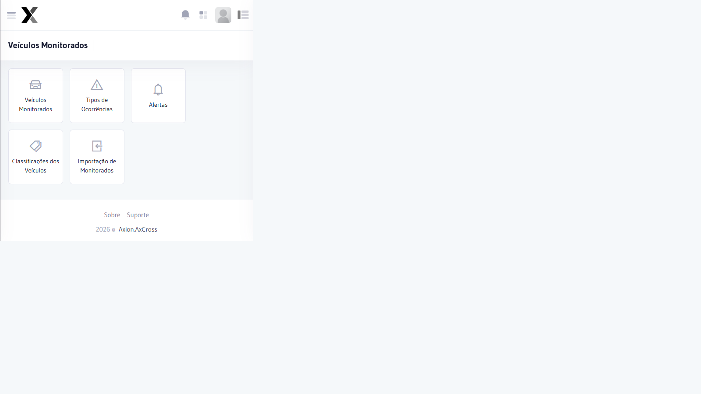

# Veículos Monitorados

Registro de placas e veículos que devem ser monitorados de forma especial pelo sistema. Quando um veículo monitorado é detectado em um cruzamento, o sistema gera um alerta automático.

## Como acessar

No **menu lateral**, clique em **Veículos Monitorados**.

## Campos

| Campo | Obrigatório | Descrição |
|-------|:-----------:|-----------|
| **Placa** | Sim | Placa do veículo a monitorar |
| **Classificação** | Sim | Tipo/classificação do veículo |
| **Motivo** | Não | Razão do monitoramento |
| **Observações** | Não | Informações adicionais |
| **Status** | Sim | Ativo ou Inativo |

## Passo a passo — Cadastrar novo veículo monitorado

1. Acesse **Veículos Monitorados** no menu lateral
2. Clique em **Novo Veículo Monitorado**
3. Informe a **Placa** do veículo
4. Selecione a **Classificação**
5. Opcionalmente, preencha **Motivo** e **Observações**
6. Clique em **Salvar**

## Editar veículo monitorado

## Importação em lote

É possível importar uma lista de placas em formato CSV para cadastrar múltiplos veículos de uma vez.

1. Clique em **Importar**
2. Clique em **Escolher Arquivo** e selecione o CSV
3. Confirme a importação

---

## Classificações de Veículos

Cada veículo monitorado é categorizado por uma classificação. Para gerenciar as classificações disponíveis, acesse **Veículos Monitorados → Classificações dos Veículos**.

:::info Alerta automático
Sempre que um veículo monitorado ativo for detectado por um equipamento, o sistema gera um alerta na tela de monitoramento online.
:::
