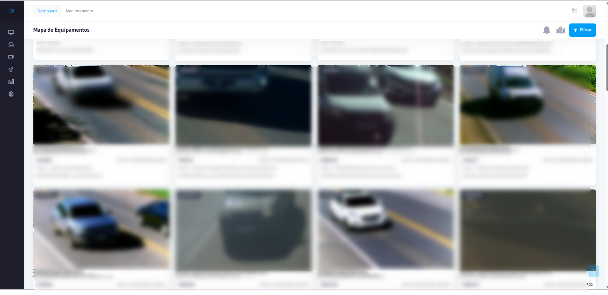

# Use Dashboard Principal Dashboard

O Use Dashboard Principal é a tela inicial do AxCross após a autenticação. Apresenta uma visão completa do estado operacional do sistema, com gráficos e indicadores em tempo real.

Dashboard Principal do AxCross](../img/Dashboard.png)

## Como acessar

- Ao realizar o Login o sistema redireciona automaticamente para o Dashboard
- Para retornar a qualquer momento: clique no **logo AxCross** no topo esquerdo

---

## Painéis do Dashboard

### 1. Status dos Equipamentos

| Item | Descrição |
|------|-----------|
| **Visualização** | Indicadores de status (online/offline) |
| **Dados** | Quantidade de Equipamentos ativos vs inativos |
| **Utilidade** | Identificar rapidamente Equipamentos com problema |

### 2. Fluxo de Passagens

| Item | Descrição |
|------|-----------|
| **Período** | Últimas 24 horas |
| **Visualização** | Gráfico de barras vertical (por hora) |
| **Dados** | Número de passagens registradas a cada hora |
| **Utilidade** | Avaliar o volume de tráfego e identificar horários de pico |

### 3. Passagens por Local

| Item | Descrição |
|------|-----------|
| **Visualização** | Gráfico de barras horizontal |
| **Dados** | Distribuição de passagens por local monitorado |
| **Utilidade** | Identificar os cruzamentos com maior fluxo |

### 4. Alertas Recentes

Dashboard - Ocorrências Recentes](../img/Dashboard - ocorrencias recentes.png)

| Item | Descrição |
|------|-----------|
| **Atualização** | Monitoramento em tempo real |
| **Colunas** | Local, Equipamento Data/Hora, Tipo, Status |
| **Dados** | Lista dos últimos alertas detectados |
| **Utilidade** | Ação imediata sobre ocorrências em andamento |

### 5. Estatísticas de Fluxo e Ocorrências por Tipo

A parte inferior do Dashboard exibe métricas de fluxo e dois gráficos analíticos:

**Indicadores de fluxo (barra superior):**

| Indicador | Descrição |
|---|---|
| **Hora Pico** | Intervalo de hora com maior volume de passagens registradas |
| **Média/Hora** | Média de passagens por hora no período analisado |
| **Última Hora** | Total de passagens registradas na última hora |
| **Maior Fluxo** | Horário e quantidade do pico máximo de passagens |
| **Menor Fluxo** | Horário e quantidade do volume mínimo de passagens |

**Ocorrências por Tipo:**

Gráfico de barras que exibe a distribuição dos alertas gerados nas **últimas 72 horas**, agrupados por categoria (ex: Placa Monitorada). Permite identificar quais tipos de ocorrência são mais frequentes.

**Passagens por Classificação:**

Gráfico de linha que exibe a distribuição das passagens por **categoria de Veículo nas últimas 24 horas. As categorias incluem: Automóvel, Caminhonete, Caminhão, Ônibus, Motocicleta, Sem Classificação e Sem Classe.

:::info Mapa integrado
Ao lado dos gráficos de fluxo, o Dashboard exibe o **mapa georreferenciado** (Google Maps) com a localização dos Equipamentos monitorados.
:::

---

## Dicas de uso

- **Acompanhe o Fluxo de Passagens** para dimensionar operações nos horários de pico
- **Verifique o Status dos Equipamentos diariamente para manutenção preventiva
- **Use Passagens por Local** para identificar cruzamentos com maior demanda
- **Monitore Alertas Recentes** para ação imediata em ocorrências críticas
