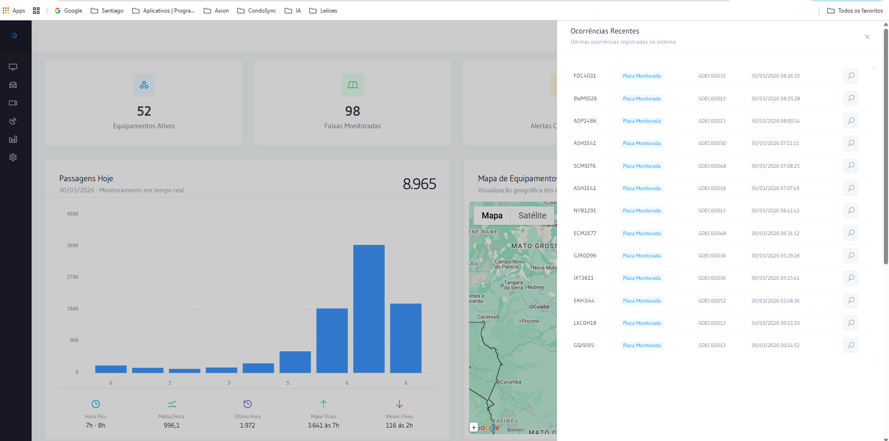

---
sidebar_position: 2
title: Dashboard Principal
description: Visão geral do Dashboard do AxCross com indicadores operacionais em tempo real
---

# Dashboard Principal

O **Dashboard Principal** é a tela inicial do **AxCross**, exibida automaticamente após a autenticação. Apresenta uma visão consolidada da operação com indicadores numéricos, gráficos de passagens, mapa georreferenciado e ocorrências em tempo real.

---

## Como acessar

- Após realizar o **Login**, o sistema redireciona automaticamente para o Dashboard
- Para retornar a qualquer momento: clique no menu **Dashboard** no painel lateral esquerdo

---

## Indicadores do Topo

Cinco cards exibem os principais números operacionais do sistema em tempo real. Cada valor reflete diretamente o que está cadastrado nas telas de cadastro correspondentes.

| Indicador | Exemplo real | Descrição | Manual | Sistema |
|-----------|:---:|-----------|--------|---------|
| **Equipamentos Ativos** | 255 | Total de equipamentos ativos no sistema | [📖 Cadastro de Equipamentos](../cadastros/equipamentos) | [🔗 Equipamentos → Cadastro](https://goiania.axcross.axion.ws/equipments/equipment/equipment) |
| **Faixas Monitoradas** | 579 | Total de faixas cadastradas por equipamento | [📖 Faixas do Equipamento](../cadastros/faixas) | [🔗 Equipamentos → Editar → Faixas](https://goiania.axcross.axion.ws/equipments/equipment/edit) |
| **Alertas Configurados** | 10 | Quantidade de regras de alerta ativas | [📖 Alertas](../operacoes/alertas) | [🔗 Ocorrências → Alertas](https://goiania.axcross.axion.ws/occurrences/alert) |
| **Veículos Monitorados** | 313.362 | Veículos cadastrados para monitoramento automático | [📖 Veículos Monitorados](../operacoes/veiculos-monitorados) | [🔗 Ocorrências → Veículos Monitorados](https://goiania.axcross.axion.ws/occurrences/monitoredvehicle/monitoredvehicle) |
| **Ocorrências (24h)** | 1.921 | Total de ocorrências detectadas nas últimas 24h (+9,6% vs. anterior) | [📖 Tipos de Ocorrências](../operacoes/tipos-ocorrencias) | Gerado automaticamente pelo sistema |

:::tip Dica
Clique em qualquer indicador do topo para ser direcionado ao cadastro correspondente dentro do sistema AxCross.
:::

---

## Passagens Hoje

Exibe o total de passagens registradas no dia atual em **tempo real**, com gráfico de barras por hora do dia.

| Item | Valor (real) | Descrição |
|------|:---:|-----------|
| **Total do dia** | 2.095.014 | Passagens acumuladas até o momento (+4,0% vs. ontem) |
| **Data** | 15/07/2026 | Data atual — monitoramento em tempo real |
| **Média/Hora** | 116.389,7 | Média de passagens por hora |
| **Última Hora** | 90.135 | Total de passagens na última hora completa |
| **Maior Fluxo** | 196.260 às 7h | Horário e volume do pico máximo de passagens |

:::info Relatório de passagens
Para consultar passagens históricas com filtros avançados, acesse: [📖 Relatório de Passagens](../relatorios/relatorio-passagens)
:::

---

## Mapa de Equipamentos

Exibido ao lado do gráfico de Passagens Hoje, mostra a localização georreferenciada de todos os equipamentos via **Google Maps**.

| Item | Descrição |
|------|-----------|
| **Título** | Mapa de Equipamentos — Visualização geográfica dos equipamentos ativos |
| **Alternância** | Botões **Mapa** / **Satélite** no canto superior esquerdo |
| **Zoom** | Controle **+** disponível no mapa |

:::tip Acesso ao mapa completo
Para o mapa em tela cheia com todos os recursos de monitoramento:
[📖 Monitoramento Online](../operacoes/monitoramento-online) | [🔗 Monitoramento → Mapa de Equipamentos](https://goiania.axcross.axion.ws/monitoringonline/monitoring/equipmentmap)
:::

---

## Ocorrências por Tipo

Gráfico de barras que exibe a distribuição das ocorrências registradas nas **últimas 24 horas** por categoria.

| Item | Descrição |
|------|-----------|
| **Filtros** | Botões **24h** / **Mês** no canto superior direito |
| **Eixo Y** | Quantidade de ocorrências |
| **Eixo X** | Categorias de ocorrência cadastradas |

Categorias reais do sistema:

| Categoria | Qtd. (real) | Manual | Sistema |
|-----------|:---:|--------|---------|
| **VEICULO FURTADO/ROUBADO** | 836 | [📖 Tipos de Ocorrências](../operacoes/tipos-ocorrencias) | [🔗 Ocorrências por Tipo](https://goiania.axcross.axion.ws/occurrences/typeoccurrence) |
| **VEICULO COM RESTRIÇÃO A CIRCULAÇÃO** | 718 | [📖 Tipos de Ocorrências](../operacoes/tipos-ocorrencias) | [🔗 Ocorrências por Tipo](https://goiania.axcross.axion.ws/occurrences/typeoccurrence) |
| **VEICULO BAIXADO** | 280 | [📖 Tipos de Ocorrências](../operacoes/tipos-ocorrencias) | [🔗 Ocorrências por Tipo](https://goiania.axcross.axion.ws/occurrences/typeoccurrence) |

:::info Relatório de ocorrências
Para consultar o histórico completo de ocorrências: [📖 Relatório de Ocorrências e Alertas](../relatorios/ocorrencias-alertas)
:::

---

## Passagens por Classificação

Gráfico de linhas exibindo a distribuição das passagens por **categoria de veículo** nas últimas **24 horas**.

| Item | Descrição |
|------|-----------|
| **Eixo X** | Horas do dia (0h a 23h) |
| **Eixo Y** | Quantidade de passagens (até 171k por hora) |
| **Visualização** | Gráfico de linhas com legenda por categoria |

Categorias de veículos do sistema:

| Categoria | Descrição | Manual |
|-----------|-----------|--------|
| **Grande** | Veículos de grande porte (caminhões, ônibus) | [📖 Classificação de Veículos](../referencia-tecnica/classificacao-veiculos-integracao) |
| **Médio** | Veículos de médio porte (vans, caminhonetes) | [📖 Classificação de Veículos](../referencia-tecnica/classificacao-veiculos-integracao) |
| **Pequeno** | Veículos de pequeno porte (automóveis, motos) | [📖 Classificação de Veículos](../referencia-tecnica/classificacao-veiculos-integracao) |
| **Sem Classificação** | Veículos detectados mas não classificados | [📖 Classificação de Veículos](../referencia-tecnica/classificacao-veiculos-integracao) |

:::warning Atenção — Sem Classificação
Alto volume de **Sem Classificação** indica que o classificador ITSCAM dos equipamentos pode estar com a **Confiabilidade mínima = 100%**, impedindo a classificação. Consulte a [📖 referência técnica de integração](../referencia-tecnica/classificacao-veiculos-integracao) para corrigir.
:::

---

## Ocorrências Recentes

Painel que exibe as últimas ocorrências registradas em **tempo real**, com atualização automática.

| Coluna | Descrição | Exemplos reais |
|--------|-----------|----------------|
| **Placa** | Placa do veículo detectado | PRV4C25, ONS5D12, PRV8137 |
| **Tipo** | Categoria da ocorrência | VEICULO BAIXADO, VEICULO FURTADO/ROUBADO, VEICULO COM RESTRIÇÃO A CIRCULAÇÃO |
| **Equipamento** | Código do equipamento que fez a detecção | GYN7M723, GYN1R242, GYN7M726 |
| **Data/Hora** | Momento exato da ocorrência | 15/07/2026 17:27:11 |
| **🔍** | Consultar detalhes da passagem | — |

| Acesso relacionado | Link |
|-------------------|------|
| 📖 Histórico de ocorrências e alertas | [Relatório de Ocorrências](../relatorios/ocorrencias-alertas) |
| 📖 Rastrear veículo por placa | [Rastreamento de Placas](../relatorios/rastreamento-placas) |
| 🔗 Veículos Monitorados no sistema | [Veículos Monitorados](https://goiania.axcross.axion.ws/occurrences/monitoredvehicle/monitoredvehicle) |

---

## Dicas de uso

- ✅ **Equipamentos Ativos** — para manutenção: [📖 Cadastro de Equipamentos](../cadastros/equipamentos)
- ✅ **Faixas Monitoradas** — para ampliar cobertura: [📖 Faixas do Equipamento](../cadastros/faixas)
- ✅ **Alertas Configurados** — para gerenciar regras: [📖 Alertas](../operacoes/alertas)
- ✅ **Veículos Monitorados** — para cadastrar veículos: [📖 Veículos Monitorados](../operacoes/veiculos-monitorados)
- ✅ **Passagens Hoje** — para relatórios históricos: [📖 Relatório de Passagens](../relatorios/relatorio-passagens)
- ✅ **Mapa de Equipamentos** — para monitoramento ao vivo: [📖 Monitoramento Online](../operacoes/monitoramento-online)
- ✅ **Ocorrências Recentes** — para histórico: [📖 Relatório de Ocorrências](../relatorios/ocorrencias-alertas)
- ✅ **Sem Classificação alto** — para corrigir: [📖 Referência Técnica — Classificação](../referencia-tecnica/classificacao-veiculos-integracao)