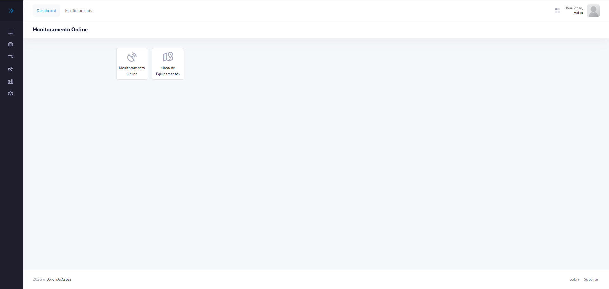

# Navegação

O AxCross possui uma interface organizada em menu lateral fixo, que permite o acesso a todos os módulos disponíveis conforme o perfil de acesso do Usuário autenticado.

## Estrutura da interface

| Elemento | Descrição |
|----------|-----------|
| **Menu lateral** | Use Dashboard à esquerda com a lista de módulos e categorias do sistema |
| **Área de conteúdo** | Região central onde as telas de cada módulo são exibidas |
| **Barra superior** | Exibe o nome do sistema, nome do Usuário autenticado e opção de sair |

## Módulos disponíveis

O menu lateral do AxCross é organizado com itens diretos e categorias expansíveis:

### Itens diretos

| Item do menu | Descrição |
|---|---|
| **Monitoramento Online** | Acompanhamento em tempo real dos Equipamentos e passagens |
| **Operações** | Cadastro e gestão de operações de fiscalização |
| **Sistema** | Configurações gerais do sistema |
| Relatório de Passagens** | Relatório de passagens registradas |

### Categorias expansíveis

| Categoria | Itens |
|---|---|
| **Cadastros** | Locais, Equipamentos Faixas |
| **Administração** | Usuários Permissões de acesso, Perfis de acesso |

:::tip Dica de navegação
Clique em uma categoria para expandir ou recolher os itens.
:::
