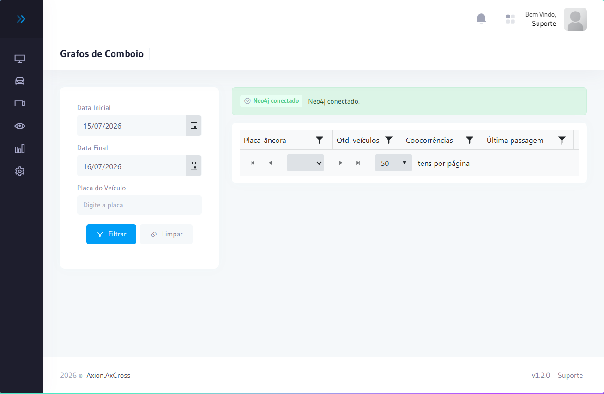

# Grafos de Comboio

O módulo de **Grafos de Comboio** identifica grupos de veículos que se deslocam em conjunto de forma consistente — padrão característico de comboios policiais, transportes de valores, frotas logísticas ou grupos suspeitos.

A detecção utiliza tecnologia **Neo4j** (banco de dados de grafos) para analisar correlações entre as passagens e identificar veículos que aparecem repetidamente nos mesmos pontos e janelas de tempo.

## Como acessar

No **menu lateral**, clique em **Relatórios** e selecione **Grafos de Comboio**.

:::info Permissão necessária
`monitoringgraph.index` — acessar e visualizar o grafo de monitoramento.
:::

:::caution Pré-requisito
A detecção de comboios requer **Neo4j configurado** e a opção **Habilitar Detecção de Comboio** ativada em **Configurações do Sistema → MDF-e**.  
O ciclo de identificação é executado automaticamente **a cada 6 horas**.
:::

---

## Como funciona

1. O sistema coleta todas as passagens registradas nos equipamentos
2. O Neo4j analisa quais veículos aparecem nos **mesmos pontos e janelas de tempo** repetidamente
3. Grupos com padrão de co-ocorrência são identificados como **comboio**
4. O alerta **COMBOIO01** é disparado no Dashboard e no Monitoramento Online
5. O grafo exibe visualmente as relações entre os veículos do comboio

---

## Lendo o grafo

| Elemento | Significado |
|----------|-------------|
| **Nó (círculo)** | Representa uma placa / veículo |
| **Aresta (linha)** | Indica que dois veículos foram detectados juntos |
| **Espessura da aresta** | Quanto mais espessa, mais vezes os veículos foram detectados juntos |
| **Cor do nó** | Pode indicar classificação do veículo ou tipo de alerta associado |

---

## Ações disponíveis

| Ação | Descrição |
|------|-----------|
| **Expandir nó** | Clique em um nó para ver todas as conexões daquele veículo |
| **Filtrar por data** | Ajuste o período para analisar comboios em uma janela específica |
| **Exportar** | Gera relatório dos comboios identificados |

---

## Uso operacional

O módulo de Grafos de Comboio é utilizado principalmente por analistas de inteligência:

- **Identificar grupos** de veículos que atuam em conjunto (transporte de drogas, receptação, etc.)
- **Confirmar hipóteses investigativas** — verificar se veículos suspeitos se cruzam consistentemente
- **Mapear redes** — entender quais veículos têm maior conectividade (mais vínculos) na rede analisada

:::tip Combinação com Painel Analítico
Após identificar um veículo relevante no grafo, utilize o [Painel Analítico](painel-analitico.md) para aprofundar a análise individual do veículo selecionado.
:::

## Relacionado

- [Painel Analítico](./painel-analitico)
- [Alertas](../operacoes/alertas)
- [Veículos Monitorados](../operacoes/veiculos-monitorados)
- [Configurações do Sistema](../sistema/configuracoes)

## Casos de uso

- **Investigação de redes criminosas**: identificar veículos que se deslocam sistematicamente com alvos de interesse
- **Transporte de valores**: verificar se veículos de escolta acompanham consistentemente os mesmos caminhões
- **Logística suspeita**: mapear frotas que operam em conjunto em rotas sensíveis
- **Validação de hipóteses**: confirmar se veículos levantados em inquérito apresentam co-ocorrência mensurável

:::warning Pré-requisito técnico
Os Grafos de Comboio requerem **Neo4j ativo** e configurado. Sem o serviço rodando, os alertas **COMBOIO01** não são gerados e o grafo não exibe dados. Verifique em **Configurações do Sistema** se a detecção de comboio está habilitada.
:::
