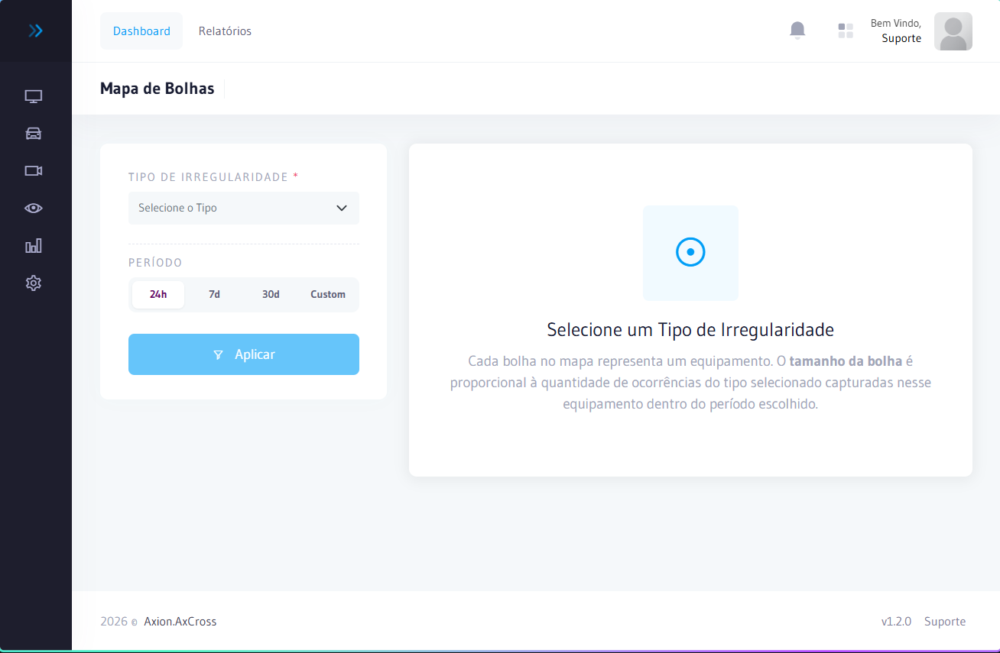

# Mapa de Bolhas por Irregularidade

O **Mapa de Bolhas** é uma visualização georreferenciada que mostra a **concentração de irregularidades por ponto de captura**. Cada bolha representa um equipamento, e seu tamanho é proporcional ao volume de irregularidades detectadas naquele local no período selecionado.

## Como acessar

No **menu lateral**, clique em **Relatórios** e selecione **Mapa de Bolhas**.

:::info Permissões necessárias
`irregularitybubblemap.index` — acessar o mapa  
`irregularitybubblemap.data` — carregar os dados de irregularidades para renderização
:::

---

## Como interpretar

| Elemento | Descrição |
|----------|-----------|
| **Bolha grande / cor intensa** | Alto volume de irregularidades naquele equipamento no período |
| **Bolha pequena / cor suave** | Baixo volume de irregularidades |
| **Ausência de bolha** | Nenhuma irregularidade detectada no equipamento |

---

## Filtros disponíveis

| Filtro | Descrição |
|--------|-----------|
| **Data Início / Fim** | Define o período de análise |
| **Tipo de Ocorrência** | Filtra por categoria específica de irregularidade |
| **Área** | Restringe a visualização a uma área de monitoramento |

## Como interpretar

| Cenário | Interpretação |
|---------|----------------|
| Vários equipamentos com bolhas grandes | Concentração de irregularidades na região |
| Um único equipamento com bolha grande | Possível alvo de atividade específica |
| Nenhuma bolha no período | Operação regular na área |

:::tip
Use filtros de **Tipo de Ocorrência** para focar em categorias específicas (ex.: veículos roubados) e identificar rotas ou padrões de atividade.
:::

---

## Uso operacional

O Mapa de Bolhas é ideal para:

- **Identificar pontos críticos** na malha viária com maior concentração de infrações ou veículos suspeitos
- **Priorizar a alocação de recursos** — direcionar patrulhamento para os cruzamentos com mais ocorrências
- **Comparar períodos** — avaliar se ações operacionais reduziram as irregularidades em determinado ponto
- **Apresentar resultados** em reuniões de gestão com visualização imediata da situação operacional

:::tip Dica
Combine o Mapa de Bolhas com o [Relatório de Ocorrências](ocorrencias-alertas.md) para detalhar quais irregularidades estão concentradas em cada ponto identificado no mapa.
:::

## Relacionado

- [Ocorrências e Alertas](./ocorrencias-alertas) — Detalhamento das irregularidades por equipamento
- [Mapeamento de Rotas](./mapeamento-rotas) — Visualização geográfica das rotas de veículos
- [Painel Analítico](./painel-analitico) — Análise aprofundada por placa

## Erros comuns

| Erro | Causa | Solução |
|------|-------|----------|
| Mapa sem bolhas | Nenhuma irregularidade no período | Ampliar o período ou verificar o tipo de ocorrência selecionado |
| Equipamento não aparece no mapa | Coordenadas não cadastradas | Verificar latitude/longitude no cadastro do equipamento |
| Permissão negada ao acessar | Usuário sem `irregularitybubblemap.index` | Solicitar ao administrador a concessão da permissão |
