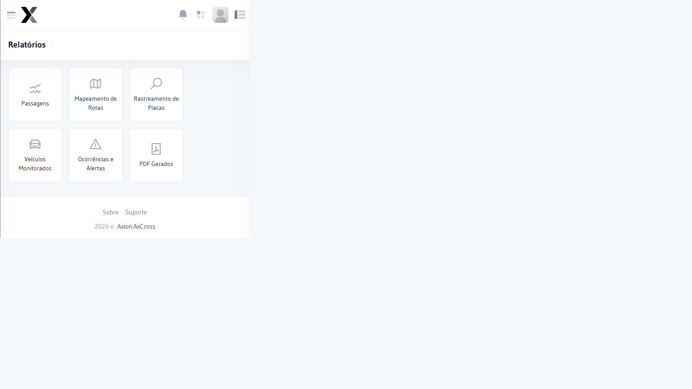

# Mapeamento de Rotas

Permite visualizar no mapa os percursos registrados por Veículos detectados nas câmeras monitoradas, identificando rotas frequentes, trajetos e padrões de deslocamento.

## Como acessar

No **menu lateral**, clique em Relatórios e selecione **Mapeamento de Rotas**.

## Filtros

| Filtro | Obrigatório | Descrição |
|--------|:-----------:|-----------|
| **Placa** | Sim | Placa do Veículo a rastrear |
| **Data Início** | Sim | Data inicial do período de consulta |
| **Data Fim** | Sim | Data final do período de consulta |

## O que o relatório exibe

- Mapa com o percurso do veículo pelos cruzamentos monitorados
- Linha do tempo das detecções com data/hora e local
- Imagens das passagens registradas

## Passo a passo

1. Acesse **Relatórios → Mapeamento de Rotas**
2. Informe a **Placa** do veículo
3. Defina o **Período** (Data Início e Fim)
4. Clique em **Consultar**
5. O mapa exibirá o percurso com marcadores por cruzamento

:::tip Investigações
O mapeamento de rotas é especialmente útil em operações de busca de veículos furtados/roubados, permitindo traçar o último percurso conhecido.
:::

## Limitações

- O mapeamento mostra apenas cruzamentos cobertos por equipamentos AxCross
- Períodos acima de 30 dias podem ter desempenho reduzido
- Placas com baixa qualidade OCR podem ter passagens ausentes no mapa

## Exemplos de uso

### Localização de veículo furtado

1. Receber informação com placa e data/hora do furto
2. Rastrear passagens a partir do momento do furto até 24h depois
3. Identificar o último cruzamento onde o veículo foi visto
4. Exportar relatório para a equipe de campo

### Análise de rota suspeita

1. Selecionar a placa do veículo e o período de 7 dias
2. Observar repetição de rota nos mesmos horários
3. Confirmar padrão de comportamento combinando com [Painel Analítico](../relatorios/painel-analitico)
4. Registrar como ocorrência em [Veículos Monitorados](../operacoes/veiculos-monitorados)

## Tabela de referência

| Cenário | Período sugerido | Observação |
|---------|:----------------:|------------|
| Veículo furtado | 1 a 3 dias | A partir da data do furto |
| Investigação criminal | 7 a 30 dias | Verificar desempenho |
| Acompanhamento preventivo | Até 7 dias | Mais responsivo |
| Análise histórica | >30 dias | Pode ser lento — exportar e filtrar |

## Relacionado

- [Passagens](../glossario/passagem)
- [Veículos Monitorados](./veiculos-monitorados)
- [Painel Analítico](../painel/painel-analitico)

## Perguntas frequentes

**Por que algumas passagens do veículo não aparecem no mapeamento de rotas?**
Passagens não aparecem quando o OCR não conseguiu ler a placa corretamente naquele cruzamento. A qualidade do mapeamento depende diretamente da taxa OCR dos equipamentos. Use o **Painel Analítico** para ver todas as passagens registradas, incluindo as com baixa confiança de leitura.

**Qual o período máximo recomendado para o mapeamento de rotas sem comprometer o desempenho?**
Períodos de até 7 dias têm melhor desempenho. Para análises históricas acima de 30 dias, considere exportar os dados e analisá-los externamente, pois a renderização do mapa pode ser lenta com grande volume de passagens.

**O Mapeamento de Rotas mostra somente cruzamentos cobertos pelo AxCross?**
Sim. O relatório exibe apenas os pontos onde o veículo foi detectado por equipamentos cadastrados no AxCross. Deslocamentos em vias sem cobertura de câmeras não aparecem no percurso, gerando lacunas na rota reconstruída.

:::
| Equipamento | Não | Filtrar por câmera específica |

## Informações exibidas no mapa

| Informação | Descrição |
|------------|-----------|
| **Marcadores** | Pontos no mapa onde o Veículo foi detectado |
| **Sequência temporal** | Numeração indicando a ordem das passagens |
| **Local** | Nome do cruzamento onde a detecção ocorreu |
| **Data/Hora** | Momento de cada detecção |
| **Faixa** | Faixa onde o Veículo passou |

## Passo a passo

1. Acesse **Relatórios → Mapeamento de Rotas** no menu lateral
2. Informe a **Placa** do Veículo
3. Defina o **período** de consulta
4. Clique em **Consultar**
5. O mapa exibirá os pontos de detecção conectados em sequência cronológica

:::tip Dica
Combine o Mapeamento de Rotas com o **Rastreamento de Placas** para uma Análise completa dos deslocamentos.
:::

## Casos de uso

- **Investigação de incídentes**: reconstruir o último percurso de um veículo furtado/roubado para identificar o trajeto após o crime
- **Comprovação de presença**: confirmar que um veículo passou por determinado cruzamento em uma hora específica
- **Análise de padrões de rota**: identificar trajetos habituais de veículos suspeitos para previsão operacional
- **Suporte jurídico**: fornecer evidência de localização de veículo para processos judiciais ou administrativos

## Relacionado

- [Rastreamento de Placas](./rastreamento-placas)
- [Veículos Monitorados](./veiculos-monitorados)
- [Painel Analítico](./painel-analitico)

## Erros comuns

| Erro | Causa | Solução |
|------|-------|----------|
| Mapa sem marcadores | Placa sem passagens no período selecionado | Ampliar o período ou verificar a grafia da placa |
| Rota desconectínua (pontos isolados) | Equipamentos com lacunas de cobertura geográfica | Compreensivo — a rede de câmeras não cobre 100% das vias |
| Período acima de 30 dias com lentidão | Volume alto de registros | Dividir a consulta em intervalos menores de até 15 dias |
