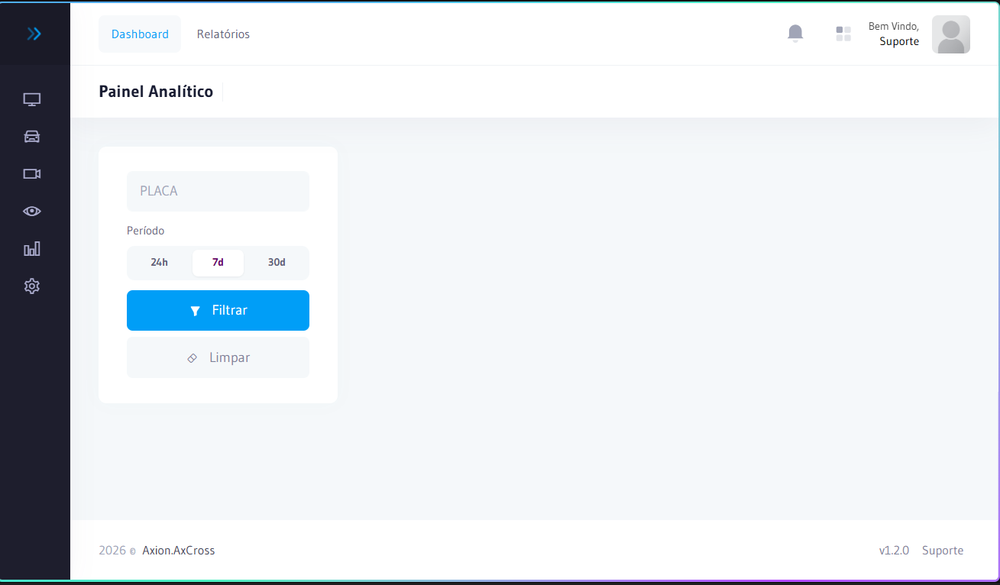

# Painel Analítico de Veículo

O **Painel Analítico** permite uma análise aprofundada do histórico completo de um veículo específico. A partir de uma placa e período, é possível visualizar todas as detecções, reconstruir rotas percorridas, identificar padrões de deslocamento e verificar alertas associados.

## Como acessar

No **menu lateral**, clique em **Relatórios** e selecione **Painel Analítico**.

:::info Permissão necessária
`vehicleanalytics.index` — acesso ao painel analítico.  
Cada aba do painel requer uma permissão específica (ver tabela abaixo).
:::

---

## Filtros de entrada

| Filtro | Obrigatório | Descrição |
|--------|:-----------:|-----------|
| **Placa** | Sim | Placa do veículo (formato Mercosul ou antigo) |
| **Data Início** | Sim | Data inicial do período de análise |
| **Data Fim** | Sim | Data final do período de análise |

---

## Abas disponíveis

O painel é organizado em abas, cada uma oferecendo uma perspectiva diferente sobre o veículo analisado:

| Aba | Permissão | Descrição |
|-----|-----------|-----------|
| **Resumo Rápido** | `vehicleanalytics.quick` | Visão geral imediata: última passagem, total de detecções, alertas ativos |
| **Sumário** | `vehicleanalytics.summary` | Dados consolidados do período: total de passagens por local, frequência e equipamento |
| **Heatmap** | `vehicleanalytics.heatmap` | Mapa de calor georreferenciado com concentração de passagens por ponto de captura |
| **Linha do Tempo** | `vehicleanalytics.timeline` | Cronologia completa de todas as passagens, com data/hora e local |
| **Rotas** | `vehicleanalytics.routes` | Reconstrução visual das rotas percorridas pelo veículo no mapa |
| **Passagens** | `vehicleanalytics.passages` | Lista detalhada de cada passagem registrada (data, local, faixa, imagem) |
| **Alertas** | `vehicleanalytics.alerts` | Alertas associados ao veículo no período consultado |

---

## Detalhamento das abas

### Resumo Rápido
Exibe de forma imediata os principais indicadores do veículo consultado:
- Última passagem registrada (data, hora e local)
- Total de detecções no período
- Quantidade de alertas ativos
- Se o veículo está cadastrado na lista de Monitorados

### Heatmap
O mapa de calor mostra visualmente em quais pontos de captura o veículo foi detectado com maior frequência.  
**Quanto mais intensa a cor, maior o número de passagens naquele equipamento.**

Use o heatmap para identificar:
- Rotas mais utilizadas pelo veículo
- Horários e locais de concentração
- Padrões de comportamento suspeito

### Linha do Tempo
Exibe todas as passagens em ordem cronológica. Permite:
- Verificar deslocamento sequencial entre cruzamentos
- Calcular tempo de deslocamento entre pontos
- Identificar lacunas no rastreamento (cruzamentos sem cobertura)

### Rotas
Reconstrói graficamente o percurso no mapa, conectando os pontos de captura na ordem em que ocorreram.

:::tip Uso investigativo
Combine **Linha do Tempo** + **Rotas** para reconstruir completamente o deslocamento de um veículo suspeito em uma janela de tempo específica.
:::

### Passagens
Lista completa de todas as detecções com:
- Data e hora exatas
- Local e equipamento
- Faixa de captura
- Imagem da passagem
- Velocidade (quando disponível)

---

## Exemplo operacional

**Cenário:** Veículo envolvido em ocorrência às 14h30 — identificar rota de fuga.

1. Acessar **Painel Analítico** e informar a placa
2. Definir período: 14h00 a 16h00 do dia da ocorrência
3. Acessar aba **Linha do Tempo** para ver cada ponto de captura em ordem
4. Acessar aba **Rotas** para visualizar o percurso no mapa
5. Exportar as **Passagens** para laudo ou boletim de ocorrência
