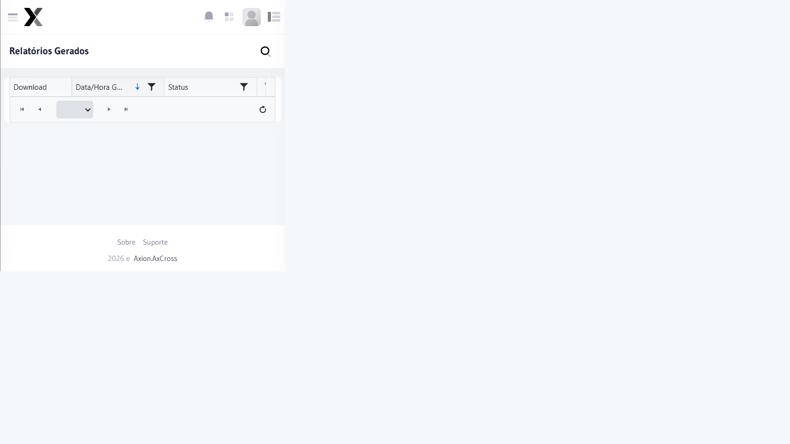

# PDF Gerados

Lista todos os relatórios em formato PDF que foram gerados no sistema, permitindo download, visualização e reprocessamento.

## Como acessar

No **menu lateral**, clique em **Relatórios** e selecione **PDF Gerados**.

## Informações exibidas

| Campo | Descrição |
|-------|-----------|
| **Nome do Arquivo** | Nome identificador do relatório gerado |
| **Tipo** | Tipo de relatório (Passagens, Ocorrências, Veículos Monitorados, etc.) |
| **Período** | Intervalo de datas do relatório |
| **Gerado por** | Usuário que solicitou a geração |
| **Data de Geração** | Data e hora em que o PDF foi criado |
| **Status** | Processando, Concluído, Erro |

## Ações disponíveis

| Ação | Descrição |
|------|-----------|
| **Download** | Baixar o arquivo PDF gerado |
| **Visualizar** | Abrir o PDF diretamente no navegador |
| **Reprocessar** | Gerar novamente o relatório (quando houver erro) |
| **Excluir** | Remover o arquivo da lista |

## Passo a passo — Baixar um relatório

1. Acesse **Relatórios → PDF Gerados** no menu lateral
2. Localize o relatório na lista (use a pesquisa se necessário)
3. Clique no ícone de **Download** na coluna Ação
4. O arquivo será baixado para o seu computador

:::tip Relatórios pendentes
Relatórios com grande volume de dados podem levar alguns minutos para serem gerados. Se o status aparecer como "Processando", aguarde e atualize a página.
:::

:::info Retenção de arquivos
PDFs gerados ficam disponíveis por um período limitado conforme a política de retenção configurada no sistema. Faça o download dos relatórios importantes para armazenamento externo.
:::
