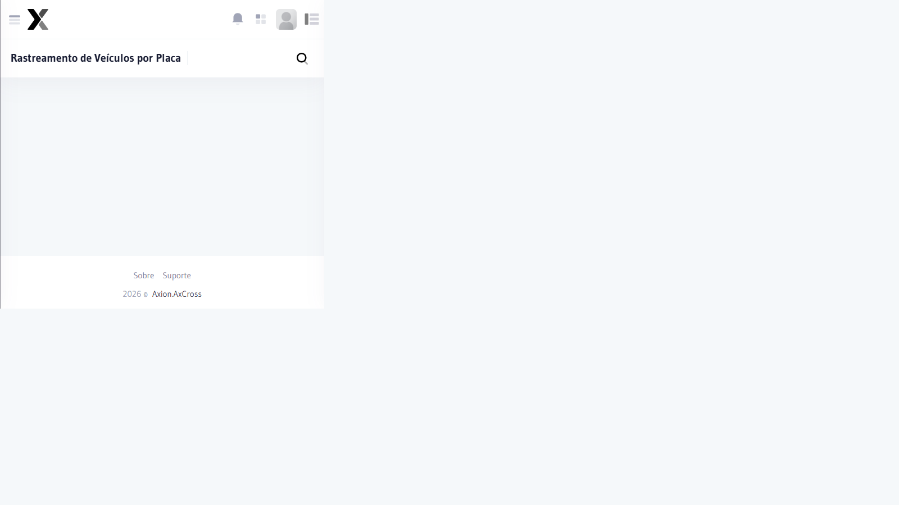

# Rastreamento de Placas

Permite rastrear as passagens de um veículo específico em todos os cruzamentos monitorados, exibindo o histórico completo de detecções com imagens capturadas.

## Como acessar

No **menu lateral**, clique em **Relatórios** e selecione **Rastreamento de Placas**.

## Filtros

| Filtro | Obrigatório | Descrição |
|--------|:-----------:|-----------|
| **Placa** | Sim | Placa do veículo (formato Mercosul ou antigo) |
| **Data Início** | Sim | Data inicial do período |
| **Data Fim** | Sim | Data final do período |
| **Equipamento** | Não | Filtrar por câmera específica |
| **Faixa** | Não | Filtrar por faixa de pista |

## Colunas do resultado

| Coluna | Descrição |
|--------|-----------|
| **Data/Hora** | Momento da detecção |
| **Local** | Cruzamento onde o veículo foi detectado |
| **Equipamento** | Câmera que registrou a passagem |
| **Faixa** | Faixa onde passou o veículo |
| **Placa** | Placa detectada (pode haver OCR parcial) |
| **Velocidade** | Velocidade registrada (quando disponível) |
| **Imagem** | Foto da passagem |

## Passo a passo

1. Acesse **Relatórios → Rastreamento de Placas** no menu lateral
2. Informe a **Placa** do veículo
3. Defina o **período** de consulta
4. Clique em **Consultar**
5. Para exportar, clique em **Excel**

:::tip Veículos Monitorados
Se a placa consultada estiver cadastrada na lista de veículos monitorados, um ícone de alerta será exibido ao lado dos registros.
:::

:::info OCR e precisão de leitura
Em condições adversas (chuva, sujeira, ângulo), a leitura da placa pode ser parcial. Utilize a imagem capturada para confirmação visual.
:::
