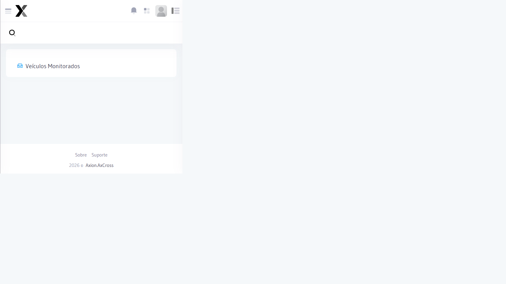

---
sidebar_position: 4
title: Relatório de Veículos Monitorados
description: Relatório de detecções de Veículos monitorados no AxCross
---

# Relatório de Veículos Monitorados

Consolida as detecções de Veículos cadastrados na lista de monitorados, exibindo cada ocorrência com dados de local, data/hora e imagem da passagem.

## Como acessar

No **menu lateral**, clique em Relatórios e selecione Veículos Monitorados**.


)

## Filtros

| Filtro | Obrigatório | Descrição |
|--------|:-----------:|-----------|
| **Data Início** | Sim | Data inicial do período |
| **Data Fim** | Sim | Data final do período |
| **Placa** | Não | Filtrar por placa específica |
| **Classificação** | Não | Filtrar por classificação do Veículo (ex.: Roubado, VIP) |
| **Local** | Não | Filtrar por cruzamento específico |
| **Status do Alerta** | Não | Aberto, Em atendimento, Resolvido |

## Colunas do resultado

| Coluna | Descrição |
|--------|-----------|
| **Data/Hora** | Momento da detecção |
| **Placa** | Placa detectada |
| **Classificação** | Categoria do Veículo monitorado |
| **Local** | Cruzamento onde ocorreu a detecção |
| Equipamento | Câmera que registrou a passagem |
| **Status Alerta** | Status da tratativa do alerta gerado |
| **Imagem** | Foto da passagem |

## Passo a passo

1. Acesse Relatórios → Veículos Monitorados** no menu lateral
2. Defina o **período** de consulta
3. Opcionalmente, aplique filtros adicionais
4. Clique em **Consultar**
5. Para exportar, clique em **Excel** ou **PDF**

:::tip Acompanhamento de alertas
Use este Relatório em conjunto com a tela de **Alertas** para acompanhar o status das tratativas de cada detecção.
:::

