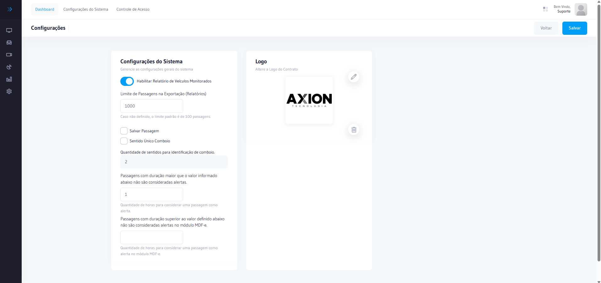

# Configurações do Sistema

Tela de configurações gerais do AxCross, onde são definidos parâmetros operacionais, dados do órgão e integrações.

## Como acessar

No **menu lateral**, clique em **Sistema**.

## Seções

### Dados Gerais

| Campo | Descrição |
|-------|-----------|
| **Nome do Órgão** | Nome do órgão responsável pelo sistema |
| **CNPJ** | CNPJ do órgão |
| **Endereço** | Endereço do órgão |
| **Contato** | Telefone e e-mail de contato |

### Configurações Operacionais

| Campo | Descrição |
|-------|-----------|
| **Intervalo de atualização** | Frequência de atualização do monitoramento online (segundos) |
| **Timeout de conexão** | Tempo máximo de espera para comunicação com equipamentos |
| **Retenção de dados** | Período de retenção dos registros de passagem |

### Integrações

| Campo | Descrição |
|-------|-----------|
| **API externa** | Configuração de integração com sistemas externos |
| **Webhook** | URL de callback para notificações |

:::caution Permissão necessária
Apenas usuários com perfil de administrador têm acesso às configurações do sistema.
:::
