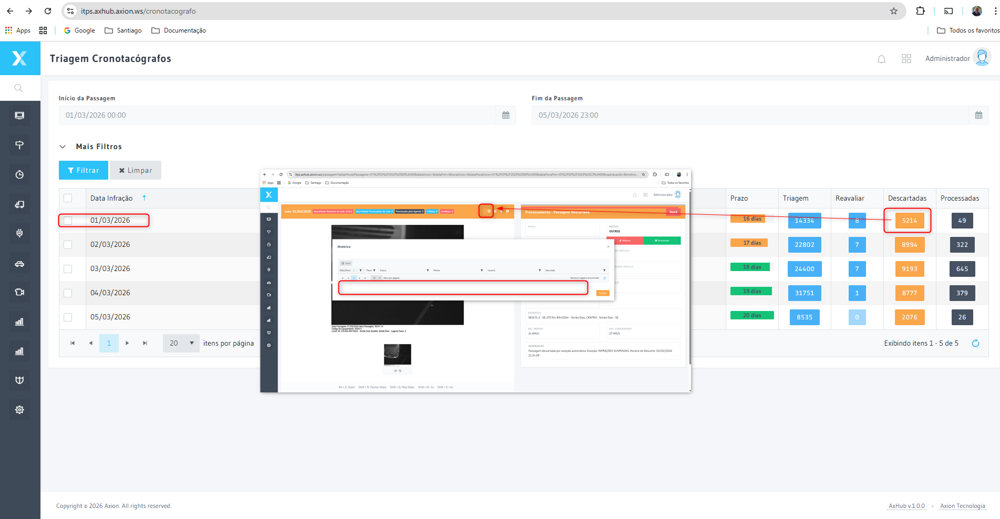

# Triagem — Cronotacógrafo

A tela de Triagem do Cronotacógrafo permite que os analistas revisem as Infrações de excesso de jornada e outras violações detectadas nos registros de cronotacógrafo dos Veículos pesados.

## Como acessar

**Menu lateral** → Cronotacógrafo → **Triagem**

## Fluxo de triagem do cronotacógrafo

A triagem do cronotacógrafo é paralela à triagem de Infrações convencionais, porém com uma etapa adicional: a **consulta ao sistema de registros de cronotacógrafo** antes de confirmar a Infração

## Dados da triagem — `TBTriagensCronotacografos`

A triagem do cronotacógrafo usa o mesmo Id da passagem (`TBPassagensCronotacografos.Id`):

| Campo | Tipo | Descrição |
|-------|------|-----------|
| **Id** | = PassagemCronotacografo_id | Identity shared com a passagem |
| **Motivo Descarte** | FK | Motivo de descarte aplicado na triagem |
| Usuário | FK | Usuário responsável pela triagem |
| Usuário Triagem** | FK | Analista que fez a triagem manual |
| Usuário Auditoria** | FK | Auditor que validou a triagem |
| **Status Consulta Cronotacógrafo** | varchar(15) | Estado da consulta ao banco externo: `Pendente`, `Consultado`, `Erro`, `NaoAplicavel` |

## Dados verificados na consult — `TBDadosCronotacografos`

| Campo | Tipo | Descrição |
|-------|------|-----------|
| **Data Documento** | date | Data do documento de registro |
| **Data Vencimento** | date | Vencimento do certificado do cronotacógrafo |
| **Tipo Certificado** | varchar(50) | Tipo do dispositivo/certificado |
| **Número Certificado** | varchar(50) | Número do certificado |
| **Descrição Certificado** | varchar(100) | Descrição do certificado |
| **Status Cronotacógrafo** | varchar(50) | Resultado da verificação: `Regular`, `Irregular`, `Vencido`, `NaoEncontrado` |

## Integrações

| Tabela | Relacionamento | Descrição |
|--------|---------------|-----------|
| `TBPassagensCronotacografos` | 1:1 | Passagem que originou a triagem |
| `TBDadosCronotacografos` | `PassagemCronotacografo_id` | Dados do certificado verificado |
| `TBMotivosDescartes` | `MotivoDescarte_id` | Motivo de descarte da triagem |
| `TBInfracoes` | `Infracao_id` | Infração gerada quando o cronotacógrafo está irregular |

## Termos Tecnicos

| Termo | Definicao |
|-------|-----------|
| [Cronotacografo](../glossario/cronotacografo) | Ver definicao no glossario |
| [Triagem](../glossario/triagem) | Ver definicao no glossario |

---

## Relacionado

- [Cronotacógrafo](../glossario/cronotacografo)
- [Consulta de Cronotacógrafo](./consulta)
- [Triagem de Infrações](../infracoes/triagem)
- [Enquadramentos](../administracao/enquadramentos)

## Boas práticas

- Verifique o status do certificado antes de confirmar a infração — certificado vencido invalida a autuação
- Registre o motivo de descarte quando o status retornar `NaoEncontrado` para manter a rastreabilidade
- Mantenha a fila de triagem com menos de 24h de defasagem para preservar a validade legal das autuações
- Revise periodicamente veículos com status recorrente `Irregular` para identificar frotas com problemas sistêmicos

:::tip
Acesse **Cronotacógrafo → Consulta** para visualizar o histórico completo de verificações e identificar veículos com irregularidades recorrentes.
:::

## Navegacao Relacionada

| Tipo | Pagina | Descricao |
|------|--------|-----------|
| próximo | [Consulta](./consulta) | Consultar registros processados |
| Glossario | [Cronotacografo](../glossario/cronotacografo) | Definicao tecnica e base legal |
