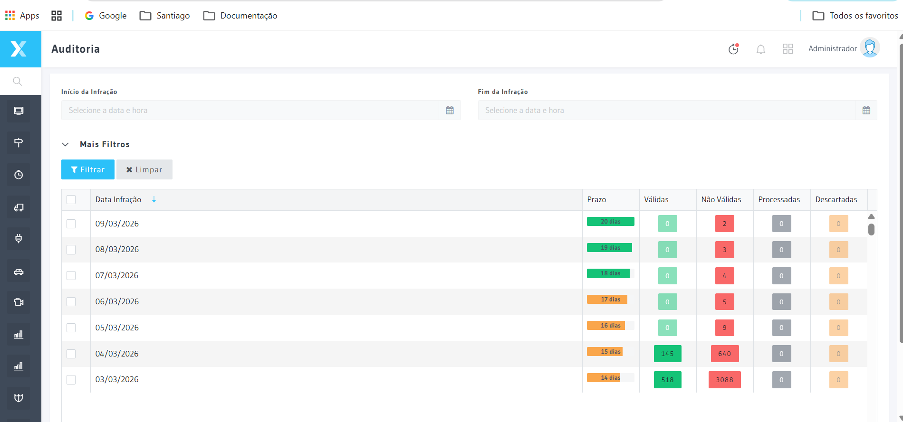
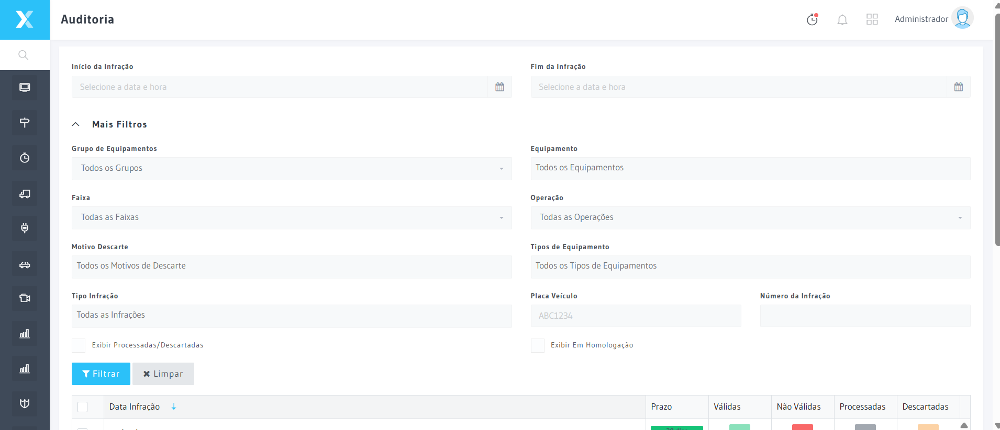

# Auditoria

A tela de Auditoria permite que auditores revisem as Infrações que foram validadas ou descartadas na etapa de triagem, garantindo a qualidade do processo antes da exportação para os órgãos autuadores.

## Como acessar

**Menu lateral** → Infrações → **Auditoria**

## Tipos de auditoria

| Tipo | Descrição |
|------|-----------|
| **Auditoria de Válidas** | Revisar Infrações aprovadas pelo analista na triagem |
| **Auditoria de Descartadas** | Revisar Infrações descartadas pelo analista na triagem |

## Filtros avançados

| Filtro | Descrição |
|--------|-----------|
| **Faixa de data** | Período a ser auditado |
| Equipamento | Auditar Equipamento específico |
| **Tipo de Infração | Velocidade, sinal, faixa exclusiva, etc. |
| **Analista responsável** | Auditar trabalho de analista específico |
| **Amostragem (%)** | Percentual de Infrações a auditar (ex: 10%, 25%, 100%) |

## Fluxo de trabalho

1. O sistema apresenta a Infração com todas as imagens e dados da triagem
2. O auditor analisa e decide:
   - ✅ **Confirma** — Infração correta, segue para exportação
   - ❌ **Rejeita** — devolve para triagem com observação
   - 📝 **Adiciona observações** — registra comentários sem alterar o status

## Boas práticas

- Auditar com amostragem mínima de 10% por equipamento por turno
- Rejeitar infrações com imagens ambíguas mesmo que a placa seja legível
- Documentar o motivo de rejeição para retroalimentação dos analistas

## Relacionado

- [Triagem](../glossario/triagem)
- [Infrações Descartadas](./infracoes-descartadas)
- [Processamento por Usuário](../relatorios/processamento-por-usuario)

3. O contador de tempo controla a produtividade (configurado em Configurações do Sistema → aba Triagem**)
4. O status é atualizado automaticamente após cada decisão

:::warning Impacto nas métricas
As decisões de auditoria alimentam os Relatórios de qualidade e produtividade. Rejeições freqüentes do mesmo analista devem ser investigadas.
:::

## Tabela de referência — decisões de auditoria

| Situação | Decisão | Justificativa |
|----------|---------|---------------|
| Imagem clara, placa legível, velocidade correta | Confirmar | Infração válida |
| Imagem ambígua mas placa lida corretamente | Confirmar com observação | Registrar dúvida |
| Placa incorretamente lida pelo OCR | Rejeitar | Devolver para triagem |
| Infração descartada sem motivo claro | Rejeitar descarte | Reenviar para triagem |
| Veículo isento autuado | Rejeitar | Verificar regras de exceção |

## Erros comuns

| Problema | Causa | Solução |
|----------|-------|----------|
| Auditor não vê infrações para auditar | Perfil sem permissão `auditoria.index` | Configurar permissões do perfil |
| Rejeição não altera o status | Status já exportado | Infrações exportadas não podem ser devolvidas |
| Amostragem mostra zerado | Período sem infrações triadas | Ampliar o período de consulta |
| Velocidade diferente do enquadramento | Configuração de enquadramento incorreta | Revisar Configurações de Enquadramento |

## Relacionado

- [Triagem](./triagem)
- [Exportação](./exportacao)
- [Consulta de Infrações](./consulta-infracoes)
- [Processamento por Usuário](../relatorios/processamento-por-usuario)
| Proxima etapa | [Exportacao](./exportacao) | Gerar lote para envio ao orgao |
| Consulta | [Consulta de Infracoes](./consulta-infracoes) | Buscar infracoes |
| Glossario | [Autuacao](../glossario/autuacao) | Ato administrativo de registro |

## Integração com outros módulos

| Módulo | Como usa este cadastro |
|--------|----------------------|
| **Triagem** | A auditoria é a etapa seguinte à triagem; infrações triadas aguardam na fila de auditoria para revisão |
| **Exportação** | Somente infrações com status **Auditada** são incluídas no lote de exportação |
| **Processamento por Usuário** | O relatório registra as decisões de cada auditor para avaliação de produtividade e consistência |
| **Dashboard** | Exibe o número de infrações aguardando auditoria como indicador de backlog operacional |
| Glossario | [Infracao](../glossario/infracao) | Definicao tecnica |

## Perguntas frequentes

**Qual o percentual mínimo de infrações que deve ser auditado?**
Recomenda-se no mínimo 10% por equipamento por turno. Contratos com cláusula de qualidade podem exigir percentuais maiores — consulte o contrato vigente.

**Uma infração já exportada pode ser revertida pelo auditor?**
Não. Infrações com status Exportada são imutáveis. Somente infrações com status Triada ou Auditada podem ser revertidas pelo auditor.

**O que fazer quando o auditor identifica um padrão de aprovação incorreto por um analista?**
Rejeite as infrações incorretas e documente com observação. Use o Relatório de Processamento por Usuário para quantificar o problema e embasar o feedback ao analista.
