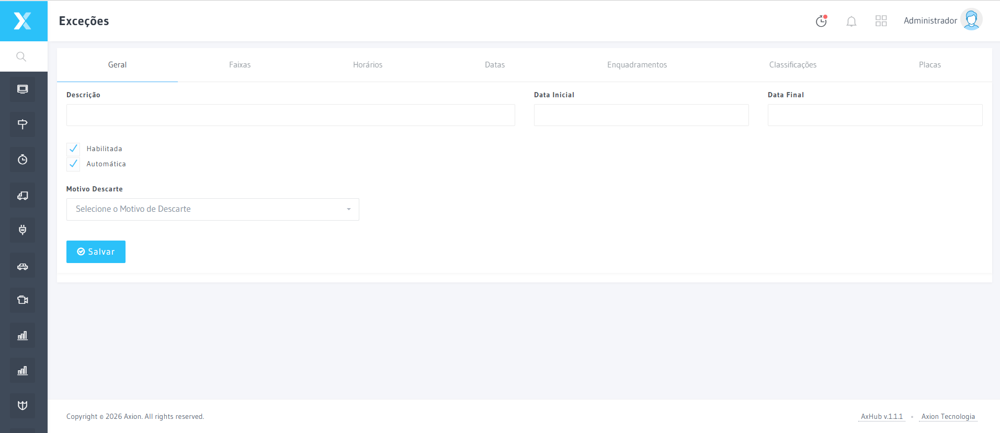

# Exceções

A tela de Exceções permite configurar regras que isentam determinados veículos ou situações do auto de infração. Exceções são aplicadas automaticamente durante o processamento.

## Como acessar

**Menu lateral** → Infrações → **Exceções**

## Tipos de filtro

| Filtro | Descrição |
|--------|-----------|
| **Placas** | Inverte infrações para placas específicas (ex: veículos oficiais) |
| **Horários** | Exceção por dia da semana e faixa de horário |
| **Faixas** | Exceção para faixas de trânsito específicas |
| **Classificações** | Exceção por classificação do veículo |
| **Enquadramentos** | Exceção por tipo de infração/enquadramento legal |
| **Datas** | Exceção para períodos específicos (feríados, eventos) |

## Tipos de exceção

| Tipo | Descrição |
|------|-----------|
| **Permanentes** | Veículos de emergência (ambulância, polícia, bombeiros) |
| **Temporárias** | Autoridades em visita, eventos especiais com prazo definido |
| **Por equipamento** | Exceção válida apenas em determinado ponto de fiscalização |
| **Por tipo de infração** | Ex: isento de velocidade mas não de sinal |

## Funcionalidades

- Criar regras com múltiplos filtros combinados
- Definir motivo de descarte automático para cada regra
- Configurar período de vigência da exceção
- Ativar/desativar exceções sem excluí-las
- Consultar histórico de aplicações da exceção

:::warning
Exceções ativas descartam infrações automaticamente durante a importação. Revise periodicamente as regras cadastradas para evitar cobertura indevida de infrações.
:::

## Termos Tecnicos

| Termo | Definicao |
|-------|-----------|
| [Enquadramento](../glossario/enquadramento) | Ver definicao no glossario |
| [Triagem](../glossario/triagem) | Ver definicao no glossario |

---

## Navegacao Relacionada

| Tipo | Pagina | Descricao |
|------|--------|-----------|
| Etapa anterior | [Triagem](./triagem) | Processo de validacao inicial |
| Proxima etapa | [Auditoria](./auditoria) | Revisao pos-excecao |
| Glossario | [Enquadramento](../glossario/enquadramento) | Classificacao legal |
