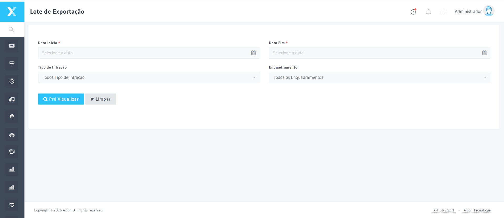

# Exportação

A tela de Exportação permite enviar as infrações validadas pelo fluxo de triagem e auditoria para os órgãos autuadores (DETRAN, DER, PRF, etc.), gerando os arquivos nos layouts exigidos por cada órgão.

## Como acessar

**Menu lateral** → Infrações → **Exportação**

## Como usar

1. Acesse **Infrações → Exportação**
2. Configure o lote:
   - **Órgão destino**: DETRAN, Prefeitura, DER, PRF, etc.
   - **Período**: Infrações a exportar por data
   - **Status**: Apenas infrações auditadas e válidas
   - **Layout**: Formato do arquivo (configurado em Administração → Layouts Arquivos)
3. Clique em **Gerar lote** — o sistema valida os dados, gera o arquivo e cria o hash de assinatura digital
4. Clique em **Enviar lote** via SFTP/API ou faça o download para envio manual

## Formatos suportados

| Formato | Descrição |
|---------|-----------|
| **RENAINF** | Padrão nacional para infrações de trânsito |
| **XML** | Layout customizável por órgão |
| **TXT** | Arquivo texto com delimitadores definidos |
| **CSV** | Para importação em sistemas legados |

## Validações realizadas antes da exportação

- ✅ Placa válida e legível
- ✅ Imagens em qualidade adequada
- ✅ Dados de local e equipamento completos
- ✅ Enquadramento legal correto
- ✅ Assinaturas digitais de triagem e auditoria presentes
- ✅ Infração não duplicada no lote
- ✅ Período de presção dentro do prazo legal

:::info
Os layouts de arquivo são configurados em **Administração → Layouts Arquivos**, com os campos e delimitadores exigidos por cada órgão autuador.
:::

## Termos Tecnicos

| Termo | Definicao |
|-------|-----------|
| [Enquadramento](../glossario/enquadramento) | Ver definicao no glossario |
| [Lote de Exportacao](../glossario/lote-exportacao) | Ver definicao no glossario |
| [Triagem](../glossario/triagem) | Ver definicao no glossario |

---

:::info Dica
Em caso de erros na exportação de lotes, utilize o assistente **AxionIA** (botão no canto inferior direito) para obter orientações detalhadas de correção.
:::

## Navegacao Relacionada

| Tipo | Pagina | Descricao |
|------|--------|-----------|
| Etapa anterior | [Auditoria](./auditoria) | Revisao final antes da exportacao |
| Configuracao | [Layouts de Arquivos](../administracao/layouts-arquivos) | Formatos |
| Configuracao | [Sequenciais de Lote](../administracao/sequenciais-lote-exportacao) | Numeracao |
| Glossario | [Lote de Exportacao](../glossario/lote-exportacao) | Definicao tecnica |
| Glossario | [Autuacao](../glossario/autuacao) | Ato de autuacao |
