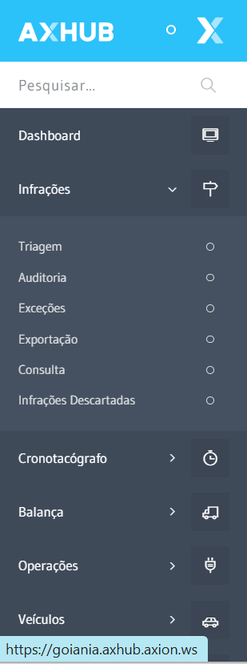
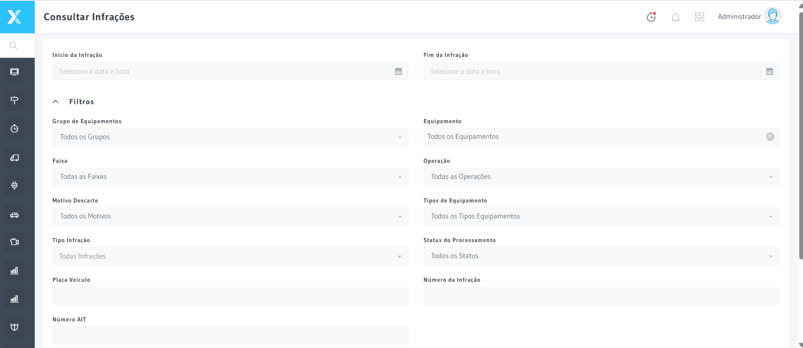
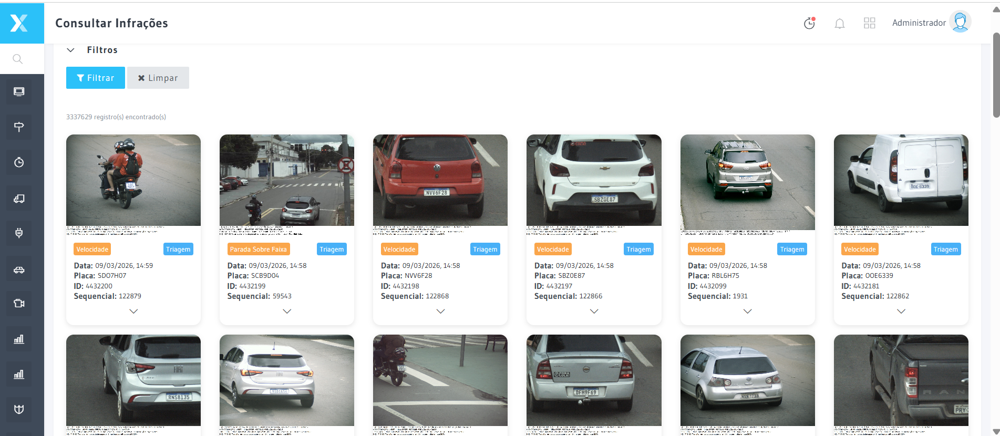
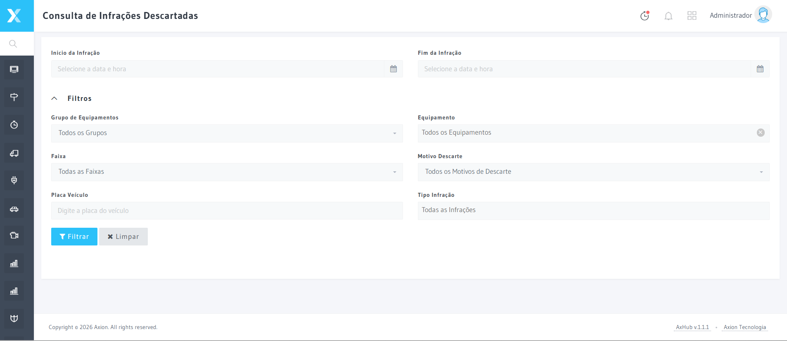

# Triagem — Infrações

Permite revisar, validar ou descartar Infrações pendentes antes da exportação para os órgãos autuadores.

## Como acessar

**Menu lateral** → Infrações → **Triagem**

## Tela principal

## Campos exibidos

| Campo | Descrição |
|-------|-----------|
| **Número Auto** | Identificador único da Infração |
| **Placa Veículo | Placa do Veículo infrator |
| **Data/Hora** | Momento da Infração |
| **Imagem** | Foto capturada pelo Equipamento |
| **Velocidade Medida** | Velocidade capturada |
| **Velocidade Considerada** | Velocidade após tolerância |
| **Velocidade Regulamentada** | Velocidade permitida no local |
| **Tipo Infração | Tipo de Infração registrada |
| **Status Triagem** | `Pendente` · `Validada` · `Descartada` |
| **Motivo Descarte** | Motivo informado ao descartar |
| **Operador** | Usuário que realizou a triagem |

## Filtros disponíveis

| Filtro | Descrição |
|--------|-----------|
| **Período** | Data/Hora da Infração |
| **Status Triagem** | Estado atual da triagem |
| **Tipo Infração | Tipo de Infração |
| **Operação** | Operação vinculada |

## Resultado da consulta

## Ações disponíveis

| Ação | Descrição |
|------|-----------|
| **Validar** | Confirma a Infração para exportação |
| **Descartar** | Rejeita com motivo obrigatório |
| **Reabrir** | Reabre Infração descartada para nova Análise |

## Infrações descartadas

## Auditoria

## Exceções

## Exportação

## Integrações

| Tabela | Descrição |
|--------|-----------|
| `TBInfracoes` | Registro principal da Infração |
| `TBTriagens` | Registro da triagem realizada |
| `TBMotivosDescarte` | Motivos disponíveis para descarte |
| `TBUsuarios` | Operador que realizou a triagem |

## Termos Tecnicos

| Termo | Definicao |
|-------|-----------|
| Use Infração (com acento) de Transito](../glossario/infracao) | Ver definicao no glossario |
| [Lote de Exportacao](../glossario/lote-exportacao) | Ver definicao no glossario |
| [Triagem](../glossario/triagem) | Ver definicao no glossario |

---

## Navegacao Relacionada

| Tipo | Pagina | Descricao |
|------|--------|-----------|
| Proxima etapa | [Excecoes](./excecoes) | Infracoes fora dos criterios padrao |
| Proxima etapa | [Auditoria](./auditoria) | Revisao das infracoes aprovadas |
| Configuracao | [Motivos de Descarte](../administracao/motivos-descartes) | Motivos disponiveis |
| Configuracao | Use Configuração Enquadramentos](../administracao/configuracoes-enquadramento) | Tipos de enquadramento |
| Configuracao | [Enquadramentos](../administracao/enquadramentos) | Lista de enquadramentos |
| Glossario | [Enquadramento](../glossario/enquadramento) | Definicao tecnica CTB |
| Glossario | [Infracao](../glossario/Use Infração (com acento)) | O que constitui uma Use Infração (com acento) |
| Glossario | [Triagem](../glossario/triagem) | Definicao do processo |
