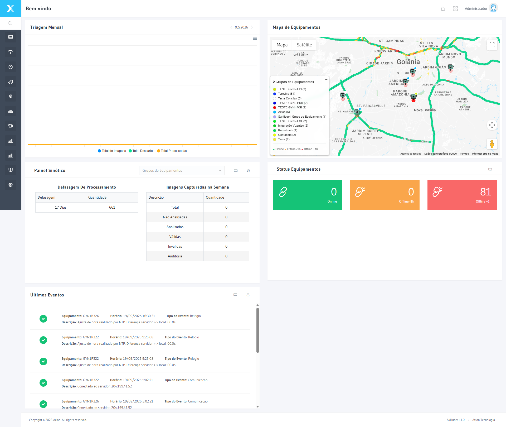
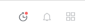
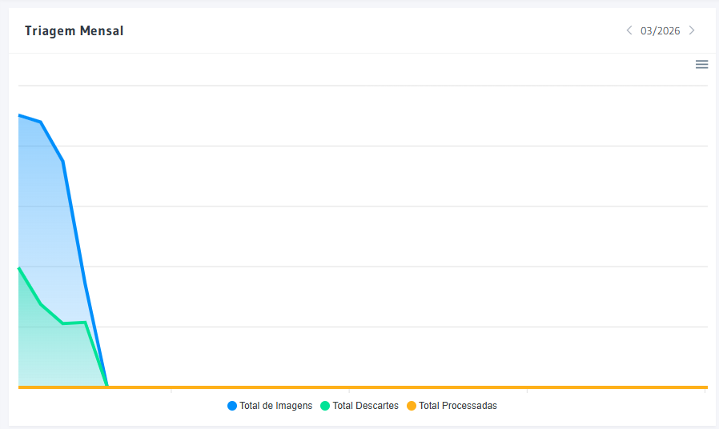
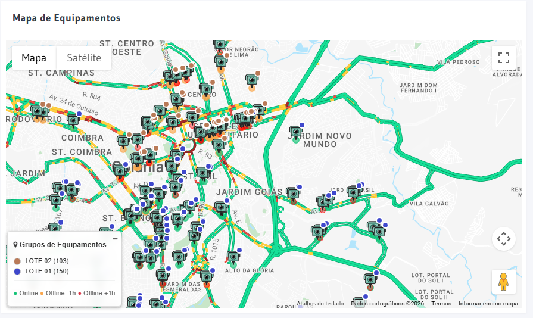
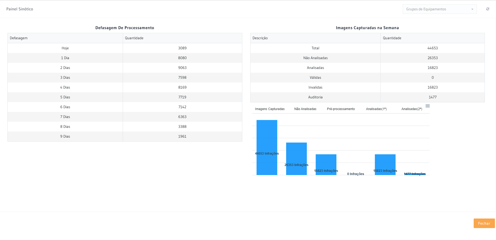
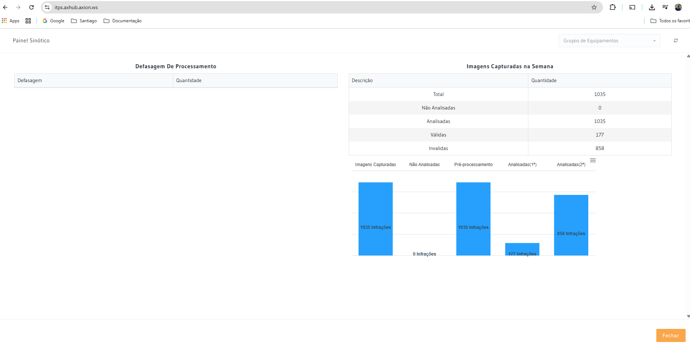
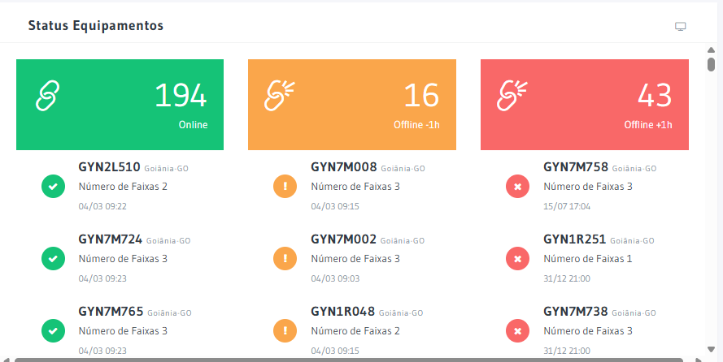
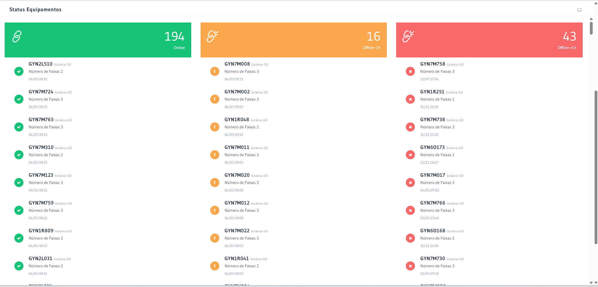
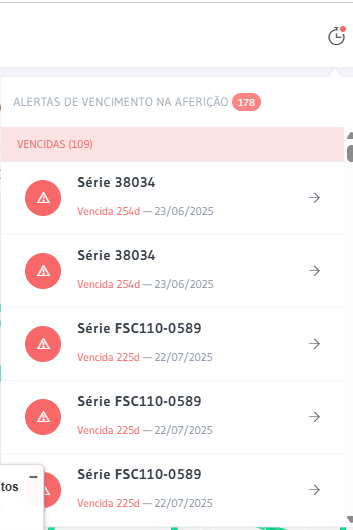
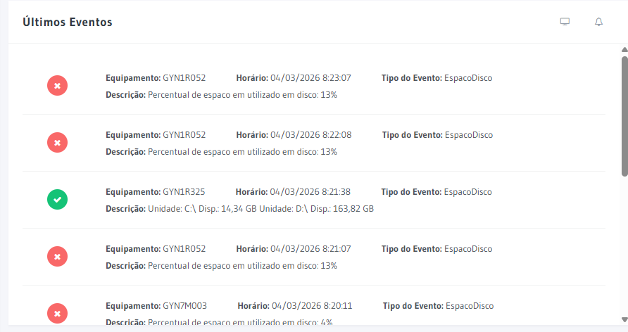

# Dashboard

O Dashboard é a tela inicial do AxHub após o login. Ele apresenta uma visão geral do estado operacional de todos os equipamentos e do processamento de infrações.

## Como acessar

**Menu lateral** → primeiro ícone (Dashboard)

## Atalhos de navegação

A barra lateral do Dashboard exibe ícones de atalho para os principais módulos do sistema. Clique em qualquer ícone para navegar diretamente para o módulo correspondente.

## Painéis disponíveis

### Triagem Mensal

Gráfico de barras horizontais que mostra o volume de processamento mensal:

- **Total de Imagens** — quantidade total de imagens recebidas
- **Total Descartado** — imagens/infrações descartadas na triagem
- **Total Processado** — imagens/infrações validadas

Clique em **Atualizar** para recarregar os dados do gráfico.

### Mapa de Equipamentos

Mapa interativo (Google Maps) que exibe a localização de todos os equipamentos de trânsito. Cada grupo de equipamentos é representado por uma **cor diferente** no mapa, conforme configurado no cadastro de grupos.

- Use os controles de **Mapa/Satélite** para alternar a visualização
- Clique em um **marcador** para ver detalhes do equipamento
- A **legenda** lateral lista todos os grupos de equipamentos e suas cores

### Painel Sintético

Painel com dois resumos operacionais:

**Defasagem de Processamento:**
Mostra há quanto tempo existem imagens aguardando processamento (ex: "> 7 dias"), indicando possíveis atrasos na triagem.

**Imagens Capturadas na Semana:**
Resumo semanal por status:
- **Não Publicadas** — aguardando publicação
- **Invalidadas** — descartadas no processamento
- **Válidas** — aprovadas na triagem
- **Análise** — em processo de triagem
- **Auditoria** — em processo de auditoria

Use o filtro **Grupos de Equipamentos** para visualizar dados de um grupo específico.

#### Visão em tela cheia — Painel Sinótico

Clique no ícone de expansão no canto do painel para abrir o Painel Sinótico em tela cheia, facilitando o monitoramento em painéis de controle e monitores dedicados.

### Status Equipamentos

Quatro indicadores coloridos mostram o status de conectividade dos equipamentos em tempo real:

| Cor | Status | Descrição |
|:---:|--------|-----------|
| Verde | **Online** | Equipamento operando normalmente |
| Laranja | **Offline recente** | Equipamento sem comunicação recente |
| Vermelho | **Offline** | Equipamento sem comunicação |
| Azul | **Total** | Total de equipamentos cadastrados |

#### Visão em tela cheia — Status Equipamentos

Clique no ícone de expansão no painel de Status Equipamentos para exibir a lista completa em tela cheia, com informações detalhadas de cada equipamento (código, grupo, tempo offline).

### Alertas de Vencimento de Aferição

Painel de alertas que exibe os equipamentos com certificado INMETRO próximo do vencimento ou vencido. Cada linha indica o equipamento, a data de vencimento e o número de dias restantes (ou em atraso). Equipamentos com prazo expirado aparecem em destaque vermelho.

### Últimos Eventos

Log em tempo real dos últimos eventos reportados pelos equipamentos:

- **Equipamento** — código do equipamento
- **Recebido** — data/hora do evento
- **Tipo de Evento** — classificação (Pânico, Comunicação, etc.)
- **Descrição** — detalhes do evento

:::warning Atenção
Eventos do tipo **Pânico** (indicados em vermelho) requerem atenção imediata, pois podem indicar violação ou mau funcionamento do equipamento.
:::

## Termos Tecnicos

| Termo | Definicao |
|-------|-----------|
| [Afericao](../glossario/afericao) | Ver definicao no glossario |
| [Triagem](../glossario/triagem) | Ver definicao no glossario |

---

## Navegacao Relacionada

| Tipo | Pagina | Descricao |
|------|--------|-----------|
| Navegacao | [Login](./login) | Como acessar o sistema |
| Navegacao | [Navegacao](./navegacao) | Estrutura do sistema |
| Fluxo | [Triagem](../infracoes/triagem) | Iniciar triagem de infracoes |
| Glossario | [Afericao](../glossario/afericao) | Alertas de vencimento |
