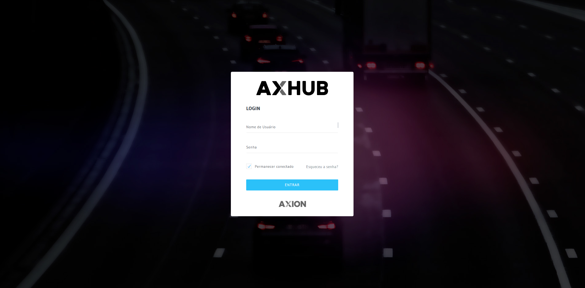

# Login

A tela de login é o ponto de entrada para o sistema AxHub. O acesso é feito através de credenciais fornecidas pelo administrador do sistema.

## Como acessar

1. Abra o navegador e acesse a URL do sistema fornecida pela sua organização
2. Informe seu **usuário** e **senha**
3. Clique em **Entrar**

## Campos do formulário

| Campo | Descrição |
|-------|-----------|
| **Usuário** | Login fornecido pelo administrador |
| **Senha** | Senha de acesso (diferencia maiúsculas e minúsculas) |
| **Lembrar-me** | Mantém a sessão ativa no navegador |

## Primeiro acesso

- No primeiro acesso, utilize as credenciais enviadas pelo administrador
- O sistema pode solicitar a troca de senha obrigatória
- Recomenda-se utilizar uma senha forte com letras, números e caracteres especiais

## Recuperação de senha

Caso esqueça sua senha:
1. Clique em **Esqueci minha senha** na tela de login
2. Informe o e-mail cadastrado
3. Verifique sua caixa de entrada e siga as instruções do e-mail recebido

:::info Restrições de acesso
O administrador pode configurar restrições de acesso por IP e horário. Caso não consiga acessar o sistema mesmo com credenciais corretas, verifique com o administrador se há restrições configuradas para seu usuário.
:::

---

## Navegacao Relacionada

| Tipo | Pagina | Descricao |
|------|--------|-----------|
| Proximo | [Dashboard](./dashboard) | Tela inicial apos login |
| Seguranca | [Usuarios](../controle-acesso/usuarios) | Gestao de usuarios |
| Seguranca | [Perfis de Acesso](../controle-acesso/perfis-acesso) | Configurar permissoes |
