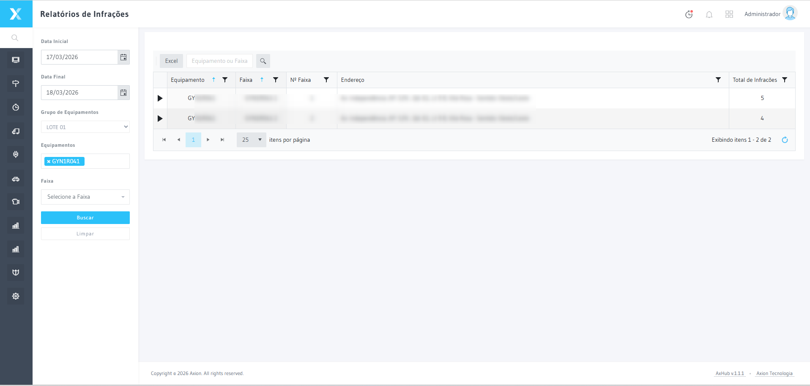
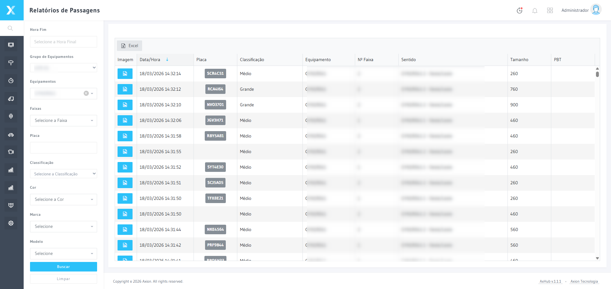
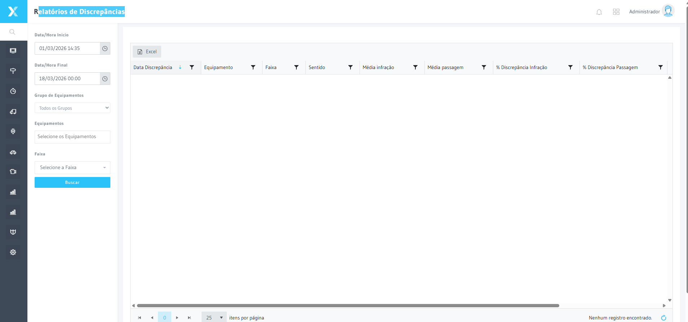
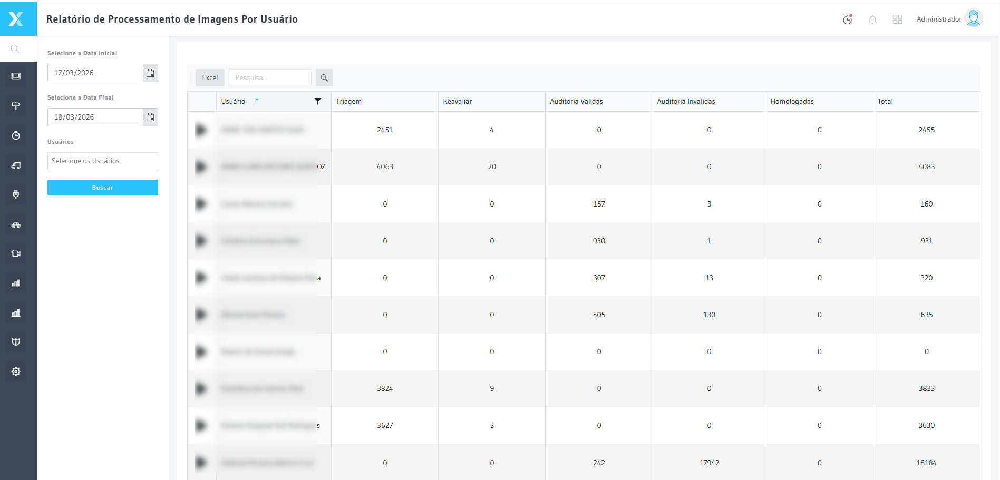
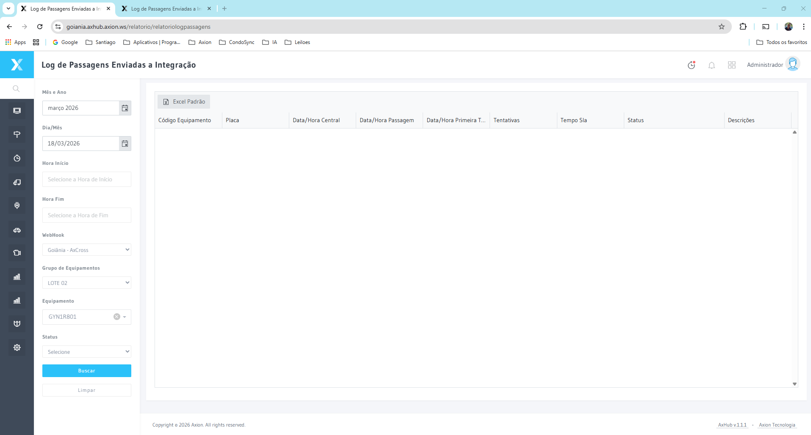
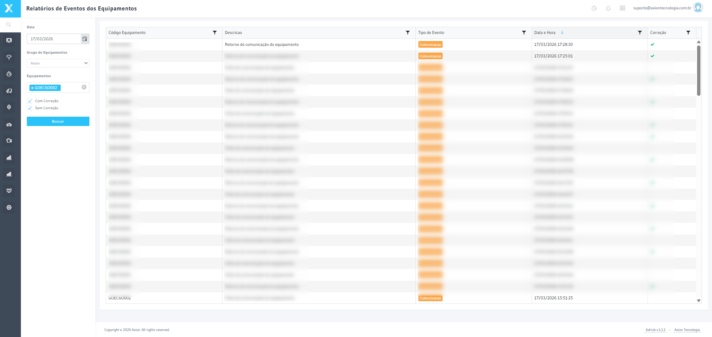

# relatorio por dia e equipamento/faixa de Fluxo/Imagens  — Procedimento Operacional

:::caution Gerado em modo offline
Este documento foi criado com o **template local** (sem IA generativa).
Revise e complete as seções marcadas com ✏️ antes de publicar.
:::

:::info Para quem é este documento?
> ✏️ _Descreva o público-alvo: analistas, operadores, administradores..._
:::

---

## O que é relatorio por dia e equipamento/faixa de Fluxo/Imagens ?

> ✏️ _Explique em 2-3 frases o que este processo/funcionalidade faz e por que é importante._

Benefícios deste processo:
- ✅ ✏️ _Benefício 1_
- ✅ ✏️ _Benefício 2_
- 🔒 ✏️ _Requisito ou restrição importante_

:::warning Atenção
> ✏️ _Adicione um alerta sobre responsabilidades ou impactos desta operação._
:::

---

## Como Acessar

### Passo 1 — Login

> ✏️ _Descreva aqui o que o usuário deve fazer neste passo._


### Passo 2 — Relatorio   Relatorio de infrações

> ✏️ _Descreva aqui o que o usuário deve fazer neste passo._



### Passo 3 — Relatorio   Relatorio de passagens

> ✏️ _Descreva aqui o que o usuário deve fazer neste passo._



### Passo 4 — Relatorio   Relatorio de discrepancias

> ✏️ _Descreva aqui o que o usuário deve fazer neste passo._



### Passo 5 — Relatorio   Relatorio de procesamento de imagens por usuário

> ✏️ _Descreva aqui o que o usuário deve fazer neste passo._



### Passo 6 — Relatorio   Relatorio de log de passagens enviadas a integração

> ✏️ _Descreva aqui o que o usuário deve fazer neste passo._



### Passo 7 — Relatorios   relatorio de eventos dos equipamentos

> ✏️ _Descreva aqui o que o usuário deve fazer neste passo._




---

## Checklist de Verificação

Antes de confirmar qualquer operação, verifique:

- [ ] ✏️ _Item de verificação 1_
- [ ] ✏️ _Item de verificação 2_
- [ ] ✏️ _Item de verificação 3_
- [ ] ✏️ _Item de verificação 4_

---

## Critérios e Regras

| Situação | Ação | Motivo |
|---|---|---|
| ✏️ _Caso 1_ | ✅ ✏️ _Ação_ | ✏️ _Motivo_ |
| ✏️ _Caso 2_ | ❌ ✏️ _Ação_ | ✏️ _Motivo_ |
| ✏️ _Caso 3_ | ⚠️ ✏️ _Ação_ | ✏️ _Motivo_ |

---

## Casos Especiais

:::tip Dica
> ✏️ _Descreva uma situação especial comum e como lidar._
:::

:::danger Situação Crítica
> ✏️ _Descreva um caso crítico que exige atenção redobrada ou escalação._
:::

---

## Fluxo do Processo

```
[Início]
    ↓
[✏️ Etapa 1]
    ↓
[✏️ Etapa 2]
  ↙       ↘
[✅ OK]  [❌ Erro]
    ↓          ↓
[✏️ Resultado OK]  [✏️ Ação de Erro]
```

---

## Contexto Adicional

Solicitação relatorio por dia e equipamento/faixa de Fluxo/Imagens
Solicitação relatorio por dia e equipamento/faixa de Fluxo/Imagens

Para agilizar o conferencia diária de passagens e imagens no sistema, solicitamos o relatorio no modelo em anexo.
Um para passagens e um para imagens.

--- Conteúdo extraído do arquivo "Modelo Relatorio.png" ---
[Imagem anexada: Modelo Relatorio.png (113 KB) — arquivo visual; utilize o campo "Contexto adicional" para descrever o conteúdo desta imagem para a IA.]

---

> **Próximos passos:** ✏️ _Adicione links para páginas relacionadas._
