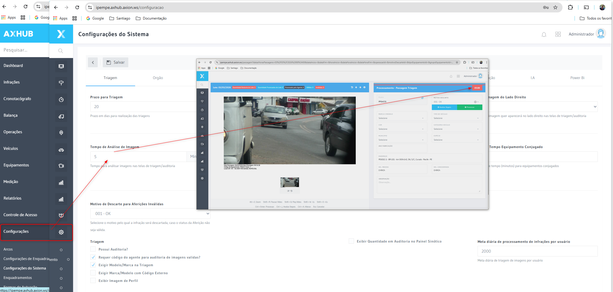

# Triagem e Auditoria

O módulo de triagem e auditoria é o coração do processamento de infrações no AxHub. Aqui, analistas revisam as infrações detectadas automaticamente, validando ou descartando cada uma.

## Fluxo de processamento

```
Importação → Triagem → Auditoria → Exportação
```

1. **Importação** — Imagens e dados chegam dos equipamentos
2. **Triagem** — Analista verifica placa, veículo e condições da infração
3. **Auditoria de Válidas** — Auditor revisa as infrações aprovadas na triagem
4. **Auditoria de Descartadas** — Auditor revisa as infrações descartadas na triagem
5. **Exportação** — Infrações validadas são exportadas para os órgãos autuadores

## Papéis

| Papel | Descrição |
|-------|-----------|
| **Analista de Triagem** | Realiza a primeira análise das infrações |
| **Auditor de Válidas** | Revisa infrações aprovadas pelo analista |
| **Auditor de Descartadas** | Revisa infrações descartadas pelo analista |
| **Supervisor** | Acesso completo a todos os estágios do fluxo |

## Motivos de descarte

As infrações podem ser descartadas por diversos motivos configuráveis, como:
- Placa ilegível
- Imagem com qualidade insuficiente
- Veículo oficial/emergência
- Erro do equipamento
- Exceção cadastrada

## Configurações de Tempo de Triagem

O sistema permite configurar parâmetros de tempo para controlar o fluxo de trabalho e garantir conformidade com prazos legais. Para acessar essas configurações, navegue até **Configurações → Configurações do Sistema → aba Triagem**.

### Principais Configurações

#### Prazo para Triagem
- **Campo**: Valor numérico em dias (padrão: 20)
- **Descrição**: "Prazo em dias para realização das triagens"
- **Função**: Define o número máximo de dias que o sistema considera uma infração/medição como dentro do prazo legal para ser triada. Após esse período, pode haver alertas, bloqueios ou marcações de atraso no sistema.

#### Tempo de Análise de Imagem
- **Campo**: Valor numérico em minutos (padrão: 5)
- **Descrição**: "Tempo para analisar imagens nas telas de triagem/auditoria"
- **Função**: Controla o tempo (em minutos) que o sistema disponibiliza ao agente/operador para analisar cada imagem individualmente nas telas de triagem e auditoria. Este é o contador que aparece no topo da tela de processamento durante a análise.

### Como Alterar as Configurações de Tempo

1. **Acesse a tela de configuração**
   - No menu lateral esquerdo, clique em **Configurações** (ícone de engrenagem ⚙️)
   - Selecione **Configurações do Sistema**
   - Clique na aba **Triagem**

2. **Localize os campos**
   - Role até a seção **Triagem** (geralmente a primeira ou segunda seção da tela)
   - Encontre o campo **Prazo para Triagem** (valor atual padrão: 20 dias)
   - Logo abaixo, localize o campo **Tempo de Análise de Imagem** (valor atual padrão: 5 minutos)

3. **Realize a alteração**
   - Clique diretamente no campo numérico desejado (ele se torna editável)
   - Digite o novo valor:
     - Exemplo: mude de 5 para 8 minutos no Tempo de Análise de Imagem
     - Ou de 20 para 15 dias no Prazo para Triagem
   - Repita para os outros campos que desejar ajustar

4. **Salve as alterações**
   - No topo da tela, clique no botão **Salvar** (ícone de disquete ou texto "Salvar")
   - Aguarde a confirmação de salvamento (mensagem de sucesso ou recarregamento da tela)

5. **Valide a alteração na prática**
   - Saia da configuração e vá para o módulo de **Triagem** ou **Processamento**
   - Abra uma passagem/imagem qualquer para análise (status "Pendente" ou "Em triagem")
   - Observe o contador de tempo no canto superior da tela de análise
   - O contador deve refletir o novo valor configurado (ex.: 08:00 se você alterou para 8 minutos)
   - Se não atualizar imediatamente, tente atualizar a página (F5) ou sair e entrar novamente no módulo

:::tip Dica importante
Algumas alterações de tempo podem exigir que o agente saia e entre novamente na sessão, ou que uma nova passagem seja aberta, para que o sistema carregue o novo parâmetro. Se o contador continuar mostrando o valor antigo, verifique se o salvamento foi efetivado com sucesso e se não há cache do navegador interferindo.
:::

### Outras Configurações da Aba Triagem

Além dos tempos, a aba Triagem oferece outras opções configuráveis:

- **Motivo de Descarte**: Dropdown para selecionar motivos de invalidação
- **Exigir Modelo/Marca na Triagem**: Obriga o preenchimento de marca/modelo do veículo
- **Requer código do agente para auditoria**: Exige autenticação adicional do agente
- **Exibir imagem de perfil**: Mostra foto frontal do veículo
- **Exigir Marca/Modelo com código externo**: Valida com base de dados externa
- **Meta diária de processamento**: Define quantidade de infrações esperadas por usuário/dia

## Funcionalidades do Módulo de Triagem

O módulo de triagem do AxHub oferece um conjunto completo de ferramentas para gerenciar o ciclo de vida das infrações desde a captura até a exportação.

### Menu Principal


O menu de triagem está organizado nas seguintes funcionalidades principais:

- **Processamento** - Tela principal de análise de infrações
- **Consultar Infrações** - Busca e visualização de infrações processadas
- **Consultar Descartadas** - Revisão de infrações descartadas
- **Auditoria** - Validação de infrações aprovadas
- **Exceções** - Gerenciamento de regras de exceção
- **Exportação** - Envio de infrações para órgãos autuadores

---

### 1. Consultar Infrações


**Objetivo**: Permitir a busca e visualização detalhada de infrações já processadas no sistema.

#### Como Usar

1. **Acesse**: Menu Triagem → Consultar Infrações
2. **Filtros disponíveis**:
   - **Período**: Data inicial e final da captura
   - **Equipamento**: Filtro por dispositivo específico
   - **Placa**: Busca por veículo
   - **Status**: Aguardando Triagem, Em Triagem, Válida, Descartada, Auditoria
   - **Operação**: Tipo de fiscalização (velocidade, avanço de sinal, etc.)
   - **Usuário**: Filtro por analista/auditor

3. **Clique em Consultar** para exibir os resultados

#### Resultado da Consulta


A tela de resultados exibe:
- **Lista de infrações** com foto do veículo
- **Dados da infração**: Placa, data/hora, velocidade, local, equipamento
- **Status atual** do processamento
- **Ações disponíveis**: Visualizar detalhes, imprimir, exportar

#### Integração

- **Banco de dados**: Consulta as tabelas `TBTicketPesagens` e `TBInfracao`
- **Filtros dinâmicos**: Integração com módulos de Equipamentos e Usuários
- **Exportação**: Permite exportar dados para Excel/PDF

---

### 2. Consultar Infrações Descartadas


**Objetivo**: Revisar infrações que foram descartadas durante a triagem, permitindo análise de qualidade e eventual reversão.

#### Como Usar

1. **Acesse**: Menu Triagem → Consultar Descartadas
2. **Filtros específicos**:
   - **Motivo do descarte**: Placa ilegível, qualidade insuficiente, veículo oficial, etc.
   - **Analista**: Quem descartou
   - **Período**: Quando foi descartada
   - **Equipamento**: De qual dispositivo veio

3. **Clique em Consultar**

#### Funcionalidades

- **Visualização de imagens**: Revisar a qualidade da captura
- **Histórico**: Ver quem descartou e quando
- **Estatísticas**: Análise de motivos mais frequentes
- **Reversão**: Possibilidade de reenviar para triagem (com permissão adequada)

#### Integração

- **Auditoria de log**: Registra todas as ações em `TBHistoricoAlteracao`
- **Motivos configuráveis**: Integra com Configurações do Sistema
- **Relatórios**: Alimenta dashboards de qualidade

---

### 3. Auditoria


**Objetivo**: Validar infrações aprovadas na triagem antes do envio para o órgão autuador.

#### Como Usar

1. **Acesse**: Menu Triagem → Auditoria
2. **Selecione o tipo de auditoria**:
   - **Auditoria de Válidas**: Revisar infrações aprovadas
   - **Auditoria de Descartadas**: Revisar infrações descartadas

3. **Use os filtros** para segmentar o trabalho


#### Filtros Avançados

- **Faixa de data**: Período a ser auditado
- **Equipamento**: Auditar equipamento específico
- **Tipo de infração**: Velocidade, sinal, faixa exclusiva, etc.
- **Analista responsável**: Auditar trabalho de analista específico
- **Amostragem**: Percentual de infrações a auditar (ex: 10%, 25%, 100%)

#### Fluxo de Trabalho

1. **Sistema apresenta infração** com todas as imagens e dados
2. **Auditor analisa**:
   - ✅ Confirma se está correta
   - ❌ Rejeita e envia de volta para triagem
   - 📝 Adiciona observações

3. **Contador de tempo** controla produtividade (configurável)
4. **Status atualizado** automaticamente após decisão

#### Integração

- **Banco de dados**: Atualiza `UsuarioAuditoria_id` e `InicioAuditoria` em `TBTicketPesagens`
- **Workflow**: Transição automática de status conforme análise
- **Notificações**: Pode enviar alertas para analistas quando infração é devolvida
- **Métricas**: Alimenta relatórios de produtividade e qualidade

---

### 4. Exceções


**Objetivo**: Cadastrar e gerenciar regras de exceção que automaticamente descartam infrações de veículos específicos.

#### Como Usar

1. **Acesse**: Menu Triagem → Exceções
2. **Cadastre nova exceção**:
   - **Placa**: Veículo a ser ignorado
   - **Tipo de veículo**: Oficial, emergência, diplomático
   - **Período**: Validade da exceção (início e fim)
   - **Motivo**: Justificativa legal
   - **Documentação**: Anexo de ofício ou autorização

3. **Exceções ativas** descartam automaticamente infrações na importação

#### Tipos de Exceção

- **Permanentes**: Veículos de emergência (ambulância, polícia, bombeiros)
- **Temporárias**: Autoridades em visita, eventos especiais
- **Por equipamento**: Exceção válida apenas em determinado local
- **Por tipo de infração**: Exceção para velocidade mas não para sinal

#### Integração

- **Processamento automático**: Motor de regras aplica exceções na importação
- **Log de aplicação**: Registra quando exceção foi aplicada
- **Validade**: Sistema verifica automaticamente datas de vigência
- **Relatórios**: Lista exceções aplicadas por período

---

### 5. Exportação


**Objetivo**: Enviar lotes de infrações validadas para os órgãos autuadores nos formatos e layouts exigidos por lei.

#### Como Usar

1. **Acesse**: Menu Triagem → Exportação
2. **Configure o lote**:
   - **Órgão destino**: DETRAN, Prefeitura, etc.
   - **Período**: Infrações a exportar
   - **Status**: Apenas infrações auditadas e válidas
   - **Layout**: Formato do arquivo (configurável)

3. **Gerar lote**:
   - Sistema valida completude dos dados
   - Gera arquivo no formato especificado
   - Cria hash/assinatura digital
   - Registra log de exportação

4. **Enviar lote**:
   - Upload via SFTP/API conforme órgão
   - Ou download local para envio manual
   - Recibo de exportação gerado

#### Formatos Suportados

- **RENAINF**: Padrão nacional para infrações de trânsito
- **XML**: Layout customizável por órgão
- **TXT**: Arquivo texto com delimitadores
- **CSV**: Para importação em sistemas legados

#### Validações Realizadas

- ✅ Placa válida e legível
- ✅ Imagens em qualidade adequada
- ✅ Dados de local e equipamento completos
- ✅ Enquadramento legal correto
- ✅ Assinaturas digitais de triagem e auditoria

#### Integração

- **Layout manager**: Usa configurações de layout por órgão
- **FTP/SFTP**: Envio automatizado
- **APIs externas**: Integração com sistemas dos órgãos
- **Controle de lote**: Rastreamento completo do envio
- **Retorno de processamento**: Importa respostas dos órgãos sobre aceitação/rejeição

---

### 6. Tempo de Análise de Imagem



**Objetivo**: Controlar o tempo disponível para análise de cada infração, garantindo produtividade sem comprometer qualidade.

Essa configuração foi detalhada na seção [Configurações de Tempo de Triagem](#configurações-de-tempo-de-triagem) acima. A imagem mostra:

- **Contador visível** na tela de processamento (05:00 no exemplo)
- **Alerta visual** quando tempo está acabando
- **Pausa automática** se operador não interagir
- **Métricas de tempo** para relatórios de produtividade

---

## Integrações do Módulo de Triagem

O módulo de triagem integra-se com diversos outros componentes do AxHub:

### Integrações Internas

| Módulo | Integração | Descrição |
|--------|-----------|-----------|
| **Importação** | Alimentação | Infrações importadas alimentam fila de triagem |
| **Equipamentos** | Dados técnicos | Valida origem e parâmetros do equipamento |
| **Operações** | Contexto | Associa infração à operação de fiscalização |
| **Usuários** | Controle de acesso | Perfis determinam permissões (analista/auditor) |
| **Configurações** | Parâmetros | Tempos, motivos, layouts, regras |
| **Relatórios** | Métricas | Produtividade, qualidade, status |
| **Webhooks** | Notificações | Eventos de mudança de status |

### Integrações Externas

| Sistema | Tipo | Descrição |
|---------|------|-----------|
| **RENAVAM** | API | Consulta dados do veículo para validação |
| **DETRAN** | SFTP/API | Exportação de infrações |
| **Prefeituras** | SFTP/API | Exportação de infrações municipais |
| **RENAINF** | Web Service | Envio no padrão nacional |
| **Sistemas de OCR** | API | Melhoria de leitura de placas |

### Banco de Dados - Principais Tabelas

```sql
-- Tabela principal de infrações
TBTicketPesagens
  - UsuarioTriagem_id
  - UsuarioAuditoria_id  
  - InicioTriagem
  - InicioAuditoria
  - DataProcessamento
  - StatusProcessamento

-- Histórico de alterações
TBHistoricoAlteracao
  - NovoStatusProcessamento
  - StatusProcessamentoAnterior
  - DataAlteracao
  - Usuario_id

-- Configurações
TBConfiguracoes
  - PrazoTriagem
  - TempoAnaliseImagem
  - MotivoDescarte
```

---

:::tip Melhor Prática
Configure os tempos de análise de acordo com a complexidade média das infrações do seu órgão. Tempos muito curtos prejudicam a qualidade; tempos muito longos reduzem produtividade. Monitore os relatórios de desempenho para ajustar adequadamente.
:::
