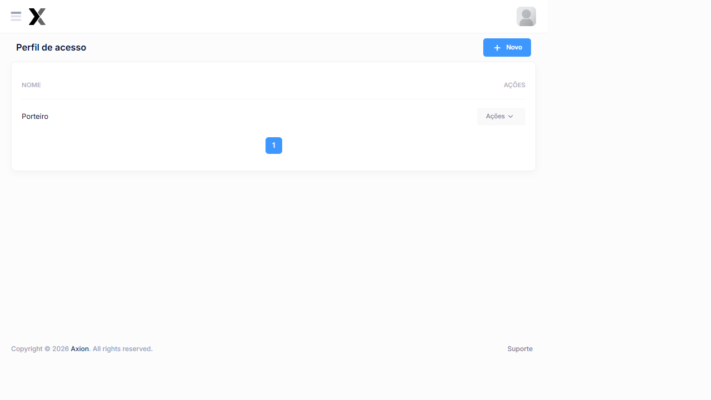
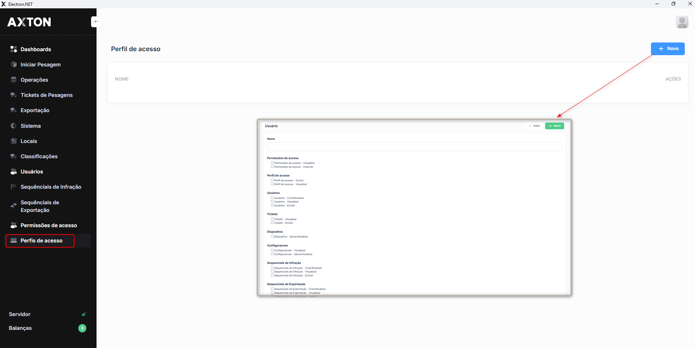

# Perfis de Acesso

O módulo de perfis de acesso define os conjuntos de permissões que serão atribuídos aos Usuários do sistema. Cada perfil agrupa as funcionalidades às quais os Usuários vinculados a ele terão acesso.

## Como acessar

**Menu lateral** → **Perfis de Acesso**

## Listagem

### Colunas

| Coluna | Descrição |
|--------|-----------|
| **Nome** | Nome do perfil de acesso |
| **Ações** | Editar e Excluir |

### Perfis cadastrados no sistema

| Perfil | Descrição de uso |
|--------|-----------------|
| **Porteiro** | Operador de cancela com acesso limitado à pesagem |

### Ações disponíveis

| Ação | Descrição |
|------|-----------|
| **+ Novo** | Cadastrar um novo perfil de acesso |
| **Editar** | Alterar nome e permissões do perfil |
| **Excluir** | Remover o perfil (não permitido se houver Usuários vinculados) |

## Cadastro

1. Acesse **Controle de Acesso → Perfis de Acesso**
2. Clique em **+ Novo**
3. Informe o **Nome** do perfil
4. Configure as **Permissões** por módulo
5. Clique em **Salvar**

:::tip
Crie perfis com o mínimo de permissões necessárias (princípio do mínimo privilégio). Revise e ajuste periodicamente com base nas funções reais de cada grupo.
:::

## Segurança

- Nunca crie um único perfil para funções muito diferentes — separe Operador, Auditor e Administrador em perfis distintos
- Revise os perfis a cada alteração de escopo ou troca de colaboradores para evitar permissões obsoletas
- Use os **Logs de Acesso** periodicamente para verificar se usuários estão acessando apenas as áreas esperadas
- Desative perfis que não estão mais em uso em vez de excluí-los para preservar o histórico de atribuições

## Relacionado

- [Usuários](./usuarios)
- [Permissões](./configurar-permissoes)

## Exemplos de perfis recomendados

| Perfil | Módulos com acesso | Restrições |
|--------|-------------------|-----------|
| **Operador de Pesagem** | Pesagem, Tickets, Consulta de Placas | Sem acesso a Exportação e Configurações |
| **Auditor** | Triagem, Auditoria, Relatórios | Somente leitura; sem cadastros |
| **Supervisor** | Todos os módulos operacionais + Exportação | Sem Administração |
| **Administrador** | Acesso total | Sem restrições |
| **Porteiro** | Apenas Iniciar Pesagem | Sem triagem ou relatórios |

## Fluxo de criação de perfil

1. Identificar a função do grupo de usuários
2. Acessar **Administração → Perfis de Acesso**
3. Criar o perfil com nome descritivo
4. Acessar **Permissões de Acesso** e configurar cada módulo
5. Criar os usuários e vincular ao perfil
6. Testar acessando com um usuário do perfil para validar as permissões

## Erros comuns

| Situação | Causa | Solução |
|----------|-------|----------|
| Usuário não vê módulo no menu | Perfil sem permissão `grid.view` | Habilitar permissão de visualização |
| Não consegue salvar registro | Sem permissão `form.saveorupdate` | Habilitar permissão de criação/edição |
| Perfil não pode ser excluído | Usuários vinculados ao perfil | Desvincular usuários primeiro |

### Campos

| Campo | Obrigatório | Descrição |
|-------|:-----------:|-----------|
| **Código** | Sim | Código único de identificação do perfil |
| **Descrição** | Sim | Nome descritivo do perfil (ex.: Administrador, Operador, Auditor) |
| **Ativo** | Sim | Define se o perfil estará disponível para atribuição a Usuários |

## Perguntas frequentes

**Posso usar o mesmo perfil para funções muito diferentes?**
Não é recomendado. Crie perfis separados para Operação, Auditoria e Administração. Perfis genéricos com múltiplas funções dificultam a rastreabilidade e aumentam o risco de acessos indevidos.

**O que acontece quando excluo um perfil com usuários vinculados?**
O sistema bloqueia a exclusão. Desvincule todos os usuários do perfil antes de removê-lo. Prefira inativar perfis obsoletos em vez de excluir.

**Com que frequência devo revisar os perfis e permissões?**
Revise sempre que houver troca de colaboradores, mudanças de escopo ou atualizações do sistema. Permissões obsoletas são um risco de segurança.

### Passo a passo — Cadastrar perfil de acesso

1. Na listagem, clique em **+ Novo**
2. Informe o **Código** e a **Descrição** do perfil
3. Confirme que o campo **Ativo** está marcado
4. Clique em **Salvar**
5. Após salvar, acesse o módulo de **Permissões de Acesso** para configurar as permissões vinculadas ao perfil

:::tip Boas práticas
Crie perfis com nomes descritivos que reflitam o cargo ou função dos Usuários que serão atribuídos a eles. Evite criar um perfil único com acesso total para todos os Usuários pois isso dificulta a rastreabilidade das operações realizadas no sistema.
:::

:::warning Exclusão de perfis
Um perfil de acesso somente poderá ser excluído se não houver Usuários vinculados a ele. Para desabilitar um perfil sem excluí-lo, utilize o campo **Ativo**.
:::

## Integração com outros módulos

| Módulo | Como se relaciona com Perfis de Acesso |
|--------|----------------------------------------|
| **Usuários** | Cada usuário deve ter um perfil vinculado — sem perfil, o acesso não funciona corretamente |
| **Permissões de Acesso** | As permissões configuradas por módulo são associadas ao perfil e aplicadas a todos os usuários vinculados |
| **Logs de Acesso** | Os acessos registrados incluem o perfil do usuário, facilitando auditorias por grupo |
| **Login** | O perfil define quais módulos aparecem no menu após a autenticação |

## Exemplo prático

**Cenário**: Uma empresa vencedora de contrato de pesagem veicular precisa configurar perfis distintos para 3 funções: operadores de pesagem, supervisores e auditores do órgão contratante.

| Perfil | Módulos com acesso | Restrição |
|--------|-------------------|-----------|
| Operador Pesagem | Pesagem, Tickets, Consulta de Placas | Sem Exportação ou Configurações |
| Supervisor de Turno | Pesagem + Operações + Exportação | Sem Administração |
| Auditor Externo | Relatórios somente leitura | Sem cadastros ou exportação |

**Passo a passo**:
1. Acesse **Administração → Perfis de Acesso** e clique em **+ Novo**
2. Crie o perfil `Operador Pesagem` com acesso a Pesagem e Tickets
3. Crie o perfil `Supervisor de Turno` adicionando Operações e Exportação
4. Crie o perfil `Auditor Externo` com apenas `grid.view` nos módulos de relatório
5. Vincule cada usuário ao perfil correspondente
6. Teste acessando com usuários de cada perfil para validar as restrições

**Resultado**: Cada grupo acessa apenas o que é necessário. O auditor externo não consegue alterar dados; o operador não exporta lotes. Rastreabilidade garantida por perfil nos Logs de Acesso.
