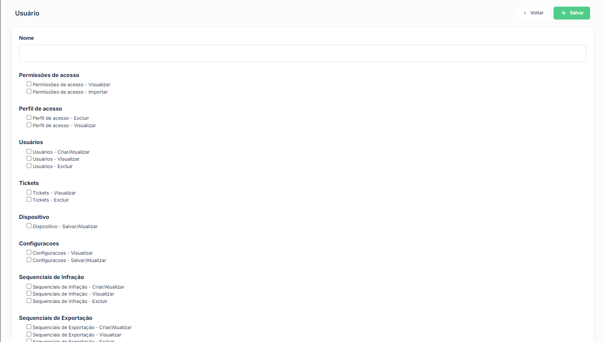

# Perfis de Acesso

O módulo de perfis de acesso define os conjuntos de permissões que serão atribuídos aos usuários do sistema. Cada perfil agrupa as funcionalidades às quais os usuários vinculados a ele terão acesso.

## Como acessar

**Menu lateral** → Administração → **Perfis de Acesso**

## Listagem

### Colunas

| Coluna | Descrição |
|--------|-----------|
| **Código** | Código de identificação do perfil |
| **Descrição** | Nome do perfil de acesso |
| **Ativo** | Indica se o perfil está habilitado para atribuição a usuários |

### Ações disponíveis na listagem

| Ação | Descrição |
|------|-----------|
| **+ Novo** | Cadastrar um novo perfil de acesso |
| **Pesquisa** | Buscar perfis por qualquer campo da listagem |
| **Editar** | Alterar os dados de um perfil existente (ícone lápis) |
| **Excluir** | Remover um perfil do sistema (ícone X) |

## Cadastro

### Campos

| Campo | Obrigatório | Descrição |
|-------|:-----------:|-----------|
| **Código** | Sim | Código único de identificação do perfil |
| **Descrição** | Sim | Nome descritivo do perfil (ex.: Administrador, Operador, Auditor) |
| **Ativo** | Sim | Define se o perfil estará disponível para atribuição a usuários |

### Passo a passo — Cadastrar perfil de acesso

1. Na listagem, clique em **+ Novo**
2. Informe o **Código** e a **Descrição** do perfil
3. Confirme que o campo **Ativo** está marcado
4. Clique em **Salvar**
5. Após salvar, acesse o módulo de **Permissões de Acesso** para configurar as permissões vinculadas ao perfil

:::tip Boas práticas
Crie perfis com nomes descritivos que reflitam o cargo ou função dos usuários que serão atribuídos a eles. Evite criar um perfil único com acesso total para todos os usuários, pois isso dificulta a rastreabilidade das operações realizadas no sistema.
:::

:::warning Exclusão de perfis
Um perfil de acesso somente poderá ser excluído se não houver usuários vinculados a ele. Para desabilitar um perfil sem excluí-lo, utilize o campo **Ativo**.
:::
