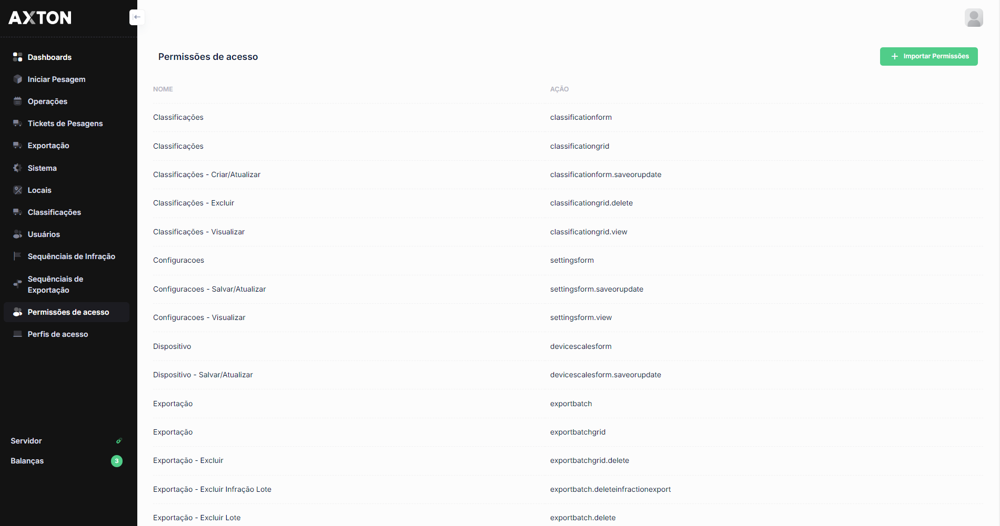
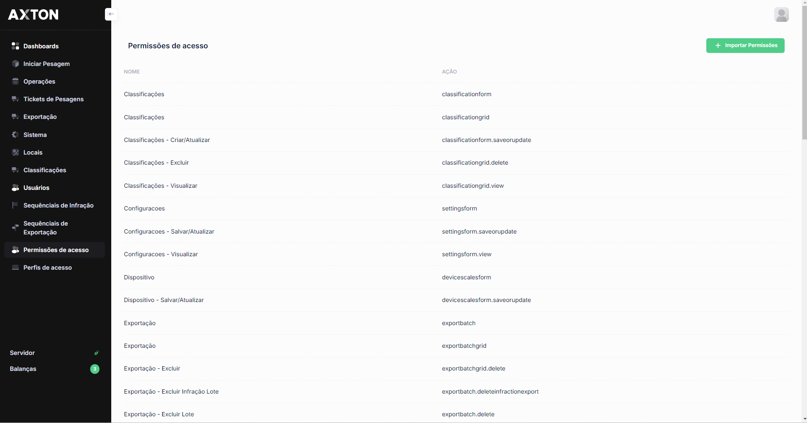
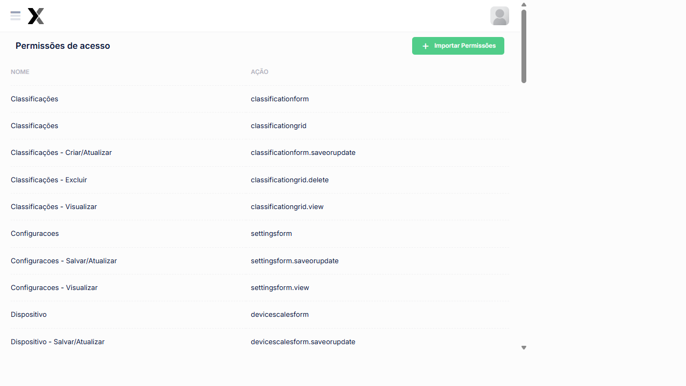

# Permissões de Acesso

O módulo de permissões de acesso permite definir, para cada perfil cadastrado, quais funcionalidades do sistema estarão disponíveis. As permissões controlam o acesso a módulos, telas e ações específicas.

## Como acessar

**Menu lateral** → Administração → **Permissões de acesso**

## Listagem

### Estrutura da tela

A tela exibe a matriz de permissões organizada por **perfil de acesso** e **funcionalidade**. Para cada combinação, é possível habilitar ou desabilitar o acesso.

## Configuração de permissões

### Tipos de permissão

| Permissão | Descrição |
|-----------|-----------|
| **Visualizar** | Permite ao Usuário acessar e visualizar os dados da funcionalidade |
| **Criar** | Permite ao Usuário cadastrar novos registros na funcionalidade |
| **Editar** | Permite ao Usuário alterar registros existentes |
| **Excluir** | Permite ao Usuário remover registros do sistema |

### Passo a passo — Configurar permissões de um perfil

1. No menu lateral, abra **Administração** e clique em **Permissões de acesso**
2. Selecione o **Perfil de Acesso** a ser configurado
3. Para cada funcionalidade listada, marque ou desmarque os tipos de permissão desejados
4. Clique em **Salvar** para aplicar as Configurações

:::warning Impacto imediato
As alterações nas permissões de um perfil têm efeito imediato para todos os Usuários vinculados a esse perfil. Usuários com sessão ativa poderão perceber a alteração no próximo acesso a uma funcionalidade afetada.
:::

## Permissões por Módulo (sistema real)

A tabela abaixo lista as permissões disponíveis por módulo conforme o sistema AxTon:

| Módulo | Ações disponíveis |
|--------|-------------------|
| **Classificações** | grid.view, form.saveorupdate, grid.delete |
| Configurações | grid.view, form.saveorupdate |
| **Dispositivo** | grid.view, form.saveorupdate, grid.delete |
| **Exportação** | grid.view, form.saveorupdate, grid.delete |
| **Locais** | grid.view, form.saveorupdate, grid.delete |
| **Operações** | grid.view, form.saveorupdate, grid.delete |
| **Perfil de Acesso** | grid.view, form.saveorupdate, grid.delete |
| **Pesagem** | start-weighing, ticket-actions |
| Relatório | grid.view, export.pdf |
| **Sequencial** | grid.view, form.saveorupdate, grid.delete |
| **Tickets** | grid.view, grid.delete |
| Usuários | grid.view, form.saveorupdate, grid.delete |

### Tipos de ação

| Ação | Descrição |
|------|-----------|
| **grid.view** | Visualizar a listagem do módulo |
| **form.saveorupdate** | Criar e editar registros |
| **grid.delete** | Excluir registros |
| **start-weighing** | Iniciar processo de pesagem |
| **ticket-actions** | Ações nos tickets (visualizar, reclassificar) |
| **export.pdf** | Exportar Relatórios em PDF |

:::tip Perfil Porteiro
Para operadores de cancela/portaria, configure o perfil **Porteiro** com acesso apenas a:
- **Pesagem**: start-weighing e ticket-actions
- **Tickets**: grid.view
:::

## Perguntas frequentes

**As alterações de permissão entram em vigor imediatamente?**
Sim. As mudanças têm efeito imediato para todos os usuários do perfil. Usuários com sessão ativa podem precisar fazer logout e login novamente para que as novas permissões sejam aplicadas.

**Como permitir que um operador inicie pesagens mas não altere cadastros?**
Configure o perfil com `pesagem: start-weighing` e `tickets: grid.view`. Remova as permissões `form.saveorupdate` dos módulos de cadastro para restringir a criação e edição.

**Preciso testar as permissões após configurar um perfil?**
Sim. Crie um usuário de teste vinculado ao perfil e acesse o sistema para validar quais funcionalidades aparecem e quais estão bloqueadas.

## Integração com outros módulos

| Módulo | Como se relaciona com Permissões |
|--------|----------------------------------|
| **Perfis de Acesso** | As permissões são configuradas por perfil — cada perfil tem sua própria matriz de permissões |
| **Usuários** | As permissões do perfil vinculado ao usuário determinam o que ele pode fazer no sistema |
| **Logs de Acesso** | Tentativas de acesso a funcionalidades sem permissão podem ser registradas como alertas de segurança |
| **Login** | O menu exibido após o login reflete as permissões de visualização (`grid.view`) do perfil do usuário |
