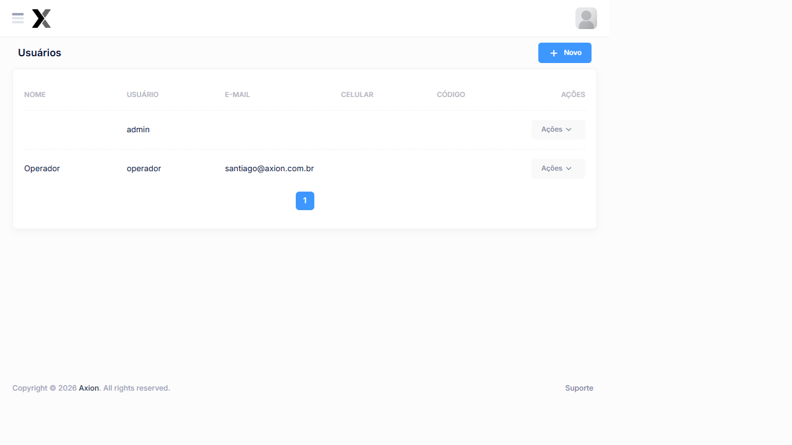

# Usuários

O módulo de Usuários gerencia as contas de acesso ao AxTon, permitindo cadastrar operadores, definir credenciais de Login e vincular perfis de acesso.

## Como acessar

**Menu lateral** → Usuários

## Listagem

### Colunas

| Coluna | Descrição |
|--------|-----------|
| **Nome** | Nome completo do Usuário |
| Usuário | Login utilizado no acesso ao sistema |
| **E-mail** | Endereço de e-mail do Usuário |
| **Celular** | Número de telefone |
| **Código** | Código do Usuário no sistema |
| **Ações** | Editar e Excluir |

### Usuários cadastrados no sistema

| Nome | Usuário | E-mail | Código |
|------|---------|--------|--------|
| **admin** | admin | — | — |
| **Operador** | operador | santiago@axion.com.br | — |

## Cadastro

### Campos

| Campo | Obrigatório | Descrição |
|-------|:-----------:|-----------|
| **Nome** | Sim | Nome completo do Usuário |
| Usuário | Sim | Login de acesso ao sistema |
| **E-mail** | Não | E-mail para notificações |
| **Celular** | Não | Telefone de contato |
| **Código** | Não | Código funcional do operador |
| **Senha** | Sim | Senha de acesso (mínimo 8 caracteres) |

### Passo a passo — Cadastrar Usuário

1. No menu lateral, clique em Usuários
2. Clique em **+ Novo**
3. Preencha o **Nome** e o Usuário Login
4. Informe o **E-mail** e o **Celular** (opcional)
5. Defina uma **Senha** segura
6. Clique em **Salvar**

:::warning Segurança
Use senhas fortes com letras maiúsculas, minúsculas, números e caracteres especiais. Não compartilhe credenciais entre operadores.
:::

## Veja também

| Funcionalidade | Descrição |
|---|---|
| [**Perfis de Acesso**](../administracao/perfis-acesso) | Definir níveis de acesso |
| [**Permissões**](../administracao/permissoes) | Controle granular de permissões |

### Campos

| Campo | Obrigatório | Descrição |
|-------|:-----------:|-----------|
| **Nome** | Sim | Nome completo do Usuário |
| **Nome de Usuário | Sim | Identificador de Login sem espaços ou caracteres especiais |
| **E-mail** | Sim | Endereço de e-mail para comunicações e recuperação de senha |
| **Senha** | Sim | Senha de acesso ao sistema |
| **Confirmar Senha** | Sim | Repetição da senha para confirmação |
| **Perfil de Acesso** | Sim | Perfil que define as permissões do Usuário no sistema |
| **Ativo** | Sim | Define se a conta estará habilitada para Login |

### Passo a passo — Cadastrar Usuário

1. Na listagem, clique em **+ Novo**
2. Preencha o **Nome** completo do Usuário
3. Informe o **Nome de Usuário para Login
4. Informe o **E-mail** do Usuário
5. Defina e confirme a **Senha**
6. Selecione o **Perfil de Acesso** correspondente
7. Confirme que o campo **Ativo** está marcado
8. Clique em **Salvar**

## Configuração de acesso

Após o cadastro, é possível configurar detalhes adicionais de acesso ao Usuário como restrições de horário, locais permitidos e outras parametrizações vinculadas ao perfil.

:::warning Segurança de senha
As senhas devem ser informadas diretamente ao Usuário de forma segura. O sistema não exibe a senha após o cadastro. Em caso de esquecimento, utilize a função de **recuperação de senha** disponível na tela de Login
:::

:::tip Desativação de Usuários
Para revogar o acesso de um Usuário sem excluir seu histórico de operações, desmarque o campo **Ativo** no cadastro. O Usuário não conseguirá realizar Login mas seus registros serão preservados.
:::

## Perguntas frequentes

**Posso ter dois usuários com o mesmo login?**
Não. O campo Login deve ser único no sistema. Use um padrão como email ou código funcional para garantir unicidade.

**Como redefinir a senha de um usuário que esqueceu?**
O administrador pode editar o cadastro do usuário e definir uma nova senha temporária. Oriente o usuário a alterá-la no primeiro acesso por segurança.

**Devo excluir o usuário de um colaborador desligado ou apenas inativá-lo?**
Inative em vez de excluir. A exclusão apaga o histórico de operações do usuário, que pode ser necessário em auditorias futuras.
