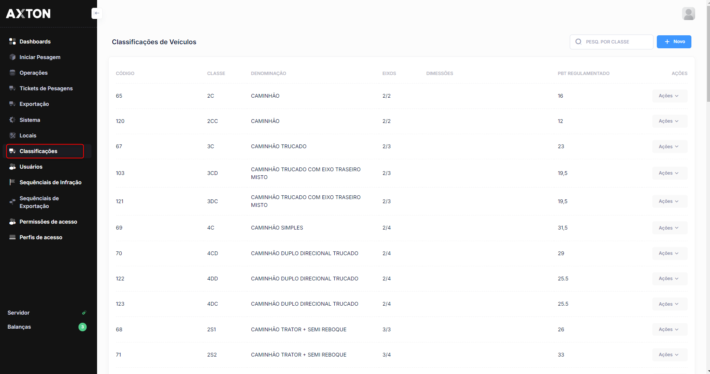

# Classificação de Veículos

O módulo de classificação de veículos define as categorias de veículos reconhecidas pelo sistema AxTon. Cada classificação determina os parâmetros aplicados nas operações de pesagem e fiscalização.

## Como acessar

**Menu lateral** → Cadastros → **Classificação de Veículos**

## Listagem

### Colunas

| Coluna | Descrição |
|--------|-----------|
| **Código** | Código de identificação da classificação |
| **Descrição** | Nome da categoria de veículo |
| **Número de Eixos** | Quantidade de eixos do veículo na classificação |
| **Peso Máximo (t)** | Peso bruto total máximo permitido, em toneladas |
| **Ativo** | Indica se a classificação está habilitada para uso |

### Ações disponíveis na listagem

| Ação | Descrição |
|------|-----------|
| **+ Novo** | Cadastrar uma nova classificação |
| **Pesquisa** | Buscar classificações por qualquer campo |
| **Editar** | Alterar os dados de uma classificação existente (ícone lápis) |
| **Excluir** | Remover uma classificação do sistema (ícone X) |

## Cadastro

### Campos

| Campo | Obrigatório | Descrição |
|-------|:-----------:|-----------|
| **Código** | Sim | Código único de identificação da classificação |
| **Descrição** | Sim | Nome da categoria de veículo (ex.: Caminhão 2 Eixos, Bitrem) |
| **Número de Eixos** | Sim | Quantidade de eixos que define a classificação |
| **Peso Máximo (t)** | Sim | Limite máximo de peso bruto total para a categoria, em toneladas |
| **Ativo** | Sim | Define se a classificação estará disponível nas operações |

### Passo a passo — Cadastrar classificação

1. Na listagem, clique em **+ Novo**
2. Informe o **Código** e a **Descrição** da classificação
3. Preencha o **Número de Eixos** correspondente à categoria
4. Informe o **Peso Máximo** permitido em toneladas
5. Confirme que o campo **Ativo** está marcado
6. Clique em **Salvar**

:::warning Peso máximo
O valor do peso máximo deve estar em conformidade com a legislação vigente para cada categoria de veículo. Consulte a regulamentação do órgão responsável antes de cadastrar ou alterar esses valores.
:::

:::tip Hierarquia de cadastros
As classificações de veículos devem ser cadastradas antes do registro de operações de pesagem, pois são utilizadas na identificação do tipo de veículo fiscalizado.
:::
