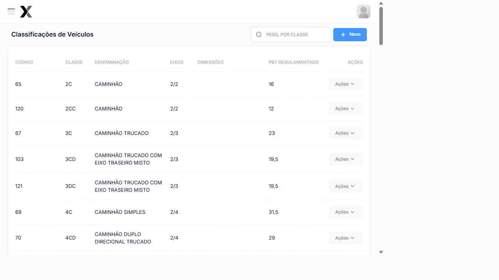
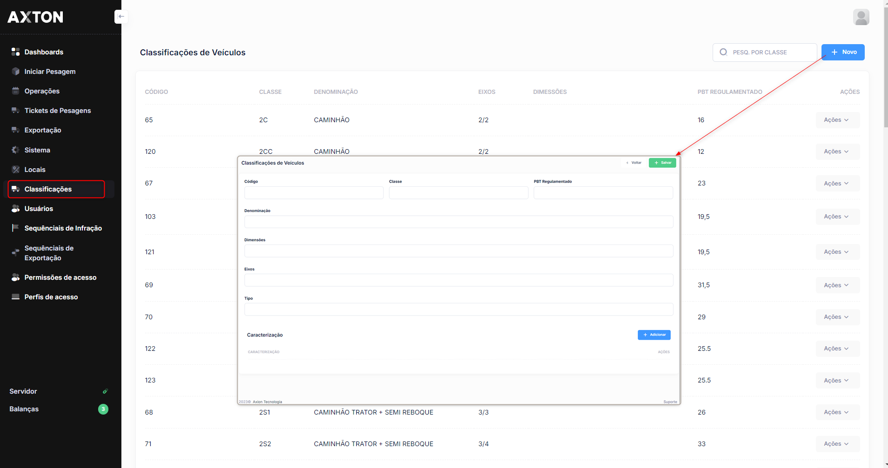

# Classificação de Veículos

O módulo de classificação de Veículos define as categorias reconhecidas pelo sistema AxTon. Cada classificação determina o **PBT Regulamentado** (Peso Bruto Total máximo permitido em toneladas) e o número de eixos aplicados nas operações de pesagem.

## Como acessar

**Menu lateral** → **Classificações**

## Listagem

### Colunas

| Coluna | Descrição |
|--------|-----------|
| **Código** | Código numérico da classificação |
| **Classe** | Sigla da classe (ex: 2C, 3S3, 3T6) |
| **Denominação** | Nome completo da categoria do Veículo |
| **Eixos** | Quantidade de eixos (dianteiros/traseiros) |
| **Dimensões** | Comprimento máximo em metros |
| **PBT Regulamentado** | Peso Bruto Total máximo em toneladas |
| **Ações** | Editar e Excluir |

### Classificações cadastradas no sistema

| Código | Classe | Denominação | Eixos | PBT (t) |
|--------|--------|-------------|-------|---------|
| 65 | **2C** | Caminhão | 2/2 | 16 |
| 120 | **2CC** | Caminhão | 2/2 | 12 |
| 67 | **3C** | Caminhão Trucado | 2/3 | 23 |
| 103 | **3CD** | Caminhão Trucado c/ Eixo Traseiro Misto | 2/3 | 19,5 |
| 69 | **4C** | Caminhão Simples | 2/4 | 31,5 |
| 70 | **4CD** | Caminhão Duplo Direcional Trucado | 2/4 | 29 |
| 68 | **2S1** | Caminhão Trator + Semi Reboque | 3/3 | 26 |
| 71 | **2S2** | Caminhão Trator + Semi Reboque | 3/4 | 33 |
| 74 | **2S3** | Caminhão Trator + Semi Reboque | 3/5 | 41,5 |
| 80 | **2I2** | Caminhão Trator + Semi Reboque | 4/4 | 36 |
| 82 | **2I3** | Caminhão Trator + Semi Reboque | 5/5 | 45/46 |
| 84 | **2I1** | Caminhão Trator + Semi Reboque | 4/5 | 43 |

:::info PBT Regulamentado
O **Peso Bruto Total (PBT)** é o limite legal de peso do Veículo conforme a classificação. Pesagens acima desse valor (considerando a tolerância configurada) geram Infração automática.
:::

## Cadastro

### Campos

| Campo | Obrigatório | Descrição |
|-------|:-----------:|-----------|
| **Código** | Sim | Código numérico único da classificação |
| **Classe** | Sim | Sigla (ex: 3S3, 2S2, 3T6) |
| **Denominação** | Sim | Nome completo da categoria do Veículo |
| **Eixos** | Sim | No formato `dianteiros/traseiros` (ex: 2/3) |
| **Dimensões** | Não | Comprimento máximo em metros |
| **PBT Regulamentado** | Sim | Peso máximo em toneladas |

### Passo a passo — Cadastrar classificação

1. Na listagem, clique em **+ Novo**
2. Informe o **Código** e a **Classe** (sigla)
3. Preencha a **Denominação** completa
4. Informe a Configuração de **Eixos**
5. Informe o **PBT Regulamentado** em toneladas
6. Clique em **Salvar**

:::warning Atenção
A alteração do PBT de uma classificação impacta diretamente o cálculo de Infrações Consulte a legislação vigente antes de modificar.
:::

## Veja também

| Funcionalidade | Descrição |
|---|---|
| [**Iniciar Pesagem**](../pesagem/ticket-aberto) | Como a classificação é usada na pesagem |
| [**Reclassificação**](../pesagem/reclassificar) | Corrigir classificação durante pesagem |
| [**Configurações**](../sistema/configuracoes) | Tolerâncias de PBT e eixo |

### Ações disponíveis na listagem

| Ação | Descrição |
|------|-----------|
| **+ Novo** | Cadastrar uma nova classificação |
| **Pesquisa** | Buscar classificações por qualquer campo |
| **Editar** | Alterar os dados de uma classificação existente (ícone lápis) |
| **Excluir** | Remover uma classificação do sistema (ícone X) |

## Cadastro

### Campos

| Campo | Obrigatório | Descrição |
|-------|:-----------:|-----------|
| **Código** | Sim | Código único de identificação da classificação |
| **Descrição** | Sim | Nome da categoria de Veículo (ex.: Caminhão 2 Eixos, Bitrem) |
| **Número de Eixos** | Sim | Quantidade de eixos que define a classificação |
| **Peso Máximo (t)** | Sim | Limite máximo de peso bruto total para a categoria, em toneladas |
| **Ativo** | Sim | Define se a classificação estará disponível nas operações |

### Passo a passo — Cadastrar classificação

1. Na listagem, clique em **+ Novo**
2. Informe o **Código** e a **Descrição** da classificação
3. Preencha o **Número de Eixos** correspondente à categoria
4. Informe o **Peso Máximo** permitido em toneladas
5. Confirme que o campo **Ativo** está marcado
6. Clique em **Salvar**

:::warning Peso máximo
O valor do peso máximo deve estar em conformidade com a legislação vigente para cada categoria de Veículo Consulte a regulamentação do órgão responsável antes de cadastrar ou alterar esses valores.
:::

## Perguntas frequentes

**Posso alterar o PBT de uma classificação já em uso?**
Sim, mas a alteração impacta imediatamente o cálculo de infrações futuras. Consulte a legislação vigente e comunique a equipe antes de modificar o PBT regulamentado.

**Qual a diferença entre Excesso de PBT e Excesso de Eixo?**
Excesso de PBT ocorre quando o peso total do veículo supera o limite da classificação. Excesso de Eixo ocorre quando o peso em um ou mais eixos supera o limite por eixo, independentemente do PBT total.

**Uma classificação inativa pode ser usada em pesagens?**
Não. Classificações inativas não aparecem nas opções de classificação durante a pesagem. Reative a classificação se ela ainda for utilizada.

:::tip Hierarquia de cadastros
As classificações de Veículos devem ser cadastradas antes do registro de operações de pesagem, pois são utilizadas na identificação do tipo de Veículo fiscalizado.
:::
