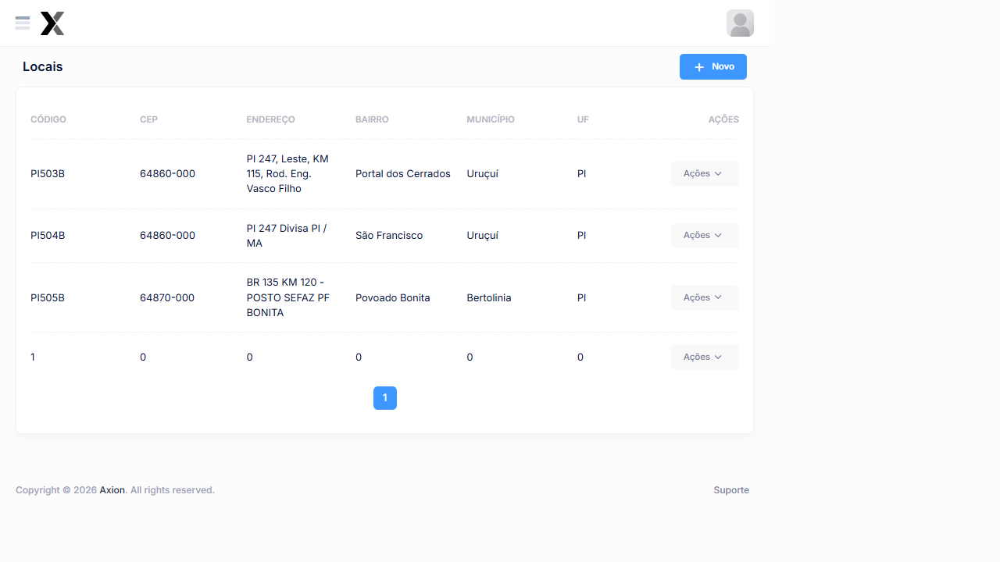

# Locais

O cadastro de locais registra os pontos físicos onde as operações de pesagem veicular são realizadas. Cada local representa um posto ou ponto de controle de peso em uma rodovia.

## Como acessar

**Menu lateral** → **Locais**

## Listagem

### Colunas

| Coluna | Descrição |
|--------|-----------|
| **Código** | Código único de identificação do local |
| **CEP** | Código de endereçamento postal |
| **Endereço** | Descrição da rodovia/localização |
| **Bairro** | Bairro ou localidade |
| **Município** | Cidade onde está localizado |
| **UF** | Unidade Federativa |
| **Ações** | Editar e Excluir |

### Locais cadastrados no sistema

| Código | CEP | Endereço | Município | UF |
|--------|-----|---------|----------|----|
| **PI503B** | 64860-000 | PI 247, Leste, KM 115, Rod. Eng. Vasco Filho | Uruçuí | PI |
| **PI504B** | 64860-000 | PI 247 Divisa PI / MA | Uruçuí | PI |
| **PI505B** | 64870-000 | BR 135 KM 120 — Posto SEFAZ, Povoado Bonita | Bertolinia | PI |

### Ações disponíveis

| Ação | Descrição |
|------|-----------|
| **+ Novo** | Cadastrar um novo local |
| **Editar** | Alterar os dados de um local existente |
| **Excluir** | Remover um local do sistema |

## Cadastro

### Campos

| Campo | Obrigatório | Descrição |
|-------|:-----------:|-----------|
| **Código** | Sim | Código único de identificação (ex: PI503B) |
| **CEP** | Sim | Código postal do local |
| **Endereço** | Sim | Nome da rodovia, KM e descrição completa |
| **Bairro** | Não | Bairro ou localidade próxima |
| **Município** | Sim | Cidade do ponto de pesagem |
| **UF** | Sim | Estado (ex: PI, MA, TO) |

### Passo a passo — Cadastrar local

1. Na listagem, clique em **+ Novo**
2. Informe o **Código** do local (ex: PI503B)
3. Preencha o **CEP** e o **Endereço** completo da rodovia
4. Informe o **Município** e a **UF**
5. Clique em **Salvar**

:::tip Código do Local
O código do local é utilizado para vincular operações e gerar relatórios. Use um padrão legível como `[UF][Número Rodovia][Letra]` para facilitar identificação.
:::

:::warning Atenção
A exclusão de um local somente será possível se não houver operações ou pesagens vinculadas a ele.
:::

## Veja também

| Funcionalidade | Descrição |
|---|---|
| [**Operações**](../operacoes/cadastro-operacoes) | Vincular locais a operações de pesagem |
| [**Configurações do Sistema**](../sistema/configuracoes) | Configurações gerais do AxTon |

### Colunas

| Coluna | Descrição |
|--------|-----------|
| **Código** | Código de identificação do local no sistema |
| **Descrição** | Nome ou descrição do local de pesagem |
| **Endereço** | Localização física do posto |
| **Ativo** | Indica se o local está habilitado para uso |

### Ações disponíveis na listagem

| Ação | Descrição |
|------|-----------|
| **+ Novo** | Cadastrar um novo local |
| **Pesquisa** | Buscar locais por qualquer campo da listagem |
| **Editar** | Alterar os dados de um local existente (ícone lápis) |
| **Excluir** | Remover um local do sistema (ícone X) |

## Cadastro

### Campos

| Campo | Obrigatório | Descrição |
|-------|:-----------:|-----------|
| **Código** | Sim | Código único de identificação do local |
| **Descrição** | Sim | Nome ou identificação do local de pesagem |
| **Endereço** | Não | Endereço completo do local |
| **Ativo** | Sim | Define se o local estará disponível para uso nas operações |

### Passo a passo — Cadastrar local

1. Na listagem, clique em **+ Novo**
2. Informe o **Código** e a **Descrição** do local
3. Preencha o **Endereço**, se disponível
4. Verifique se o campo **Ativo** está marcado
5. Clique em **Salvar**

:::warning Atenção
A exclusão de um local somente será possível se não houver registros de pesagem vinculados a ele. Para desativar temporariamente, utilize o campo **Ativo**.
:::
