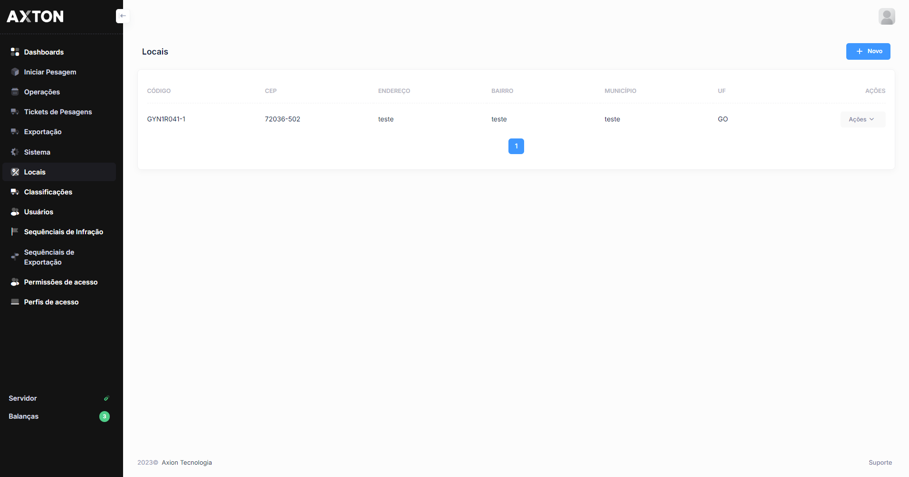
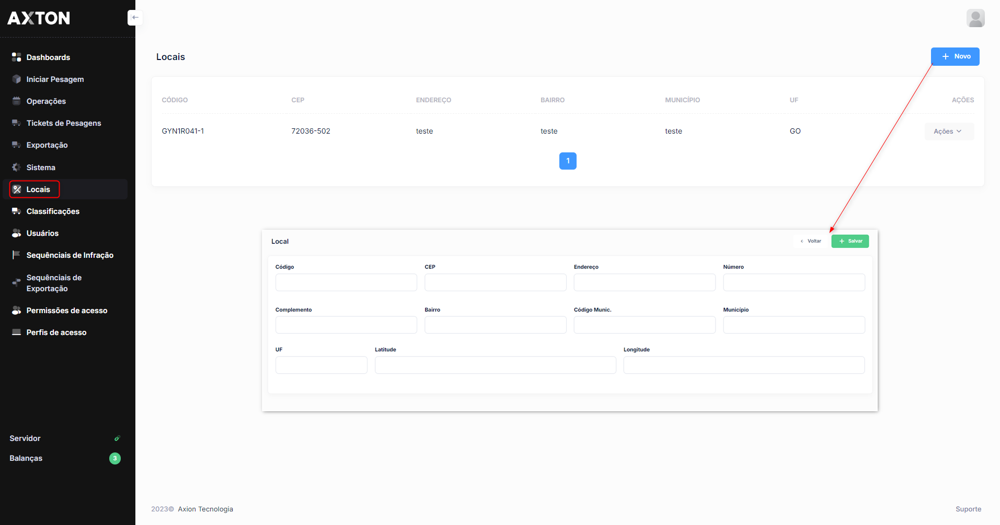

# Locais

O cadastro de locais registra os pontos físicos onde as operações de pesagem veicular são realizadas. Cada local representa um posto ou ponto de controle de peso.

## Como acessar

**Menu lateral** → Cadastros → **Locais**

## Listagem

### Colunas

| Coluna | Descrição |
|--------|-----------|
| **Código** | Código de identificação do local no sistema |
| **Descrição** | Nome ou descrição do local de pesagem |
| **Endereço** | Localização física do posto |
| **Ativo** | Indica se o local está habilitado para uso |

### Ações disponíveis na listagem

| Ação | Descrição |
|------|-----------|
| **+ Novo** | Cadastrar um novo local |
| **Pesquisa** | Buscar locais por qualquer campo da listagem |
| **Editar** | Alterar os dados de um local existente (ícone lápis) |
| **Excluir** | Remover um local do sistema (ícone X) |

## Cadastro

### Campos

| Campo | Obrigatório | Descrição |
|-------|:-----------:|-----------|
| **Código** | Sim | Código único de identificação do local |
| **Descrição** | Sim | Nome ou identificação do local de pesagem |
| **Endereço** | Não | Endereço completo do local |
| **Ativo** | Sim | Define se o local estará disponível para uso nas operações |

### Passo a passo — Cadastrar local

1. Na listagem, clique em **+ Novo**
2. Informe o **Código** e a **Descrição** do local
3. Preencha o **Endereço**, se disponível
4. Verifique se o campo **Ativo** está marcado
5. Clique em **Salvar**

:::warning Atenção
A exclusão de um local somente será possível se não houver registros de pesagem vinculados a ele. Para desativar temporariamente, utilize o campo **Ativo**.
:::
