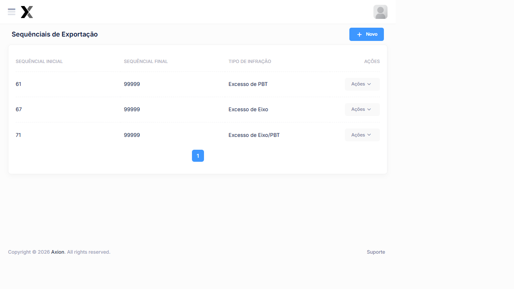

# Sequencial de Exportação

O módulo de **Sequencial de Exportação** controla a numeração dos **lotes de exportação** gerados pelo AxTon. Diferente do Sequencial de Infração (que numera os autos individuais), este sequencial numera os **arquivos de lote** enviados ao órgão autuador.

## Como acessar

**Menu lateral** → **Sequenciais de Exportação**

## Listagem

### Colunas

| Coluna | Descrição |
|--------|-----------|
| **Sequencial Inicial** | Número de início da contagem dos lotes |
| **Sequencial Final** | Número máximo de lotes (limite superior) |
| **Tipo de Infração | Tipo de Infração do lote |
| **Ações** | Editar e Excluir |

### Sequenciais cadastrados no sistema

| Sequencial Inicial | Até | Tipo de Infração |
|--------------------|-----|------------------|
| **61** | 99.999 | Excesso de PBT |
| **67** | 99.999 | Excesso de Eixo |
| **71** | 99.999 | Excesso de Eixo/PBT |

:::info Diferença entre Sequenciais
- **Sequencial de Infração → numera cada **auto de Infração individual
- **Sequencial de Exportação** → numera cada **lote/arquivo** exportado ao órgão
:::

## Cadastro

### Campos

| Campo | Obrigatório | Descrição |
|-------|:-----------:|-----------|
| **Sequencial Inicial** | Sim | Número de início da contagem de lotes |
| **Sequencial Final** | Sim | Limite superior da numeração |
| **Tipo de Infração | Sim | Excesso de PBT, Excesso de Eixo ou Excesso de Eixo/PBT |

### Passo a passo — Configurar sequencial de exportação

1. No menu lateral, clique em **Sequenciais de Exportação**
2. Clique em **+ Novo**
3. Informe o **Sequencial Inicial** (próximo número a ser usado)
4. Informe o **Sequencial Final** (normalmente 99999)
5. Selecione o **Tipo de Infração
6. Clique em **Salvar**

:::warning Atenção
Configure um sequencial para **cada tipo de Infração A geração de lotes de exportação exige que o sequencial correspondente esteja configurado.
:::

## Relacionado

- [Sequencial de Infração](./sequencial-infracao)
- [Exportação de Infrações](../infracoes/exportacao)
- [Falhas Sequenciais](../relatorios/falhas-sequenciais)

## Tabela de referência — configuração de sequencial

| Campo | Valor recomendado | Observação |
|-------|:-----------------:|------------|
| Sequencial Inicial (nova série) | 1 | Combinar com o órgão autuador |
| Sequencial Final | 99.999 | Padrão usual |
| Tipo de Infração | Um por tipo | Excesso PBT, Eixo e Eixo/PBT |
| Reinício ao esgotar | Não | Comunicar e criar nova série |

## Erros comuns

| Problema | Causa | Solução |
|----------|-------|----------|
| Lote não gerado para tipo de infração | Sequencial não cadastrado | Criar configuração para o tipo |
| Sequencial fora de ordem no órgão | Dois lotes com mesmo número | Verificar e corrigir duplicata |
| Série esgotada | Sequencial Final atingido | Ampliar ou criar nova série |

## Boas práticas

- Configure um sequencial para **cada tipo de infração** antes de iniciar a exportação — a ausência bloqueia a geração de lotes
- Não reutilize sequenciais de séries já encerradas — comunique ao órgão autuador antes de iniciar nova numeração

## Perguntas frequentes

**Qual a diferença entre Sequencial de Infração e Sequencial de Exportação?**
O Sequencial de Infração numera cada auto individual. O Sequencial de Exportação numera os lotes (arquivos) enviados ao órgão. Ambos precisam estar configurados para exportar corretamente.

**O que acontece quando o sequencial de exportação é esgotado?**
A geração de lotes é bloqueada para o tipo de infração correspondente. Crie uma nova série ou amplie o **Sequencial Final** antes do esgotamento.

**Preciso de um sequencial separado para cada tipo de infração?**
Sim. Configure um sequencial para Excesso de PBT, outro para Excesso de Eixo e outro para Excesso de Eixo/PBT. A ausência de qualquer um bloqueia a exportação do tipo correspondente.
- Monitore o **Sequencial Final** e amplie ou crie nova série antes de atingir o limite superior
- Mantenha o registro do último sequencial utilizado para referência em caso de inconsistência

:::warning
Sequenciais com números duplicados ou fora de ordem causam rejeição dos lotes pelo órgão autuador. Edite o **Sequencial Inicial** somente após consultar o histórico de exportações.
:::

## Veja também

| Funcionalidade | Descrição |
|---|---|
| [**Exportação de Infrações**](../infracoes/exportacao) | Gerar e enviar lotes de Infrações |
| [**Sequencial de Infração**](../cadastros/sequencial-infracao) | Numeração dos autos individuais |

## Integração com outros módulos

| Módulo | Como se relaciona com Sequencial de Exportação |
|--------|--------------------------------------------------|
| **Exportação de Infrações** | O sequencial numera cada lote gerado — sem ele, a exportação fica bloqueada |
| **Falhas Sequenciais** | Relatório que monitora lacunas e duplicidades nos números de lote |
| **Sequencial de Infração** | Complementar — enquanto este numera os lotes, o outro numera os autos individuais |
| **Relatório de Infrações** | Permite rastrear quais infrações estão em cada lote exportado |

## Exemplo prático

**Configurando sequenciais antes de iniciar as operações:**

1. Acessar **Sequenciais de Exportação** no menu lateral
2. Criar um sequencial para **cada tipo de infração**:

| Tipo de Infração | Sequencial Inicial | Até |
|-----------------|:-----------------:|-----|
| Excesso de PBT | 1 | 99.999 |
| Excesso de Eixo | 1 | 99.999 |
| Excesso de Eixo/PBT | 1 | 99.999 |

3. Confirmar com o órgão autuador se há exigência de faixas específicas antes de salvar

:::warning
A ausência de qualquer sequencial bloqueia a exportação do tipo correspondente. Configure os 3 antes de iniciar.
:::
