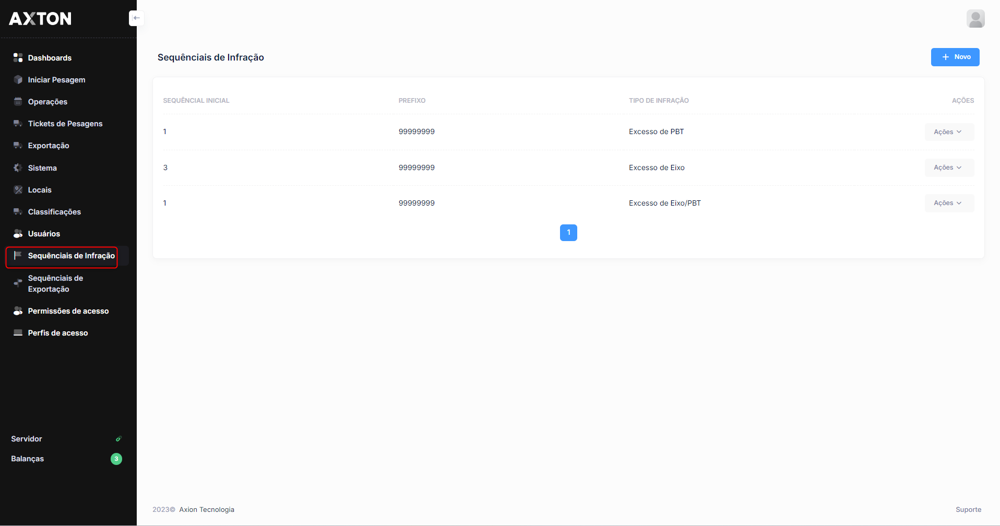
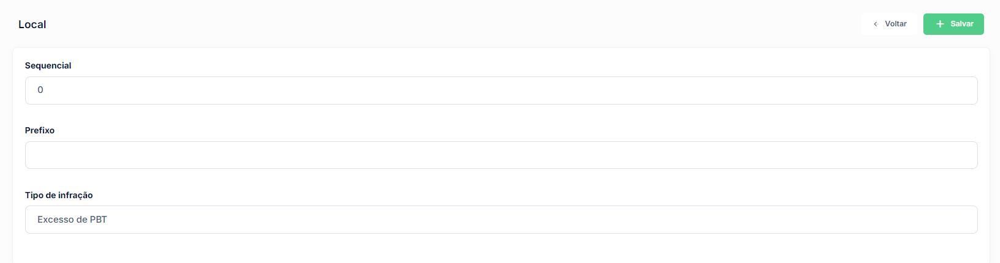

# Sequencial de Infração

O módulo de sequencial de infração define a numeração utilizada nos registros de infração gerados pelo sistema. Cada sequencial garante a rastreabilidade e unicidade dos autos de infração.

## Como acessar

**Menu lateral** → Cadastros → **Sequencial de Infração**

## Listagem

### Colunas

| Coluna | Descrição |
|--------|-----------|
| **Código** | Código de identificação do sequencial |
| **Descrição** | Descrição ou identificação do sequencial |
| **Número Atual** | Número atual do sequencial em uso |
| **Prefixo** | Prefixo adicionado ao número do auto de infração |
| **Ativo** | Indica se o sequencial está habilitado para uso |

### Ações disponíveis na listagem

| Ação | Descrição |
|------|-----------|
| **+ Novo** | Cadastrar um novo sequencial |
| **Pesquisa** | Buscar sequenciais por qualquer campo |
| **Editar** | Alterar os dados de um sequencial existente (ícone lápis) |
| **Excluir** | Remover um sequencial do sistema (ícone X) |

## Cadastro

### Campos

| Campo | Obrigatório | Descrição |
|-------|:-----------:|-----------|
| **Código** | Sim | Código único de identificação do sequencial |
| **Descrição** | Sim | Identificação do sequencial para fins de controle interno |
| **Número Inicial** | Sim | Número a partir do qual a contagem será iniciada |
| **Número Atual** | Sim | Número atual do sequencial (atualizado automaticamente a cada infração gerada) |
| **Prefixo** | Não | Prefixo alfanumérico incluído antes do número no auto de infração |
| **Ativo** | Sim | Define se o sequencial estará disponível para geração de infrações |

### Passo a passo — Cadastrar sequencial de infração

1. Na listagem, clique em **+ Novo**
2. Informe o **Código** e a **Descrição** do sequencial
3. Defina o **Número Inicial** a partir do qual a contagem começará
4. Informe o **Prefixo**, se aplicável
5. Confirme que o campo **Ativo** está marcado
6. Clique em **Salvar**

:::warning Alteração do número atual
A alteração do **Número Atual** de um sequencial em uso deve ser realizada com cautela. Modificações incorretas podem gerar duplicidade ou lacunas na numeração dos autos de infração, comprometendo a rastreabilidade dos registros.
:::

---

## Processos de Infração

| Processo | Descrição |
|---|---|
| [**Triagem de Infrações**](../infracoes/triagem) | Análise e validação de infrações de excesso de peso |
| [**Auditoria de Infrações**](../infracoes/auditoria) | Revisão de infrações processadas antes da exportação |
| [**Consulta de Infrações**](../infracoes/consulta-infracoes) | Pesquisar e consultar infrações registradas |
| [**Exceções**](../infracoes/excecoes) | Regras para dispensar veículos da autuação |
| [**Infrações Descartadas**](../infracoes/infracoes-descartadas) | Consultar e reabrir infrações descartadas |
