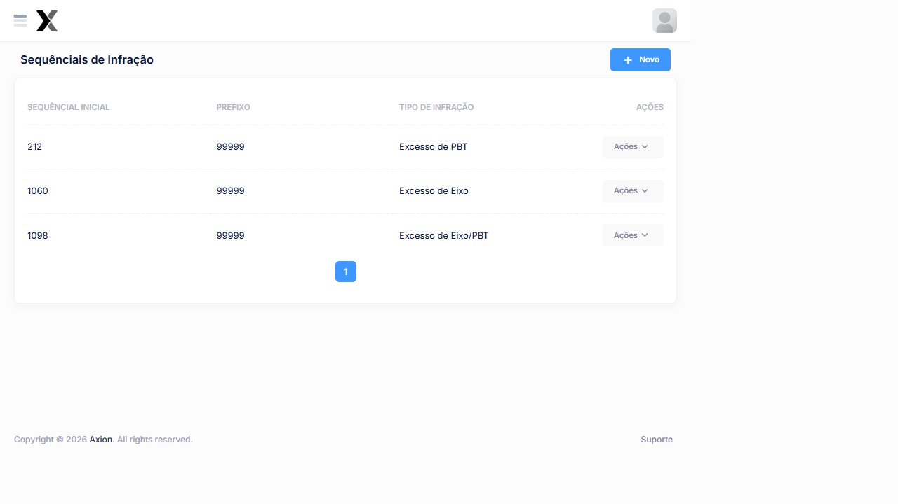

# Sequencial de Infração

O sequencial de infração define a **numeração dos autos de infração** gerados pelo sistema. Há um sequencial independente para cada **tipo de infração** (Excesso de PBT, Excesso de Eixo, Excesso de Eixo/PBT).

## Como acessar

**Menu lateral** → **Sequênciais de Infração**

## Listagem

### Colunas

| Coluna | Descrição |
|--------|-----------|
| **Sequêncial Inicial** | Número de início da contagem |
| **Prefixo** | Número máximo até onde o sequêncial vai (limite superior) |
| **Tipo de Infração** | Qual tipo de infração esse sequêncial controla |
| **Ações** | Editar e Excluir |

### Sequênciais cadastrados no sistema

| Sequêncial Inicial | Até | Tipo de Infração |
|--------------------|-----|------------------|
| **212** | 99.999 | Excesso de PBT |
| **1.060** | 99.999 | Excesso de Eixo |
| **1.098** | 99.999 | Excesso de Eixo/PBT |

## Tipos de Infração

| Tipo | Quando ocorre |
|------|---------------|
| **Excesso de PBT** | Peso Bruto Total medido supera o PBT Regulamentado + tolerância |
| **Excesso de Eixo** | Peso em um ou mais eixos supera o limite por eixo + tolerância |
| **Excesso de Eixo/PBT** | Excesso simultâneo tanto no PBT quanto em eixo |

## Cadastro

### Campos

| Campo | Obrigatório | Descrição |
|-------|:-----------:|-----------|
| **Sequêncial Inicial** | Sim | Número de início da contagem de infrações |
| **Prefixo (Até)** | Sim | Limite superior da numeração |
| **Tipo de Infração** | Sim | Excesso de PBT, Excesso de Eixo ou Excesso de Eixo/PBT |

### Passo a passo — Configurar sequêncial

1. No menu lateral, clique em **Sequênciais de Infração**
2. Clique em **+ Novo**
3. Informe o **Sequêncial Inicial** (próximo número a ser usado)
4. Informe o valor **Até** (normalmente 99999)
5. Selecione o **Tipo de Infração**
6. Clique em **Salvar**

:::warning Atenção
Configure um sequêncial para **cada tipo de infração**. Se algum tipo não tiver sequêncial configurado, infrações daquele tipo não poderão ser numeradas corretamente.
:::

:::tip Dica
Quando o número atingir o limite, edite o sequêncial com um novo número inicial ou amplie o valor máximo.
:::

## Veja também

| Funcionalidade | Descrição |
|---|---|
| [**Sequênciais de Exportação**](../infracoes/exportacao) | Números dos lotes de exportação |
| [**Configurações**](../sistema/configuracoes) | Tolerâncias e enquadramentos de infração |

### Ações disponíveis na listagem

| Ação | Descrição |
|------|-----------|
| **+ Novo** | Cadastrar um novo sequencial |
| **Pesquisa** | Buscar sequenciais por qualquer campo |
| **Editar** | Alterar os dados de um sequencial existente (ícone lápis) |
| **Excluir** | Remover um sequencial do sistema (ícone X) |

## Cadastro

### Campos

| Campo | Obrigatório | Descrição |
|-------|:-----------:|-----------|
| **Código** | Sim | Código único de identificação do sequencial |
| **Descrição** | Sim | Identificação do sequencial para fins de controle interno |
| **Número Inicial** | Sim | Número a partir do qual a contagem será iniciada |
| **Número Atual** | Sim | Número atual do sequencial (atualizado automaticamente a cada infração gerada) |
| **Prefixo** | Não | Prefixo alfanumérico incluído antes do número no auto de infração |
| **Ativo** | Sim | Define se o sequencial estará disponível para geração de infrações |

### Passo a passo — Cadastrar sequencial de infração

1. Na listagem, clique em **+ Novo**
2. Informe o **Código** e a **Descrição** do sequencial
3. Defina o **Número Inicial** a partir do qual a contagem começará
4. Informe o **Prefixo**, se aplicável
5. Confirme que o campo **Ativo** está marcado
6. Clique em **Salvar**

:::warning Alteração do número atual
A alteração do **Número Atual** de um sequencial em uso deve ser realizada com cautela. Modificações incorretas podem gerar duplicidade ou lacunas na numeração dos autos de infração, comprometendo a rastreabilidade dos registros.
:::

---

## Fluxo de Exportação

O sequencial de infração é utilizado na exportação de infrações para o órgão autuador. Após o registro da infração, a exportação utiliza o próximo número sequencial disponível.

| Processo | Descrição |
|---|---|
| [**Exportação**](../infracoes/exportacao) | Envio de infrações aprovadas em lotes para o órgão autuador |
