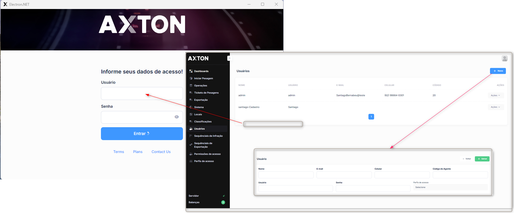

# Logs de Acesso

Registra todas as autenticações realizadas no sistema, incluindo acessos bem-sucedidos e tentativas falhas.

## Como acessar

**Menu lateral** → Controle de Acesso → **Logs de Acesso**

## Listagem

### Colunas

| Coluna | Descrição |
|--------|-----------|
| Usuário | Login do Usuário |
| **Data/Hora** | Momento do acesso |
| **IP** | Endereço IP de origem |
| **Resultado** | Sucesso ou Falha |
| **Navegador** | Browser utilizado |

### Filtros

- Período
- Usuário específico
- Resultado (Sucesso/Falha)

:::info Segurança
Múltiplas tentativas falhas consecutivas podem indicar tentativa de acesso indevido. Monitore regularmente.
:::

---

## Controle de Acesso

| Funcionalidade | Descrição |
|---|---|
| [**Restrição por IP**](../controle-acesso/acessos-por-ip) | Configurar restrição de acesso por endereço IP |
| [**Permissões Detalhadas**](../controle-acesso/configurar-permissoes) | Configurar permissões granulares por módulo |
