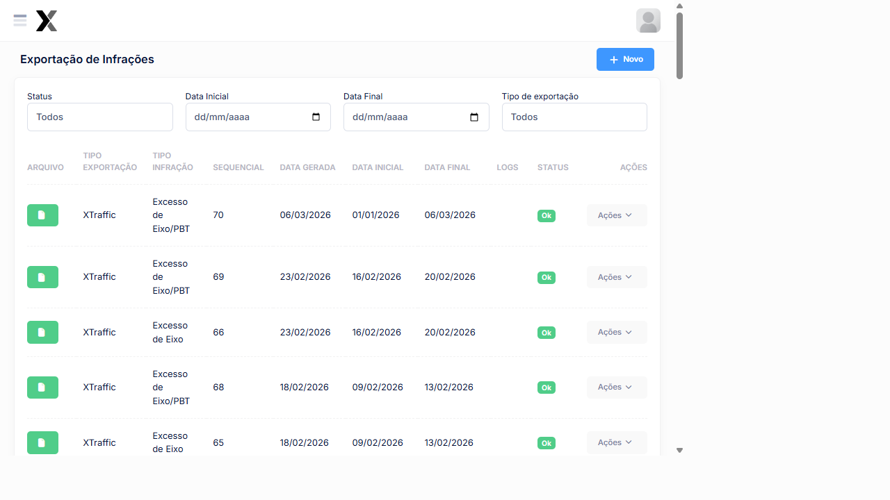

---
sidebar_position: 4
title: Exportação de Infrações
description: Exportar lotes de infrações para o órgão autuador no AxTon
---

# Exportação de Infrações

A exportação envia as infrações registradas para o órgão autuador em **lotes numerados**. Cada lote contém as infrações de um determinado período e tipo, com sequencial próprio.

## Como acessar

**Menu lateral** → **Exportação**

## Listagem de Lotes

### Colunas

| Coluna | Descrição |
|--------|-----------|
| **Arquivo** | Formato do arquivo exportado (ex: XTraffic) |
| **Tipo Exportação** | Sistema destino (XTraffic ou AxHub) |
| **Tipo Infração** | Excesso de PBT, Eixo ou Eixo/PBT |
| **Sequencial** | Número do lote de exportação |
| **Data Gerada** | Data em que o lote foi criado |
| **Data Inicial** | Período inicial das infrações |
| **Data Final** | Período final das infrações |
| **Logs** | Informações de processamento |
| **Status** | Ok, Processando ou Error |
| **Ações** | Visualizar e Excluir |

### Exemplos de lotes exportados

| Tipo Exportação | Tipo Infração | Seq | Data Gerada | Período | Status |
|-----------------|--------------|-----|------------|---------|--------|
| XTraffic | Excesso de Eixo/PBT | **70** | 06/03/2026 | 01/01/2026 a 06/03/2026 | **Ok** |
| XTraffic | Excesso de Eixo/PBT | **69** | 23/02/2026 | 16/02 a 20/02/2026 | **Ok** |
| XTraffic | Excesso de Eixo | **66** | 23/02/2026 | 16/02 a 20/02/2026 | **Ok** |
| XTraffic | Excesso de Eixo/PBT | **68** | 18/02/2026 | 09/02 a 13/02/2026 | **Ok** |
| XTraffic | Excesso de PBT | **60** | 18/02/2026 | 09/02 a 13/02/2026 | **Ok** |

### Filtros disponíveis

| Filtro | Opções |
|--------|---------|
| **Status** | Todos, Ok, Processando, Error |
| **Data Inicial** | Data de início do período |
| **Data Final** | Data de fim do período |
| **Tipo de exportação** | Todos, AxHub, XTraffic |

### Status dos Lotes

| Status | Descrição |
|--------|-----------|
| **Ok** | Lote gerado e processado com sucesso |
| **Processando** | Lote em geração ou envio |
| **Error** | Falha no processamento — verificar logs |

## Tipos de Exportação

| Sistema | Descrição |
|----------|-----------|
| **XTraffic** | Formato padrão para o sistema XTraffic do órgão autuador |
| **AxHub** | Integração direta com o AxHub para consolidação |

## Gerar Novo Lote

### Passo a passo

1. No menu lateral, clique em **Exportação**
2. Clique em **+ Novo**
3. Selecione o **Tipo de Exportação** (XTraffic ou AxHub)
4. Selecione o **Tipo de Infração**
5. Defina o **Período** (Data Inicial e Final)
6. Clique em **Salvar**
7. Aguarde o status mudar para **Ok**
8. Clique em **Visualizar** para conferir o conteúdo

:::tip Dica
Gere lotes separados para cada **Tipo de Infração**. O órgão autuador geralmente exige arquivos separados por enquadramento.
:::

:::warning Atenção
Lotes com status **Error** devem ser analisados nos **Logs** antes de reenvio. Não exclua lotes antes de confirmar que foram recebidos pelo órgão.
:::

## Veja também

| Funcionalidade | Descrição |
|---|---|
| [**Sequênciais de Exportação**](../cadastros/sequencial-infracao) | Numeração dos lotes |
| [**Tickets de Pesagens**](../pesagem/ticket-aberto) | Infrações geradas na pesagem |

:::warning Erros comuns
- **Código do município divergente**: Verifique o cadastro de faixas
- **Imagens ausentes**: Verifique o processamento de imagens
- **Dados incompletos**: Retorne para triagem e complete os dados
:::
