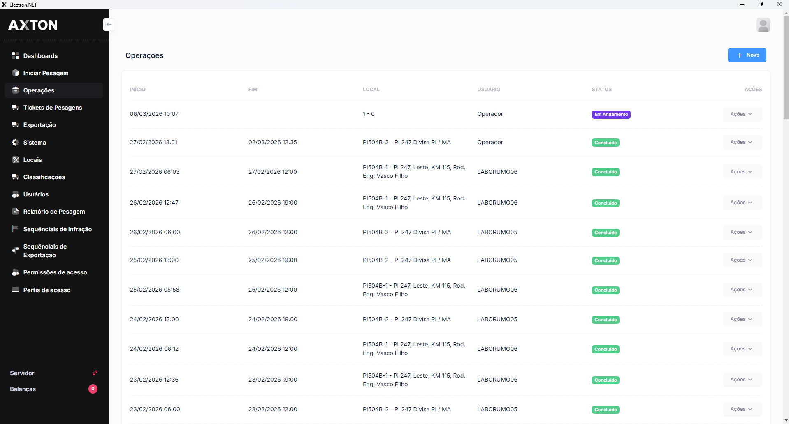

---
sidebar_position: 1
title: Cadastro de Operações
description: Cadastrar e gerenciar operações de pesagem
---

# Cadastro de Operações

Operações representam as atividades de fiscalização de pesagem realizadas em campo. Cada operação é vinculada a um posto e possui período de vigência.

## Como acessar

**Menu lateral** → **Operações**

## Listagem

### Colunas

| Coluna | Descrição |
|--------|-----------|
| **Código** | Identificador da operação |
| **Nome** | Nome/descrição da operação |
| **Posto** | Posto de pesagem vinculado |
| **Início** | Data de início |
| **Fim** | Data de término |
| **Status** | Ativa, Encerrada, Planejada |

### Campos do Cadastro

| Campo | Obrigatório | Descrição |
|-------|:-----------:|-----------|
| **Nome** | Sim | Nome da operação |
| **Posto** | Sim | Posto de pesagem vinculado |
| **Data Início** | Sim | Início da vigência |
| **Data Fim** | Não | Término (vazio = sem prazo) |
| **Observações** | Não | Notas adicionais |

### Passo a passo

1. No menu lateral, clique em **Operações**
2. Clique em **+ Novo**
3. Informe o Nome da operação
4. Selecione o Posto de pesagem
5. Defina as datas de vigência
6. Clique em **Salvar**

---

## Funcionalidades de Operações

| Funcionalidade | Descrição |
|---|---|
| [**Monitoramento Online**](../operacoes/monitoramento-online) | Acompanhamento em tempo real dos equipamentos e operações |
| [**Eventos de Equipamentos**](../operacoes/eventos-equipamentos) | Registro de eventos operacionais dos equipamentos |
| [**Consulta de Placas**](../operacoes/consulta-placas) | Pesquisar passagens de veículos por placa |
| [**Alertas**](../operacoes/alertas) | Gestão de alertas operacionais e notificações |
