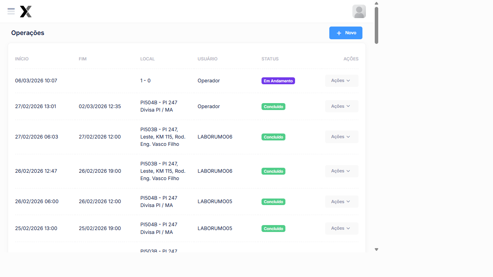

---
sidebar_position: 1
title: Cadastro de Operações
description: Cadastrar e gerenciar operações de pesagem veicular no AxTon
---

# Cadastro de Operações

Operações representam as atividades de fiscalização de pesagem veicular realizadas em campo. Cada operação é vinculada a um **local de pesagem**, possui período de vigência e um Usuário responsável**.

## Como acessar

**Menu lateral** → **Operações**

## Listagem

### Colunas

| Coluna | Descrição |
|--------|-----------|
| **Início** | Data e hora de abertura da operação |
| **Fim** | Data e hora de encerramento |
| **Local** | Código e descrição do local de pesagem |
| Usuário | Usuário que criou/gerencia a operação |
| **Status** | Em Andamento ou Concluído |
| **Ações** | Editar e Excluir |

### Exemplos de operações reais

| Início | Fim | Local | Usuário | Status |
|--------|-----|-------|---------|--------|
| 06/03/2026 10:07 | *em andamento* | 1 | Operador | **Em Andamento** |
| 27/02/2026 13:01 | 02/03/2026 12:35 | PI504B — PI 247 Divisa PI/MA | Operador | Concluído |
| 27/02/2026 06:03 | 27/02/2026 12:00 | PI503B — PI 247 KM 115 | LABORUMO06 | Concluído |
| 26/02/2026 06:00 | 26/02/2026 12:00 | PI504B | LABORUMO05 | Concluído |

### Status das Operações

| Status | Descrição |
|--------|-----------|
| **Em Andamento** | Operação ativa — pesagens podem ser registradas |
| **Concluído** | Operação encerrada — apenas consulta |

## Cadastro de Nova Operação

### Campos

| Campo | Obrigatório | Descrição |
|-------|:-----------:|-----------|
| **Local** | Sim | Local de pesagem (ex: PI503B, PI504B) |
| **Data Início** | Sim | Abertura da operação |
| **Data Fim** | Não | Encerramento (vazio = operação aberta) |
| Usuário | Sim | Responsável pela operação |

### Passo a passo

1. No menu lateral, clique em **Operações**
2. Clique em **+ Novo**
3. Selecione o **Local** de pesagem
4. Defina a **Data de Início**
5. Selecione o Usuário responsável
6. Clique em **Salvar**

:::tip Encerrar uma operação
Para encerrar uma operação em andamento, clique em **Editar** e preencha a **Data de Fim**. O status será alterado automaticamente para **Concluído**.
:::

:::warning Atenção
Somente operações com status **Em Andamento** permitem registrar novas pesagens. Verifique sempre se há uma operação ativa antes de iniciar uma pesagem.
:::

## Relacionado

- [Iniciar Pesagem](../pesagem/ticket-aberto)
- [Locais](../cadastros/locais)
- [Monitoramento Online](../operacoes/monitoramento-online)
- [Alertas](../operacoes/alertas)

## Boas práticas

- Verifique se há uma operação **Em Andamento** antes de iniciar qualquer pesagem — pesagens sem operação ativa não são vinculadas a um contexto fiscalário correto
- Encerre a operação ao final do turno ou da atividade para não misturar dados de períodos diferentes
- Registre o Usuário responsável corretamente para rastreabilidade das pesagens realizadas
- Para operações de longo prazo, monitore o status em **Monitoramento Online** para identificar equipamentos com problema

## Veja também

| Funcionalidade | Descrição |
|---|---|
| [**Iniciar Pesagem**](../pesagem/ticket-aberto) | Registrar uma nova pesagem na operação |
| [**Locais**](../cadastros/locais) | Gerenciar os locais de pesagem |
| [**Usuários**](../administracao/usuarios) | Gerenciar Usuários do sistema |

---

## Funcionalidades de Operações

| Funcionalidade | Descrição |
|---|---|
| [**Monitoramento Online**](../operacoes/monitoramento-online) | Acompanhamento em tempo real dos Equipamentos e operações |
| [**Eventos de Equipamentos**](../operacoes/eventos-Equipamentos) | Registro de eventos operacionais dos Equipamentos |
| [**Consulta de Placas**](../operacoes/consulta-placas) | Pesquisar passagens de Veículos por placa |
| [**Alertas**](../operacoes/alertas) | Gestão de alertas operacionais e notificações |
