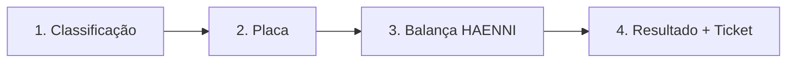

# Iniciar Pesagem


A tela de **Iniciar Pesagem** guia o operador pelo processo completo de pesagem veicular em **4 etapas sequenciais**: seleção da classificação do Veículo informação da placa, leitura automática da balança HAENNI e finalização com cálculo de excesso.

## Como acessar

**Menu lateral** → **Iniciar Pesagem**  
ou  
**Tickets de Pesagens** → **+ Nova Pesagem**

:::warning Pré-requisito
Para iniciar uma pesagem, é obrigatório ter uma **Operação com status "Em Andamento"** vinculada ao local de pesagem. Caso não exista, crie uma em **Operações → + Novo**.
:::

---

## Fluxo de Pesagem — 4 Etapas



---

### Etapa 1 — Seleção do Tipo do Veículo

O sistema exibe a lista completa de classificações cadastradas conforme norma CONTRAN/DENATRAN. O operador pode buscar de duas formas:

- **Buscar pela Classificação** (código: 3S3, 2S2, 3T6, 2C, etc.)
- **Buscar pelo PBT** (Peso Bruto Total em toneladas)

#### Tabela de classificações disponíveis

| Código | Classe | Denominação | Use Configuração Eixos | PBT (t) |
|--------|--------|-------------|:-------------:|:-------:|
| 65 | **2C** | Caminhão | 2/2 | 16 |
| 67 | **3C** | Caminhão Trucado | 2/3 | 23 |
| 71 | **2S2** | Caminhão Trator + Semi Reboque | 3/4 | 33 |
| 74 | **2S3** | Caminhão Trator + Semi Reboque | 3/5 | 41,5 |
| 82 | **2I3** | Caminhão Trator + Semi Reboque | 5/5 | 45/46 |
| — | **3S3** | Combinação 6 eixos | 3/6 | 48,5 |
| — | **3T6** | Tritrem | 5/9 | 74 |

**Como o sistema usa está informação:** O PBT regulamentado da classificação selecionada é o valor-base para calcular se há excesso de peso. Selecione a classificação observando fisicamente o Veículo no posto.

:::tip Identificação visual
Observe a Configuração de eixos do Veículo (quantos eixos dianteiros/traseiros) para selecionar a classificação correta. Em caso de dúvida, consulte a tabela DENATRAN colada no posto de pesagem.
:::

---

### Etapa 2 — Informar a Placa do Veículo

Após selecionar a classificação, informe a **placa do Veículo no campo indicado.

| Formato | Exemplo | Aceito |
|---------|---------|:------:|
| Antigo | ABC-1234 | ✓ |
| Mercosul | ABC1D23 | ✓ |

O sistema válida o formato automaticamente. Após informar a placa, clique em **Continuar**.

---

### Etapa 3 — Conexão com a Balança HAENNI

Após confirmar a placa, o sistema se conecta automaticamente com a **balança HAENNI** e aguarda o registro do peso. O status **"Aguarde..."** indica que a leitura está em andamento.

**O que acontece nos bastidores:**
1. Sistema envia comando à balança via URL configurada em Sistema → HAENNI
2. Balança realiza leitura de peso por eixo (dianteiro, traseiro, grupos)
3. Peso total é transmitido ao sistema
4. Sistema armazena peso bruto individual e total

:::warning Balança não conectada?
Se aparecer a mensagem **"Nenhum Equipamento localizado, verifique a conexão da balança!"**, verifique:
1. A balança está **ligada** e conectada à rede local
2. A **URL do servidor** está correta em **Sistema → HAENNI**
3. O **número de balanças ativas** exibido no menu lateral está acima de **0**
4. O cabo de rede entre o computador e a balança está íntegro
:::

---

### Etapa 4 — Resultado e Finalização

Com o peso registrado, o sistema calcula automaticamente todos os parâmetros:

| Cálculo | Fórmula | Descrição |
|---------|---------|-----------|
| **PBT Medido** | Soma dos eixos | Peso total registrado pela balança |
| **PBT Regulamentado** | Da classificação | Limite legal do tipo de Veículo |
| **Tolerância** | PBT Reg. × % configurado | Margem permitida acima do PBT |
| **PBT Considerado** | PBT Reg. + Tolerância | Limite real para gerar Infração |
| **Excesso** | PBT Medido − PBT Considerado | Se positivo = Infração |

#### Regras de negócio automáticas

1. **Se PBT Medido ≤ PBT Considerado:** Veículo regular → ticket finalizado sem Infração
2. **Se PBT Medido > PBT Considerado:** Excesso detectado → Infração gerada automaticamente
3. Infração de PBT:** Gerada quando PBT Regulamentado > 50.000 kg e há excesso
4. Infração de Eixo:** Gerada quando peso em eixo individual supera limite + tolerância
5. Infração Eixo/PBT:** Quando ambos os excessos ocorrem simultaneamente

#### Exemplo prático completo

```
Veículo 3S3 (Combinação 6 eixos)
PBT Regulamentado: 48.500 kg
Tolerância PBT: 5% (configurado em Sistema → Infração
PBT Considerado: 48.500 + (48.500 × 5%) = 48.500 + 2.425 = 50.925 kg

Peso Medido: 53.000 kg
Excesso: 53.000 − 50.925 = 2.075 kg

→ Infração GERADA (enquadramento: Excesso de PBT)
```

---

## Passo a passo completo

1. Verifique que há uma **Operação ativa** (status "Em Andamento")
2. No menu lateral, clique em **Iniciar Pesagem**
3. **Busque** a classificação por código ou PBT
4. **Selecione** a classificação que corresponde ao Veículo
5. **Informe a placa** do Veículo (antigo ou Mercosul)
6. Clique em **Continuar**
7. **Aguarde** a leitura automática da balança HAENNI
8. O sistema calcula: PBT Medido, Tolerância, Excesso
9. Se houver excesso → Infração gerada automaticamente**
10. **Ticket criado** com status "Finalizado"
11. Veículo pode ser **liberado** ou **retido** conforme resultado

---

## Situações especiais

| Situação | O que fazer |
|----------|-------------|
| Classificação incorreta selecionada | Use [**Reclassificação**](../pesagem/reclassificar) após finalizar |
| Balança com leitura irregular | Cancele e repese. Verifique calibração |
| Veículo com reboque não detectado | Reclassifique para tipo com reboque |
| Liberação por autoridade | Use [**Liberar Pesagem**](../pesagem/liberar-pesagem) |
| Peso abaixo do PBT | Ticket finalizado sem Infração |

---

## Veja também

| Funcionalidade | Descrição |
|---|---|
| [**Tickets de Pesagens**](../pesagem/ticket-aberto) | Ver todos os tickets registrados |
| [**Reclassificação**](../pesagem/reclassificar) | Corrigir a classificação de um Veículo |
| [**Liberar Pesagem**](../pesagem/liberar-pesagem) | Liberar Veículo retido |
| [**Classificações**](../cadastros/classificacao-veiculos) | Gerenciar as classes de Veículos |
| Configurações — HAENNI**](../sistema/configuracoes) | Configurar a balança |
| Configurações — Infração**](../sistema/configuracoes) | Definir tolerâncias e enquadramentos |
| [**Configurações**](../sistema/configuracoes) | Ajustar tolerâncias e parâmetros |
