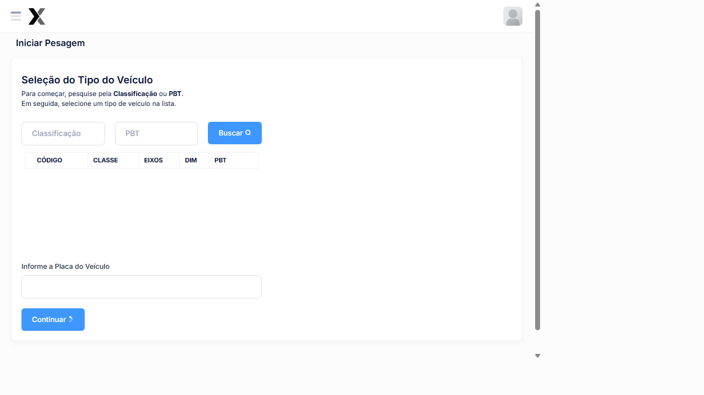

# Iniciar Pesagem

A tela de **Iniciar Pesagem** guia o operador pelo processo completo de pesagem veicular: seleção da classificação do veículo, informação da placa e registro do peso pela balança.

## Como acessar

**Menu lateral** → **Iniciar Pesagem**  
ou  
**Tickets de Pesagens** → **+ Nova Pesagem**

---

## Fluxo de Pesagem

### Etapa 1 — Seleção do Tipo do Veículo

O sistema exibe a lista de classificações cadastradas. O operador pode:

- **Buscar pela Classificação** (ex: 3S3, 2S2, 3T6)
- **Buscar pelo PBT** (Peso Bruto Total em toneladas)

#### Tabela de classificações disponíveis

| Código | Classe | Denominação | Eixos | PBT (t) |
|--------|--------|-------------|-------|---------|
| 65 | **2C** | Caminhão | 2/2 | 16 |
| 67 | **3C** | Caminhão Trucado | 2/3 | 23 |
| 71 | **2S2** | Caminhão Trator + Semi Reboque | 3/4 | 33 |
| 74 | **2S3** | Caminhão Trator + Semi Reboque | 3/5 | 41,5 |
| 82 | **2I3** | Caminhão Trator + Semi Reboque | 5/5 | 45/46 |

Selecione o tipo correto de veículo na lista antes de prosseguir.

---

### Etapa 2 — Informar a Placa do Veículo

Após selecionar a classificação, informe a **placa do veículo** no campo indicado.

:::tip Formato da Placa
O sistema aceita tanto o padrão **antigo** (ABC-1234) quanto o **Mercosul** (ABC1D23).
:::

---

### Etapa 3 — Conexão com a Balança

Após confirmar a placa, o sistema se conecta com a **balança HAENNI** e aguarda o registro do peso. O status "Aguarde..." indica que a leitura está em andamento.

:::warning Balança não conectada?
Se aparecer a mensagem **"Nenhum equipamento localizado, verifique a conexão da balança!"**, verifique:
1. A balança está ligada e conectada à rede
2. A URL do servidor da balança está correta em **Sistema → HAENNI**
3. O número de balanças ativas exibido no menu lateral está acima de **0**
:::

---

### Etapa 4 — Finalização

Com o peso registrado, o sistema calcula automaticamente:

| Cálculo | Descrição |
|---------|-----------|
| **PBT Medido** | Peso total registrado pela balança |
| **PBT Regulamentado** | Limite da classificação selecionada |
| **PBT Considerado** | PBT Regulamentado + Tolerância configurada |
| **Excesso** | PBT Medido - PBT Considerado (se positivo = infração) |

Se houver excesso, o sistema gera automaticamente a **infração** com o enquadramento configurado.

---

## Passo a passo completo

1. No menu lateral, clique em **Iniciar Pesagem**
2. Busque e selecione a **Classificação** do veículo
3. Informe a **Placa** do veículo
4. Clique em **Continuar**
5. Aguarde a leitura da balança
6. Confirme os dados e finalize a pesagem
7. O ticket é criado com status **Finalizado**

---

## Veja também

| Funcionalidade | Descrição |
|---|---|
| [**Tickets de Pesagens**](../pesagem/ticket-aberto) | Ver todos os tickets registrados |
| [**Reclassificação**](../pesagem/reclassificar) | Corrigir a classificação de um veículo |
| [**Classificações**](../cadastros/classificacao-veiculos) | Gerenciar as classes de veículos |
| [**Configurações**](../sistema/configuracoes) | Ajustar tolerâncias e parâmetros |
