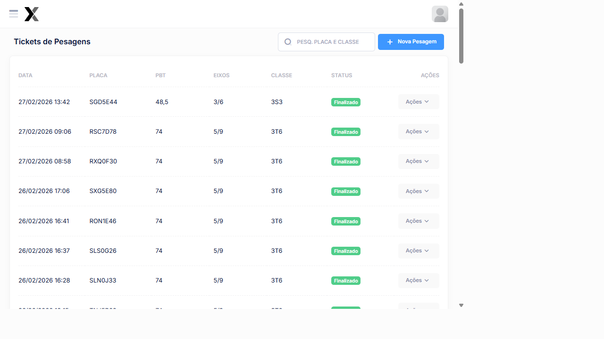

# Tickets de Pesagens

Os Tickets de Pesagens registram todas as pesagens realizadas nas operações. Cada ticket contém os dados do veículo, peso medido, classificação e status da pesagem.

## Como acessar

**Menu lateral** → **Tickets de Pesagens**

## Listagem

### Colunas

| Coluna | Descrição |
|--------|-----------|
| **Data** | Data e hora da pesagem |
| **Placa** | Placa do veículo pesado |
| **PBT** | Peso Bruto Total regulamentado da classificação (em toneladas) |
| **Eixos** | Configuração de eixos (dianteiros/traseiros) |
| **Classe** | Classe do veículo (ex: 3S3, 3T6, 3C) |
| **Status** | Finalizado ou Em andamento |
| **Ações** | Visualizar |

### Exemplos de registros reais

| Data | Placa | PBT (t) | Eixos | Classe | Status |
|------|-------|---------|-------|--------|--------|
| 27/02/2026 13:42 | **SGD5E44** | 48,5 | 3/6 | 3S3 | Finalizado |
| 27/02/2026 09:06 | **RSC7D78** | 74 | 5/9 | 3T6 | Finalizado |
| 27/02/2026 08:58 | **RXQ0F30** | 74 | 5/9 | 3T6 | Finalizado |
| 26/02/2026 17:06 | **SXG5E80** | 74 | 5/9 | 3T6 | Finalizado |
| 26/02/2026 14:17 | **ROM5J10** | 23 | 2/3 | 3C | Finalizado |
| 26/02/2026 08:04 | **GZV8I81** | 48,5 | 3/6 | 3S3 | Finalizado |

### Status dos Tickets

| Status | Descrição |
|--------|-----------|
| **Finalizado** | Pesagem concluída e registrada |
| **Em andamento** | Pesagem iniciada, aguardando finalização |

## Iniciar Nova Pesagem

Clique em **+ Nova Pesagem** para iniciar o processo de pesagem. Isso redireciona para a tela de **Iniciar Pesagem**.

### Passo a passo

1. Clique em **+ Nova Pesagem**
2. **Seleção do Tipo do Veículo:** busque pela classificação ou PBT e selecione o tipo
3. **Informe a Placa** do veículo
4. Clique em **Continuar**
5. O sistema conecta com a balança e registra o peso
6. Confirme os dados e clique em **Finalizar**

## Visualizar Ticket

Clique em **Visualizar** para ver os detalhes completos de um ticket:

| Informação | Descrição |
|-------------|-----------|
| **Placa** | Placa do veículo |
| **Classe** | Classificação do veículo |
| **PBT Regulamentado** | Peso máximo permitido (t) |
| **PBT Medido** | Peso efetivamente medido (kg) |
| **Eixos Medidos** | Peso individual por eixo |
| **Resultado** | Regular ou Infração (com tipo) |
| **Operador** | Usuário que registrou a pesagem |
| **Operação** | Operação vinculada |

## Veja também

| Funcionalidade | Descrição |
|---|---|
| [**Iniciar Pesagem**](../pesagem/ticket-aberto) | Fluxo completo de pesagem |
| [**Reclassificar**](../pesagem/reclassificar) | Corrigir a classificação de um ticket |
| [**Exportação**](../infracoes/exportacao) | Enviar infrações ao órgão autuador |

---

## Veja também

| Funcionalidade | Descrição |
|---|---|
| [**Tickets Fechados**](../pesagem/ticket-fechado) | Consulta de tickets de pesagem já finalizados |
